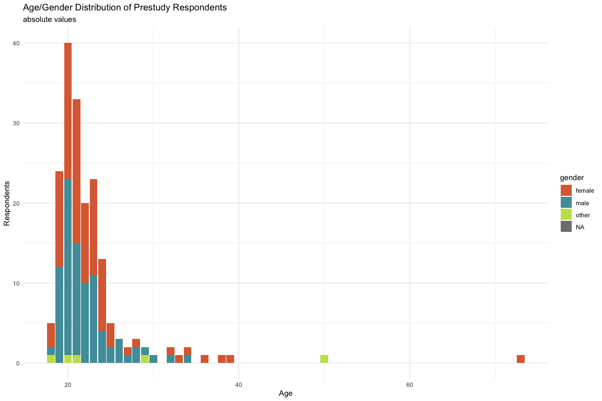

## 1. Demographic Data (Exploratry Data Analysis, a.k.a. Overview)


``` r
library(tidyverse)
library(gt)
source("analysfunc.R")
df_act = compose_df("user") |> 
  mutate(timestamp = ymd_hms(timestamp))
resp = elicit_respondents(df_act, no_timestamp = FALSE) |> 
  left_join(institute_lookup, by = c("subj" = "dep")) |> 
  na.omit()
```

Overall participants:


``` r
print(nrow(resp))
```

```
## [1] 184
```


Our respondent's data has 6 key observations:  

* `age` - age. 
* `gender` (with ability to enter gender if non-binary). 
* `subj` - department of the student's program/major. 
* `edu_year` - amount of years in the university. 
* `occup` - amount of years in Norway. 
* `family_acad` - highest degree of parents. 
* `orient`- sexual orientation. 


``` r
resp |> head() 
```

```
## # A tibble: 6 × 11
##   timestamp           id            age   gender gender_oth subj  edu_year occup
##   <dttm>              <chr>         <chr> <chr>  <chr>      <chr> <chr>    <chr>
## 1 2024-09-26 20:40:17 034010ca-4d6… 21    female ""         Depa… 2        21   
## 2 2024-09-30 11:01:02 04e683b9-5e1… 20    male   ""         Depa… 2        20   
## 3 2024-10-11 14:16:57 05bffbf4-08a… 20    male   ""         Depa… 1        13   
## 4 2024-09-30 10:59:54 07537ddc-800… 19    female ""         Depa… 2        19   
## 5 2024-09-27 07:36:03 07885f0e-1d1… 22    female ""         Depa… 2        22   
## 6 2024-09-26 15:42:22 08811b01-c6c… 21    female ""         Depa… 2        20   
## # ℹ 3 more variables: family_acad <chr>, orient <chr>, institute <chr>
```

Let's plot demographic data

### Age & Gender


``` r
resp |> 
  group_by(gender) |> 
  count()
```

```
## # A tibble: 3 × 2
## # Groups:   gender [3]
##   gender     n
##   <chr>  <int>
## 1 female    93
## 2 male      86
## 3 other      5
```

We see that gender is evenly distributed over the survey.


``` r
data_age_gender = resp |> 
    mutate(age = as.numeric(age)) |>
    count(age, gender) |>
    complete(age = 18:40, fill = list(n = 0))

ggplot(data_age_gender) +
  geom_bar(aes(x = age, y = n, fill = gender), stat = "identity") +
  theme_minimal() +
  labs(
    title = "Age/Gender Distribution of Prestudy Respondents",
    subtitle = "absolute values",
    x = "Age",
    y = "Respondents"
  ) +
  scale_fill_manual(values=c("#DD6C40", "#509DA9", "#C4E059"))
```

<!-- -->


``` r
ggplot(data_age_gender |> group_by(age) |> mutate(total_resp = sum(n)) |> filter(total_resp >= 10))+
  geom_bar(aes(x = age, y = n, fill = gender), stat = "identity", position = "fill") +
  theme_minimal() +
  labs(
    title = "Age/Gender Distribution of Prestudy Respondents",
    subtitle = "relative values for years with 10+ obs",
    x = "Age",
    y = "Respondents"
  ) +
  scale_fill_manual(values=c("#DD6C40", "#509DA9", "#C4E059"))
```

<!-- -->

Maybe it's make sense to replace gender "other" to non-binary in plots:


``` r
resp |> 
  filter(gender == "other") |> 
  select(gender_oth) |> 
  head()
```

```
## # A tibble: 5 × 1
##   gender_oth                
##   <chr>                     
## 1 ""                        
## 2 "Ikkje-bin<U+00E6>r"      
## 3 "Non-binary"              
## 4 "non binary (i think lol)"
## 5 "otger"
```

### Departments & Institutes

We still have majority of students from ex-MATNAT, and 0 respondents from Medicine and Law Faculties:


``` r
data_inst_dep = resp |> 
  group_by(institute, subj) |> 
  count() |> 
  full_join(institute_lookup, by = c("institute", "subj" = "dep")) |> 
  mutate(n = ifelse(is.na(n), 0, n))

cutiepie = c("Faculty of Fine Art, Music and Design" = "#9A3FE5", "Faculty of Humanities" = "#D5CC4A", "Faculty of Law" = "#B73737", "Faculty of Mathematics and Natural Sciences" = "#2C968C", "Faculty of Medicine" = "#55DB46", "Faculty of Psychology" = "#3E63B3", "Faculty of Social Sciences" = "#C48E43")


institue_color = data_inst_dep |>
  group_by(institute) |> 
  count() |> 
  cbind(color = cutiepie) |>  # 7 institutes 7 colors
  select(-n)

dep_color_palette_vector = generate_department_colors(data_inst_dep, institue_color) 
dep_color_palette = data.frame(Name = names(dep_color_palette_vector), Value = dep_color_palette_vector, stringsAsFactors = FALSE, row.names = NULL)
data_inst_dep = data_inst_dep |> 
  left_join(dep_color_palette, by = c("subj" = "Name")) |> 
  mutate(institute_subj = interaction(institute, subj, sep = ": ")) |> 
  arrange(institute_subj)
```


``` r
data_inst_dep  |> 
  ggplot() +
  geom_bar(aes(x = institute, y = n), stat = "identity") +
  theme_minimal() + 
  labs(
    title = "Respondents by Institute",
    fill = "Department",
    x = "institute",
    y = "respondents"
  ) +
  theme(axis.text.x = element_text(angle = 45, hjust = 1, vjust = 1))
```

<!-- -->


``` r
data_inst_dep_nonull = data_inst_dep  |> 
  filter(n>0)
data_inst_dep_nonull |> 
  ggplot() +
  geom_bar(aes(x = institute, y = n, fill = institute_subj), stat = "identity") +
  theme_minimal() + 
  labs(
    title = "Respondents by Department",
    fill = "Department",
    x = "institute",
    y = "respondents"
  ) +
  theme(axis.text.x = element_text(angle = 45, hjust = 1, vjust = 1)) + 
  scale_fill_manual(values = data_inst_dep_nonull$Value) + 
  guides(fill = guide_legend(ncol = 1))
```

<!-- -->

### Education Year


``` r
data_edu_years = resp |> 
  mutate(edu_year = as.numeric(edu_year)) |> 
  group_by(gender, edu_year) |> 
  count(edu_year) |> 
  filter(edu_year < 10)

ggplot(data_edu_years) +
  geom_bar(aes(x = edu_year, y = n, fill = gender), stat = "identity") +
  theme_minimal() +
  labs(
    title = "Current Year as a Student",
    subtitle = "Distribution of Prestudy Respondents",
    x = "Years of Education",
    y = "Respondents"
  ) +
  scale_fill_manual(values=c("#DD6C40", "#509DA9", "#C4E059"))
```

<!-- -->

### Occupation

This was a proxy on native / international student:


``` r
cat(sum(resp$age == resp$occup), " ot of ", nrow(resp), " respondents lived in Norway the whole life (", round(sum(resp$age == resp$occup)/nrow(resp)*100,2), "%)", sep = "")
```

```
## 147 ot of 184 respondents lived in Norway the whole life (79.89%)
```

Only a small part of students are from abroad: 


``` r
resp_no_full_norw = resp |> 
  filter(age != occup) |> 
  select(age, occup) |> 
  mutate(
    age = as.numeric(age),
    occup = as.numeric(occup),
    diff = age - occup) |> 
  filter(diff > 0) 

resp_no_full_norw |> 
  summarise(average_age_occup_differnece = mean(diff))
```

```
## # A tibble: 1 × 1
##   average_age_occup_differnece
##                          <dbl>
## 1                         12.0
```


``` r
ggplot(resp_no_full_norw) + 
  geom_bar(aes(x = occup)) + 
  theme_minimal() + 
  labs(
    title = "Years in Norway",
    subtitle = "Distribution for students whos age != occup_years",
    x = "Years in Norway",
    y = "Respondents"
  )
```

<!-- -->

### First of the Family

Higher degree of family members can also correlate with the preformance, well-being, etc. 


``` r
data_family =  resp |> 
  group_by(family_acad, institute) |> 
  count() |> 
  mutate(family_acad = factor(family_acad,
                                 levels = c(
                                   "elementary school",
                                   "secondary school" ,
                                   "Bachelor (or equivalent)",
                                   "Master (or equivalent)",
                                   "PhD")),
         institute = factor(institute, 
                            levels = c("Faculty of Fine Art, Music and Design ", "Faculty of Humanities", "Faculty of Mathematics and Natural Sciences", "Faculty of Psychology", "Faculty of Social Sciences"))) |> 
  left_join(institue_color, by = "institute")

ggplot(data_family) +
  geom_bar(aes(x = family_acad, y = n), stat = "identity") + 
  theme_minimal() + 
  labs(
    title = "Parents' highest degree",
    x = "Highest Degree",
    y = "Respondents"
  ) 
```

<!-- -->


``` r
data_family  |> 
  arrange(institute) |> 
  ggplot() +
    geom_bar(aes(x = family_acad, y = n, fill = institute), stat = "identity") + 
    theme_minimal() + 
    labs(
      title = "Parents' highest degree",
      x = "Highest Degree",
      y = "Respondents", 
      fill = "Faculty"
    ) +
  scale_fill_manual(values = c(cutiepie[-3][-4], "black", "black", "black", "black"))
```

<!-- -->

### Sexual Orientation


``` r
data_so = resp |> 
  filter(orient != "") |> 
  group_by(orient) |> 
  count()

ggplot(data_so) +
  geom_bar(aes(x = orient, y = n), stat = "identity") + 
  theme_minimal() + 
  labs(
    title = "Sexual Orientation",
    x = "Highest Degree",
    y = "Orientation"
  ) +
  theme(axis.text.x = element_text(angle = 45, hjust = 1, vjust = 1))
```

<!-- -->

## 2. Responses Analysis


``` r
# todo: filtering by amount of responses

topics_df = topics_df = read.csv('~/PhD/proj/code/pre-study/prestudy_app/prestudy_topics.csv')

scale_genderness = c("Completely Masculine", "Mostly Masculine", "Slightly Masculine", "Neutral", "Slightly Feminine", "Mostly Feminine", "Completely Feminine")
scale_familiarity = c("Not Familiar at All", "Slightly Familiar", "Moderately Familiar", "Very Familiar", "Highly Familiar")

evals = compose_df("evals") |> 
  mutate(familiarity = factor(familiarity, levels = scale_familiarity),
         gender = factor(gender, levels = scale_genderness)) 

topics_long <- topics_df %>%
  pivot_longer(cols = c(cs, econ, lang), 
               names_to = "field", 
               values_to = "topic") %>%
  select(topic_subcategory, topic, field)

evals <- evals %>%
  left_join(topics_long, by = c("topic" = "topic")) |> 
  mutate(topic = ifelse(is.na(topic_subcategory), topic, topic_subcategory),,
         field = ifelse(is.na(field), "base", field)) %>% 
  select(-topic_subcategory) 

head(evals)
```

```
##                                     id round assessment
## 1 034010ca-4d68-4856-afa9-4d7cf8bbb003     1          0
## 2 034010ca-4d68-4856-afa9-4d7cf8bbb003     1          0
## 3 034010ca-4d68-4856-afa9-4d7cf8bbb003     1          0
## 4 034010ca-4d68-4856-afa9-4d7cf8bbb003     1          0
## 5 034010ca-4d68-4856-afa9-4d7cf8bbb003     1          0
## 6 034010ca-4d68-4856-afa9-4d7cf8bbb003     1          0
##                       topic         familiarity               gender intime
## 1     Ocean Waves Formation     Highly Familiar              Neutral   TRUE
## 2                      Soda       Very Familiar              Neutral   TRUE
## 3                Smartphone     Highly Familiar     Mostly Masculine   TRUE
## 4 World Health Organization Moderately Familiar              Neutral   TRUE
## 5              Acne Product     Highly Familiar              Neutral   TRUE
## 6      Computer Simulations     Highly Familiar Completely Masculine   TRUE
##   field
## 1  base
## 2  base
## 3  base
## 4  base
## 5  base
## 6  base
```

* For gender perception evaluations, as expected, totally normal distribution:


``` r
evals |> 
  group_by(gender_level = as.factor(gender)) |> 
  count() |> 
  ggplot() +
  geom_bar(aes(x = gender_level, y = n), stat = "identity") +
  theme_minimal() +
  labs(title = "Distribution of gender evaluations in the prestudy",
       x = "Level of gender perception",
       y = "Observations") + 
  theme(axis.text.x = element_text(angle = 45, hjust = 1, vjust = 1))
```

<!-- -->

* For familiarity evaluations, in contrast, there's a more versatile distribution:


``` r
evals |> 
  group_by(fam_level = as.factor(familiarity)) |> 
  count() |> 
  ggplot() +
  geom_bar(aes(x = fam_level, y = n), stat = "identity") +
  theme_minimal() +
  labs(title = "Distribution of familiarity evaluations in the prestudy",
       x = "Level of familiarity",
       y = "Observations") + 
  theme(axis.text.x = element_text(angle = 45, hjust = 1, vjust = 1))
```

<!-- -->


``` r
evals2 = evals |> 
  mutate(gender = as.numeric(gender) - 4,
         familiarity = as.numeric(familiarity)) 
```

### Known Issues

#### Randomisation

Due to incorrect placement of `generate_topics()` function within the server, topics were generated in the same sample/order for all students of the current run, and changed only when the server was restarted.


``` r
total_df = resp |> 
  rename(sex = gender) |> 
  mutate(sex = fct_recode(sex, "non binary"="other")) |> 
  left_join(evals2, by="id") |> 
  na.omit()
```

```
## Warning in left_join(mutate(rename(resp, sex = gender), sex = fct_recode(sex, : Detected an unexpected many-to-many relationship between `x` and `y`.
## ℹ Row 1 of `x` matches multiple rows in `y`.
## ℹ Row 5101 of `y` matches multiple rows in `x`.
## ℹ If a many-to-many relationship is expected, set `relationship =
##   "many-to-many"` to silence this warning.
```


``` r
  # 
ii = total_df |> 
  filter(subj == 'Department of Informatics') |> 
  group_by(topic, round) |> 
  count() |> 
    pivot_wider(
    names_from = round, 
    values_from = n,
    names_prefix = "ii_round"
  )

matnat = total_df |> 
  filter(institute == 'Faculty of Mathematics and Natural Sciences' & subj != 'Department of Informatics') |> 
  group_by(topic, round) |> 
  count() |> 
    pivot_wider(
    names_from = round, 
    values_from = n,
    names_prefix = "matnat_no_ii"
  )

other_inst = total_df |> 
  filter(institute != 'Faculty of Mathematics and Natural Sciences') |> 
  group_by(topic, round) |> 
  count() |> 
    pivot_wider(
    names_from = round, 
    values_from = n,
    names_prefix = "oth_inst"
  )

occurences = topics_df |> 
  select(topic_subcategory) |> 
  left_join(ii, by = c('topic_subcategory' = 'topic')) |> 
  left_join(matnat, by = c('topic_subcategory' = 'topic')) |> 
  left_join(other_inst, by = c('topic_subcategory' = 'topic')) |> 
  mutate(across(everything(), replace_na, 0)) |> 
  group_by(topic_subcategory) |> 
  mutate(total = sum(ii_round1, ii_round2, matnat_no_ii1, matnat_no_ii2, oth_inst1, oth_inst2)) |> 
  arrange(-total) |> 
  ungroup() 
```

```
## Warning: There was 1 warning in `mutate()`.
## ℹ In argument: `across(everything(), replace_na, 0)`.
## Caused by warning:
## ! The `...` argument of `across()` is deprecated as of dplyr 1.1.0.
## Supply arguments directly to `.fns` through an anonymous function instead.
## 
##   # Previously
##   across(a:b, mean, na.rm = TRUE)
## 
##   # Now
##   across(a:b, \(x) mean(x, na.rm = TRUE))
```

``` r
occurences |> 
  gt() |> 
  data_color(
  columns = vars(ii_round1, ii_round2, matnat_no_ii1, matnat_no_ii2, oth_inst1, oth_inst2),
  colors = scales::col_numeric(
    c("lightgrey", "green"), 
    domain = c(0, 100)))
```

```
## Warning: Since gt v0.9.0, the `colors` argument has been deprecated.
## • Please use the `fn` argument instead.
## This warning is displayed once every 8 hours.
```

```
## Warning: Since gt v0.3.0, `columns = vars(...)` has been deprecated.
## • Please use `columns = c(...)` instead.
```

```{=html}
<div id="syaitotayy" style="padding-left:0px;padding-right:0px;padding-top:10px;padding-bottom:10px;overflow-x:auto;overflow-y:auto;width:auto;height:auto;">
<style>#syaitotayy table {
  font-family: system-ui, 'Segoe UI', Roboto, Helvetica, Arial, sans-serif, 'Apple Color Emoji', 'Segoe UI Emoji', 'Segoe UI Symbol', 'Noto Color Emoji';
  -webkit-font-smoothing: antialiased;
  -moz-osx-font-smoothing: grayscale;
}

#syaitotayy thead, #syaitotayy tbody, #syaitotayy tfoot, #syaitotayy tr, #syaitotayy td, #syaitotayy th {
  border-style: none;
}

#syaitotayy p {
  margin: 0;
  padding: 0;
}

#syaitotayy .gt_table {
  display: table;
  border-collapse: collapse;
  line-height: normal;
  margin-left: auto;
  margin-right: auto;
  color: #333333;
  font-size: 16px;
  font-weight: normal;
  font-style: normal;
  background-color: #FFFFFF;
  width: auto;
  border-top-style: solid;
  border-top-width: 2px;
  border-top-color: #A8A8A8;
  border-right-style: none;
  border-right-width: 2px;
  border-right-color: #D3D3D3;
  border-bottom-style: solid;
  border-bottom-width: 2px;
  border-bottom-color: #A8A8A8;
  border-left-style: none;
  border-left-width: 2px;
  border-left-color: #D3D3D3;
}

#syaitotayy .gt_caption {
  padding-top: 4px;
  padding-bottom: 4px;
}

#syaitotayy .gt_title {
  color: #333333;
  font-size: 125%;
  font-weight: initial;
  padding-top: 4px;
  padding-bottom: 4px;
  padding-left: 5px;
  padding-right: 5px;
  border-bottom-color: #FFFFFF;
  border-bottom-width: 0;
}

#syaitotayy .gt_subtitle {
  color: #333333;
  font-size: 85%;
  font-weight: initial;
  padding-top: 3px;
  padding-bottom: 5px;
  padding-left: 5px;
  padding-right: 5px;
  border-top-color: #FFFFFF;
  border-top-width: 0;
}

#syaitotayy .gt_heading {
  background-color: #FFFFFF;
  text-align: center;
  border-bottom-color: #FFFFFF;
  border-left-style: none;
  border-left-width: 1px;
  border-left-color: #D3D3D3;
  border-right-style: none;
  border-right-width: 1px;
  border-right-color: #D3D3D3;
}

#syaitotayy .gt_bottom_border {
  border-bottom-style: solid;
  border-bottom-width: 2px;
  border-bottom-color: #D3D3D3;
}

#syaitotayy .gt_col_headings {
  border-top-style: solid;
  border-top-width: 2px;
  border-top-color: #D3D3D3;
  border-bottom-style: solid;
  border-bottom-width: 2px;
  border-bottom-color: #D3D3D3;
  border-left-style: none;
  border-left-width: 1px;
  border-left-color: #D3D3D3;
  border-right-style: none;
  border-right-width: 1px;
  border-right-color: #D3D3D3;
}

#syaitotayy .gt_col_heading {
  color: #333333;
  background-color: #FFFFFF;
  font-size: 100%;
  font-weight: normal;
  text-transform: inherit;
  border-left-style: none;
  border-left-width: 1px;
  border-left-color: #D3D3D3;
  border-right-style: none;
  border-right-width: 1px;
  border-right-color: #D3D3D3;
  vertical-align: bottom;
  padding-top: 5px;
  padding-bottom: 6px;
  padding-left: 5px;
  padding-right: 5px;
  overflow-x: hidden;
}

#syaitotayy .gt_column_spanner_outer {
  color: #333333;
  background-color: #FFFFFF;
  font-size: 100%;
  font-weight: normal;
  text-transform: inherit;
  padding-top: 0;
  padding-bottom: 0;
  padding-left: 4px;
  padding-right: 4px;
}

#syaitotayy .gt_column_spanner_outer:first-child {
  padding-left: 0;
}

#syaitotayy .gt_column_spanner_outer:last-child {
  padding-right: 0;
}

#syaitotayy .gt_column_spanner {
  border-bottom-style: solid;
  border-bottom-width: 2px;
  border-bottom-color: #D3D3D3;
  vertical-align: bottom;
  padding-top: 5px;
  padding-bottom: 5px;
  overflow-x: hidden;
  display: inline-block;
  width: 100%;
}

#syaitotayy .gt_spanner_row {
  border-bottom-style: hidden;
}

#syaitotayy .gt_group_heading {
  padding-top: 8px;
  padding-bottom: 8px;
  padding-left: 5px;
  padding-right: 5px;
  color: #333333;
  background-color: #FFFFFF;
  font-size: 100%;
  font-weight: initial;
  text-transform: inherit;
  border-top-style: solid;
  border-top-width: 2px;
  border-top-color: #D3D3D3;
  border-bottom-style: solid;
  border-bottom-width: 2px;
  border-bottom-color: #D3D3D3;
  border-left-style: none;
  border-left-width: 1px;
  border-left-color: #D3D3D3;
  border-right-style: none;
  border-right-width: 1px;
  border-right-color: #D3D3D3;
  vertical-align: middle;
  text-align: left;
}

#syaitotayy .gt_empty_group_heading {
  padding: 0.5px;
  color: #333333;
  background-color: #FFFFFF;
  font-size: 100%;
  font-weight: initial;
  border-top-style: solid;
  border-top-width: 2px;
  border-top-color: #D3D3D3;
  border-bottom-style: solid;
  border-bottom-width: 2px;
  border-bottom-color: #D3D3D3;
  vertical-align: middle;
}

#syaitotayy .gt_from_md > :first-child {
  margin-top: 0;
}

#syaitotayy .gt_from_md > :last-child {
  margin-bottom: 0;
}

#syaitotayy .gt_row {
  padding-top: 8px;
  padding-bottom: 8px;
  padding-left: 5px;
  padding-right: 5px;
  margin: 10px;
  border-top-style: solid;
  border-top-width: 1px;
  border-top-color: #D3D3D3;
  border-left-style: none;
  border-left-width: 1px;
  border-left-color: #D3D3D3;
  border-right-style: none;
  border-right-width: 1px;
  border-right-color: #D3D3D3;
  vertical-align: middle;
  overflow-x: hidden;
}

#syaitotayy .gt_stub {
  color: #333333;
  background-color: #FFFFFF;
  font-size: 100%;
  font-weight: initial;
  text-transform: inherit;
  border-right-style: solid;
  border-right-width: 2px;
  border-right-color: #D3D3D3;
  padding-left: 5px;
  padding-right: 5px;
}

#syaitotayy .gt_stub_row_group {
  color: #333333;
  background-color: #FFFFFF;
  font-size: 100%;
  font-weight: initial;
  text-transform: inherit;
  border-right-style: solid;
  border-right-width: 2px;
  border-right-color: #D3D3D3;
  padding-left: 5px;
  padding-right: 5px;
  vertical-align: top;
}

#syaitotayy .gt_row_group_first td {
  border-top-width: 2px;
}

#syaitotayy .gt_row_group_first th {
  border-top-width: 2px;
}

#syaitotayy .gt_summary_row {
  color: #333333;
  background-color: #FFFFFF;
  text-transform: inherit;
  padding-top: 8px;
  padding-bottom: 8px;
  padding-left: 5px;
  padding-right: 5px;
}

#syaitotayy .gt_first_summary_row {
  border-top-style: solid;
  border-top-color: #D3D3D3;
}

#syaitotayy .gt_first_summary_row.thick {
  border-top-width: 2px;
}

#syaitotayy .gt_last_summary_row {
  padding-top: 8px;
  padding-bottom: 8px;
  padding-left: 5px;
  padding-right: 5px;
  border-bottom-style: solid;
  border-bottom-width: 2px;
  border-bottom-color: #D3D3D3;
}

#syaitotayy .gt_grand_summary_row {
  color: #333333;
  background-color: #FFFFFF;
  text-transform: inherit;
  padding-top: 8px;
  padding-bottom: 8px;
  padding-left: 5px;
  padding-right: 5px;
}

#syaitotayy .gt_first_grand_summary_row {
  padding-top: 8px;
  padding-bottom: 8px;
  padding-left: 5px;
  padding-right: 5px;
  border-top-style: double;
  border-top-width: 6px;
  border-top-color: #D3D3D3;
}

#syaitotayy .gt_last_grand_summary_row_top {
  padding-top: 8px;
  padding-bottom: 8px;
  padding-left: 5px;
  padding-right: 5px;
  border-bottom-style: double;
  border-bottom-width: 6px;
  border-bottom-color: #D3D3D3;
}

#syaitotayy .gt_striped {
  background-color: rgba(128, 128, 128, 0.05);
}

#syaitotayy .gt_table_body {
  border-top-style: solid;
  border-top-width: 2px;
  border-top-color: #D3D3D3;
  border-bottom-style: solid;
  border-bottom-width: 2px;
  border-bottom-color: #D3D3D3;
}

#syaitotayy .gt_footnotes {
  color: #333333;
  background-color: #FFFFFF;
  border-bottom-style: none;
  border-bottom-width: 2px;
  border-bottom-color: #D3D3D3;
  border-left-style: none;
  border-left-width: 2px;
  border-left-color: #D3D3D3;
  border-right-style: none;
  border-right-width: 2px;
  border-right-color: #D3D3D3;
}

#syaitotayy .gt_footnote {
  margin: 0px;
  font-size: 90%;
  padding-top: 4px;
  padding-bottom: 4px;
  padding-left: 5px;
  padding-right: 5px;
}

#syaitotayy .gt_sourcenotes {
  color: #333333;
  background-color: #FFFFFF;
  border-bottom-style: none;
  border-bottom-width: 2px;
  border-bottom-color: #D3D3D3;
  border-left-style: none;
  border-left-width: 2px;
  border-left-color: #D3D3D3;
  border-right-style: none;
  border-right-width: 2px;
  border-right-color: #D3D3D3;
}

#syaitotayy .gt_sourcenote {
  font-size: 90%;
  padding-top: 4px;
  padding-bottom: 4px;
  padding-left: 5px;
  padding-right: 5px;
}

#syaitotayy .gt_left {
  text-align: left;
}

#syaitotayy .gt_center {
  text-align: center;
}

#syaitotayy .gt_right {
  text-align: right;
  font-variant-numeric: tabular-nums;
}

#syaitotayy .gt_font_normal {
  font-weight: normal;
}

#syaitotayy .gt_font_bold {
  font-weight: bold;
}

#syaitotayy .gt_font_italic {
  font-style: italic;
}

#syaitotayy .gt_super {
  font-size: 65%;
}

#syaitotayy .gt_footnote_marks {
  font-size: 75%;
  vertical-align: 0.4em;
  position: initial;
}

#syaitotayy .gt_asterisk {
  font-size: 100%;
  vertical-align: 0;
}

#syaitotayy .gt_indent_1 {
  text-indent: 5px;
}

#syaitotayy .gt_indent_2 {
  text-indent: 10px;
}

#syaitotayy .gt_indent_3 {
  text-indent: 15px;
}

#syaitotayy .gt_indent_4 {
  text-indent: 20px;
}

#syaitotayy .gt_indent_5 {
  text-indent: 25px;
}

#syaitotayy .katex-display {
  display: inline-flex !important;
  margin-bottom: 0.75em !important;
}

#syaitotayy div.Reactable > div.rt-table > div.rt-thead > div.rt-tr.rt-tr-group-header > div.rt-th-group:after {
  height: 0px !important;
}
</style>
<table class="gt_table" data-quarto-disable-processing="false" data-quarto-bootstrap="false">
  <thead>
    <tr class="gt_col_headings">
      <th class="gt_col_heading gt_columns_bottom_border gt_left" rowspan="1" colspan="1" scope="col" id="topic_subcategory">topic_subcategory</th>
      <th class="gt_col_heading gt_columns_bottom_border gt_right" rowspan="1" colspan="1" scope="col" id="ii_round1">ii_round1</th>
      <th class="gt_col_heading gt_columns_bottom_border gt_right" rowspan="1" colspan="1" scope="col" id="ii_round2">ii_round2</th>
      <th class="gt_col_heading gt_columns_bottom_border gt_right" rowspan="1" colspan="1" scope="col" id="matnat_no_ii1">matnat_no_ii1</th>
      <th class="gt_col_heading gt_columns_bottom_border gt_right" rowspan="1" colspan="1" scope="col" id="matnat_no_ii2">matnat_no_ii2</th>
      <th class="gt_col_heading gt_columns_bottom_border gt_right" rowspan="1" colspan="1" scope="col" id="oth_inst1">oth_inst1</th>
      <th class="gt_col_heading gt_columns_bottom_border gt_right" rowspan="1" colspan="1" scope="col" id="oth_inst2">oth_inst2</th>
      <th class="gt_col_heading gt_columns_bottom_border gt_right" rowspan="1" colspan="1" scope="col" id="total">total</th>
    </tr>
  </thead>
  <tbody class="gt_table_body">
    <tr><td headers="topic_subcategory" class="gt_row gt_left">Soda</td>
<td headers="ii_round1" class="gt_row gt_right" style="background-color: #96ED7F; color: #000000;">54</td>
<td headers="ii_round2" class="gt_row gt_right" style="background-color: #D3D3D3; color: #000000;">0</td>
<td headers="matnat_no_ii1" class="gt_row gt_right" style="background-color: #98EC82; color: #000000;">52</td>
<td headers="matnat_no_ii2" class="gt_row gt_right" style="background-color: #D3D3D3; color: #000000;">0</td>
<td headers="oth_inst1" class="gt_row gt_right" style="background-color: #68F751; color: #000000;">79</td>
<td headers="oth_inst2" class="gt_row gt_right" style="background-color: #D3D3D3; color: #000000;">0</td>
<td headers="total" class="gt_row gt_right">185</td></tr>
    <tr><td headers="topic_subcategory" class="gt_row gt_left">Acne Product</td>
<td headers="ii_round1" class="gt_row gt_right" style="background-color: #96ED7F; color: #000000;">54</td>
<td headers="ii_round2" class="gt_row gt_right" style="background-color: #D3D3D3; color: #000000;">0</td>
<td headers="matnat_no_ii1" class="gt_row gt_right" style="background-color: #98EC82; color: #000000;">52</td>
<td headers="matnat_no_ii2" class="gt_row gt_right" style="background-color: #D3D3D3; color: #000000;">0</td>
<td headers="oth_inst1" class="gt_row gt_right" style="background-color: #68F751; color: #000000;">79</td>
<td headers="oth_inst2" class="gt_row gt_right" style="background-color: #D3D3D3; color: #000000;">0</td>
<td headers="total" class="gt_row gt_right">185</td></tr>
    <tr><td headers="topic_subcategory" class="gt_row gt_left">Smartphone</td>
<td headers="ii_round1" class="gt_row gt_right" style="background-color: #96ED7F; color: #000000;">54</td>
<td headers="ii_round2" class="gt_row gt_right" style="background-color: #D3D3D3; color: #000000;">0</td>
<td headers="matnat_no_ii1" class="gt_row gt_right" style="background-color: #9DEB87; color: #000000;">49</td>
<td headers="matnat_no_ii2" class="gt_row gt_right" style="background-color: #D0D5CF; color: #000000;">3</td>
<td headers="oth_inst1" class="gt_row gt_right" style="background-color: #7DF365; color: #000000;">69</td>
<td headers="oth_inst2" class="gt_row gt_right" style="background-color: #CAD8C4; color: #000000;">10</td>
<td headers="total" class="gt_row gt_right">185</td></tr>
    <tr><td headers="topic_subcategory" class="gt_row gt_left">World Health Organization</td>
<td headers="ii_round1" class="gt_row gt_right" style="background-color: #96ED7F; color: #000000;">54</td>
<td headers="ii_round2" class="gt_row gt_right" style="background-color: #D3D3D3; color: #000000;">0</td>
<td headers="matnat_no_ii1" class="gt_row gt_right" style="background-color: #98EC82; color: #000000;">52</td>
<td headers="matnat_no_ii2" class="gt_row gt_right" style="background-color: #D3D3D3; color: #000000;">0</td>
<td headers="oth_inst1" class="gt_row gt_right" style="background-color: #68F751; color: #000000;">79</td>
<td headers="oth_inst2" class="gt_row gt_right" style="background-color: #D3D3D3; color: #000000;">0</td>
<td headers="total" class="gt_row gt_right">185</td></tr>
    <tr><td headers="topic_subcategory" class="gt_row gt_left">Ocean Waves Formation</td>
<td headers="ii_round1" class="gt_row gt_right" style="background-color: #B0E49F; color: #000000;">34</td>
<td headers="ii_round2" class="gt_row gt_right" style="background-color: #C0DDB5; color: #000000;">20</td>
<td headers="matnat_no_ii1" class="gt_row gt_right" style="background-color: #B6E2A7; color: #000000;">29</td>
<td headers="matnat_no_ii2" class="gt_row gt_right" style="background-color: #BCDFB0; color: #000000;">23</td>
<td headers="oth_inst1" class="gt_row gt_right" style="background-color: #A3E990; color: #000000;">44</td>
<td headers="oth_inst2" class="gt_row gt_right" style="background-color: #AFE59E; color: #000000;">35</td>
<td headers="total" class="gt_row gt_right">185</td></tr>
    <tr><td headers="topic_subcategory" class="gt_row gt_left">Star Trek</td>
<td headers="ii_round1" class="gt_row gt_right" style="background-color: #B1E4A1; color: #000000;">33</td>
<td headers="ii_round2" class="gt_row gt_right" style="background-color: #C0DDB5; color: #000000;">20</td>
<td headers="matnat_no_ii1" class="gt_row gt_right" style="background-color: #B3E3A4; color: #000000;">31</td>
<td headers="matnat_no_ii2" class="gt_row gt_right" style="background-color: #BFDEB3; color: #000000;">21</td>
<td headers="oth_inst1" class="gt_row gt_right" style="background-color: #9AEC84; color: #000000;">51</td>
<td headers="oth_inst2" class="gt_row gt_right" style="background-color: #B7E1A9; color: #000000;">28</td>
<td headers="total" class="gt_row gt_right">184</td></tr>
    <tr><td headers="topic_subcategory" class="gt_row gt_left">Files Navigation in PC</td>
<td headers="ii_round1" class="gt_row gt_right" style="background-color: #97ED81; color: #000000;">53</td>
<td headers="ii_round2" class="gt_row gt_right" style="background-color: #D3D3D3; color: #000000;">0</td>
<td headers="matnat_no_ii1" class="gt_row gt_right" style="background-color: #9BEB86; color: #000000;">50</td>
<td headers="matnat_no_ii2" class="gt_row gt_right" style="background-color: #D1D4D0; color: #000000;">2</td>
<td headers="oth_inst1" class="gt_row gt_right" style="background-color: #77F45F; color: #000000;">72</td>
<td headers="oth_inst2" class="gt_row gt_right" style="background-color: #CDD7C9; color: #000000;">7</td>
<td headers="total" class="gt_row gt_right">184</td></tr>
    <tr><td headers="topic_subcategory" class="gt_row gt_left">Comic</td>
<td headers="ii_round1" class="gt_row gt_right" style="background-color: #C0DDB5; color: #000000;">20</td>
<td headers="ii_round2" class="gt_row gt_right" style="background-color: #B1E4A1; color: #000000;">33</td>
<td headers="matnat_no_ii1" class="gt_row gt_right" style="background-color: #BBDFAF; color: #000000;">24</td>
<td headers="matnat_no_ii2" class="gt_row gt_right" style="background-color: #B7E1A9; color: #000000;">28</td>
<td headers="oth_inst1" class="gt_row gt_right" style="background-color: #ABE699; color: #000000;">38</td>
<td headers="oth_inst2" class="gt_row gt_right" style="background-color: #A7E794; color: #000000;">41</td>
<td headers="total" class="gt_row gt_right">184</td></tr>
    <tr><td headers="topic_subcategory" class="gt_row gt_left">Rock Paper Scissors</td>
<td headers="ii_round1" class="gt_row gt_right" style="background-color: #C0DDB5; color: #000000;">20</td>
<td headers="ii_round2" class="gt_row gt_right" style="background-color: #B1E4A1; color: #000000;">33</td>
<td headers="matnat_no_ii1" class="gt_row gt_right" style="background-color: #BDDEB2; color: #000000;">22</td>
<td headers="matnat_no_ii2" class="gt_row gt_right" style="background-color: #B5E2A6; color: #000000;">30</td>
<td headers="oth_inst1" class="gt_row gt_right" style="background-color: #B3E3A4; color: #000000;">31</td>
<td headers="oth_inst2" class="gt_row gt_right" style="background-color: #9EEA89; color: #000000;">48</td>
<td headers="total" class="gt_row gt_right">184</td></tr>
    <tr><td headers="topic_subcategory" class="gt_row gt_left">Board Games</td>
<td headers="ii_round1" class="gt_row gt_right" style="background-color: #B1E4A1; color: #000000;">33</td>
<td headers="ii_round2" class="gt_row gt_right" style="background-color: #C0DDB5; color: #000000;">20</td>
<td headers="matnat_no_ii1" class="gt_row gt_right" style="background-color: #B5E2A6; color: #000000;">30</td>
<td headers="matnat_no_ii2" class="gt_row gt_right" style="background-color: #BDDEB2; color: #000000;">22</td>
<td headers="oth_inst1" class="gt_row gt_right" style="background-color: #9EEA89; color: #000000;">48</td>
<td headers="oth_inst2" class="gt_row gt_right" style="background-color: #B3E3A4; color: #000000;">31</td>
<td headers="total" class="gt_row gt_right">184</td></tr>
    <tr><td headers="topic_subcategory" class="gt_row gt_left">Computer Simulations</td>
<td headers="ii_round1" class="gt_row gt_right" style="background-color: #B1E4A1; color: #000000;">33</td>
<td headers="ii_round2" class="gt_row gt_right" style="background-color: #C0DDB5; color: #000000;">20</td>
<td headers="matnat_no_ii1" class="gt_row gt_right" style="background-color: #B7E1A9; color: #000000;">28</td>
<td headers="matnat_no_ii2" class="gt_row gt_right" style="background-color: #BBDFAF; color: #000000;">24</td>
<td headers="oth_inst1" class="gt_row gt_right" style="background-color: #A7E794; color: #000000;">41</td>
<td headers="oth_inst2" class="gt_row gt_right" style="background-color: #ABE699; color: #000000;">38</td>
<td headers="total" class="gt_row gt_right">184</td></tr>
    <tr><td headers="topic_subcategory" class="gt_row gt_left">Species Population Dynamics</td>
<td headers="ii_round1" class="gt_row gt_right" style="background-color: #97ED81; color: #000000;">53</td>
<td headers="ii_round2" class="gt_row gt_right" style="background-color: #D3D3D3; color: #000000;">0</td>
<td headers="matnat_no_ii1" class="gt_row gt_right" style="background-color: #98EC82; color: #000000;">52</td>
<td headers="matnat_no_ii2" class="gt_row gt_right" style="background-color: #D3D3D3; color: #000000;">0</td>
<td headers="oth_inst1" class="gt_row gt_right" style="background-color: #68F751; color: #000000;">79</td>
<td headers="oth_inst2" class="gt_row gt_right" style="background-color: #D3D3D3; color: #000000;">0</td>
<td headers="total" class="gt_row gt_right">184</td></tr>
    <tr><td headers="topic_subcategory" class="gt_row gt_left">Word Game</td>
<td headers="ii_round1" class="gt_row gt_right" style="background-color: #97ED81; color: #000000;">53</td>
<td headers="ii_round2" class="gt_row gt_right" style="background-color: #D3D3D3; color: #000000;">0</td>
<td headers="matnat_no_ii1" class="gt_row gt_right" style="background-color: #9BEB86; color: #000000;">50</td>
<td headers="matnat_no_ii2" class="gt_row gt_right" style="background-color: #D1D4D0; color: #000000;">2</td>
<td headers="oth_inst1" class="gt_row gt_right" style="background-color: #77F45F; color: #000000;">72</td>
<td headers="oth_inst2" class="gt_row gt_right" style="background-color: #CDD7C9; color: #000000;">7</td>
<td headers="total" class="gt_row gt_right">184</td></tr>
    <tr><td headers="topic_subcategory" class="gt_row gt_left">Fruits</td>
<td headers="ii_round1" class="gt_row gt_right" style="background-color: #D3D3D3; color: #000000;">0</td>
<td headers="ii_round2" class="gt_row gt_right" style="background-color: #97ED81; color: #000000;">53</td>
<td headers="matnat_no_ii1" class="gt_row gt_right" style="background-color: #D1D4D0; color: #000000;">2</td>
<td headers="matnat_no_ii2" class="gt_row gt_right" style="background-color: #9BEB86; color: #000000;">50</td>
<td headers="oth_inst1" class="gt_row gt_right" style="background-color: #CDD7C9; color: #000000;">7</td>
<td headers="oth_inst2" class="gt_row gt_right" style="background-color: #77F45F; color: #000000;">72</td>
<td headers="total" class="gt_row gt_right">184</td></tr>
    <tr><td headers="topic_subcategory" class="gt_row gt_left">Football Leagues and Rules</td>
<td headers="ii_round1" class="gt_row gt_right" style="background-color: #97ED81; color: #000000;">53</td>
<td headers="ii_round2" class="gt_row gt_right" style="background-color: #D3D3D3; color: #000000;">0</td>
<td headers="matnat_no_ii1" class="gt_row gt_right" style="background-color: #9AEC84; color: #000000;">51</td>
<td headers="matnat_no_ii2" class="gt_row gt_right" style="background-color: #D2D4D2; color: #000000;">1</td>
<td headers="oth_inst1" class="gt_row gt_right" style="background-color: #6FF657; color: #000000;">76</td>
<td headers="oth_inst2" class="gt_row gt_right" style="background-color: #D0D5CF; color: #000000;">3</td>
<td headers="total" class="gt_row gt_right">184</td></tr>
    <tr><td headers="topic_subcategory" class="gt_row gt_left">Elections</td>
<td headers="ii_round1" class="gt_row gt_right" style="background-color: #B1E4A1; color: #000000;">33</td>
<td headers="ii_round2" class="gt_row gt_right" style="background-color: #C0DDB5; color: #000000;">20</td>
<td headers="matnat_no_ii1" class="gt_row gt_right" style="background-color: #B3E3A4; color: #000000;">31</td>
<td headers="matnat_no_ii2" class="gt_row gt_right" style="background-color: #BFDEB3; color: #000000;">21</td>
<td headers="oth_inst1" class="gt_row gt_right" style="background-color: #9AEC84; color: #000000;">51</td>
<td headers="oth_inst2" class="gt_row gt_right" style="background-color: #B7E1A9; color: #000000;">28</td>
<td headers="total" class="gt_row gt_right">184</td></tr>
    <tr><td headers="topic_subcategory" class="gt_row gt_left">Gas Station</td>
<td headers="ii_round1" class="gt_row gt_right" style="background-color: #97ED81; color: #000000;">53</td>
<td headers="ii_round2" class="gt_row gt_right" style="background-color: #D3D3D3; color: #000000;">0</td>
<td headers="matnat_no_ii1" class="gt_row gt_right" style="background-color: #98EC82; color: #000000;">52</td>
<td headers="matnat_no_ii2" class="gt_row gt_right" style="background-color: #D3D3D3; color: #000000;">0</td>
<td headers="oth_inst1" class="gt_row gt_right" style="background-color: #68F751; color: #000000;">79</td>
<td headers="oth_inst2" class="gt_row gt_right" style="background-color: #D3D3D3; color: #000000;">0</td>
<td headers="total" class="gt_row gt_right">184</td></tr>
    <tr><td headers="topic_subcategory" class="gt_row gt_left">Turtle Navigation (Programming Basics)</td>
<td headers="ii_round1" class="gt_row gt_right" style="background-color: #D3D3D3; color: #000000;">0</td>
<td headers="ii_round2" class="gt_row gt_right" style="background-color: #97ED81; color: #000000;">53</td>
<td headers="matnat_no_ii1" class="gt_row gt_right" style="background-color: #D1D4D0; color: #000000;">2</td>
<td headers="matnat_no_ii2" class="gt_row gt_right" style="background-color: #9BEB86; color: #000000;">50</td>
<td headers="oth_inst1" class="gt_row gt_right" style="background-color: #CDD7C9; color: #000000;">7</td>
<td headers="oth_inst2" class="gt_row gt_right" style="background-color: #77F45F; color: #000000;">72</td>
<td headers="total" class="gt_row gt_right">184</td></tr>
    <tr><td headers="topic_subcategory" class="gt_row gt_left">Climatology</td>
<td headers="ii_round1" class="gt_row gt_right" style="background-color: #C0DDB5; color: #000000;">20</td>
<td headers="ii_round2" class="gt_row gt_right" style="background-color: #B1E4A1; color: #000000;">33</td>
<td headers="matnat_no_ii1" class="gt_row gt_right" style="background-color: #BDDEB2; color: #000000;">22</td>
<td headers="matnat_no_ii2" class="gt_row gt_right" style="background-color: #B5E2A6; color: #000000;">30</td>
<td headers="oth_inst1" class="gt_row gt_right" style="background-color: #B3E3A4; color: #000000;">31</td>
<td headers="oth_inst2" class="gt_row gt_right" style="background-color: #9EEA89; color: #000000;">48</td>
<td headers="total" class="gt_row gt_right">184</td></tr>
    <tr><td headers="topic_subcategory" class="gt_row gt_left">Rental Market</td>
<td headers="ii_round1" class="gt_row gt_right" style="background-color: #97ED81; color: #000000;">53</td>
<td headers="ii_round2" class="gt_row gt_right" style="background-color: #D3D3D3; color: #000000;">0</td>
<td headers="matnat_no_ii1" class="gt_row gt_right" style="background-color: #9AEC84; color: #000000;">51</td>
<td headers="matnat_no_ii2" class="gt_row gt_right" style="background-color: #D2D4D2; color: #000000;">1</td>
<td headers="oth_inst1" class="gt_row gt_right" style="background-color: #6FF657; color: #000000;">76</td>
<td headers="oth_inst2" class="gt_row gt_right" style="background-color: #D0D5CF; color: #000000;">3</td>
<td headers="total" class="gt_row gt_right">184</td></tr>
    <tr><td headers="topic_subcategory" class="gt_row gt_left">Healthcare Data</td>
<td headers="ii_round1" class="gt_row gt_right" style="background-color: #97ED81; color: #000000;">53</td>
<td headers="ii_round2" class="gt_row gt_right" style="background-color: #D3D3D3; color: #000000;">0</td>
<td headers="matnat_no_ii1" class="gt_row gt_right" style="background-color: #98EC82; color: #000000;">52</td>
<td headers="matnat_no_ii2" class="gt_row gt_right" style="background-color: #D3D3D3; color: #000000;">0</td>
<td headers="oth_inst1" class="gt_row gt_right" style="background-color: #68F751; color: #000000;">79</td>
<td headers="oth_inst2" class="gt_row gt_right" style="background-color: #D3D3D3; color: #000000;">0</td>
<td headers="total" class="gt_row gt_right">184</td></tr>
    <tr><td headers="topic_subcategory" class="gt_row gt_left">Pong (Game)</td>
<td headers="ii_round1" class="gt_row gt_right" style="background-color: #C0DDB5; color: #000000;">20</td>
<td headers="ii_round2" class="gt_row gt_right" style="background-color: #B1E4A1; color: #000000;">33</td>
<td headers="matnat_no_ii1" class="gt_row gt_right" style="background-color: #BBDFAF; color: #000000;">24</td>
<td headers="matnat_no_ii2" class="gt_row gt_right" style="background-color: #B7E1A9; color: #000000;">28</td>
<td headers="oth_inst1" class="gt_row gt_right" style="background-color: #ABE699; color: #000000;">38</td>
<td headers="oth_inst2" class="gt_row gt_right" style="background-color: #A7E794; color: #000000;">41</td>
<td headers="total" class="gt_row gt_right">184</td></tr>
    <tr><td headers="topic_subcategory" class="gt_row gt_left">Driving Toll Fees</td>
<td headers="ii_round1" class="gt_row gt_right" style="background-color: #97ED81; color: #000000;">53</td>
<td headers="ii_round2" class="gt_row gt_right" style="background-color: #D3D3D3; color: #000000;">0</td>
<td headers="matnat_no_ii1" class="gt_row gt_right" style="background-color: #9DEB87; color: #000000;">49</td>
<td headers="matnat_no_ii2" class="gt_row gt_right" style="background-color: #D0D5CF; color: #000000;">3</td>
<td headers="oth_inst1" class="gt_row gt_right" style="background-color: #7DF365; color: #000000;">69</td>
<td headers="oth_inst2" class="gt_row gt_right" style="background-color: #CAD8C4; color: #000000;">10</td>
<td headers="total" class="gt_row gt_right">184</td></tr>
    <tr><td headers="topic_subcategory" class="gt_row gt_left">Sequences (Math)</td>
<td headers="ii_round1" class="gt_row gt_right" style="background-color: #97ED81; color: #000000;">53</td>
<td headers="ii_round2" class="gt_row gt_right" style="background-color: #D3D3D3; color: #000000;">0</td>
<td headers="matnat_no_ii1" class="gt_row gt_right" style="background-color: #9BEB86; color: #000000;">50</td>
<td headers="matnat_no_ii2" class="gt_row gt_right" style="background-color: #D1D4D0; color: #000000;">2</td>
<td headers="oth_inst1" class="gt_row gt_right" style="background-color: #77F45F; color: #000000;">72</td>
<td headers="oth_inst2" class="gt_row gt_right" style="background-color: #CDD7C9; color: #000000;">7</td>
<td headers="total" class="gt_row gt_right">184</td></tr>
    <tr><td headers="topic_subcategory" class="gt_row gt_left">Books Edition</td>
<td headers="ii_round1" class="gt_row gt_right" style="background-color: #D3D3D3; color: #000000;">0</td>
<td headers="ii_round2" class="gt_row gt_right" style="background-color: #97ED81; color: #000000;">53</td>
<td headers="matnat_no_ii1" class="gt_row gt_right" style="background-color: #D1D4D0; color: #000000;">2</td>
<td headers="matnat_no_ii2" class="gt_row gt_right" style="background-color: #9BEB86; color: #000000;">50</td>
<td headers="oth_inst1" class="gt_row gt_right" style="background-color: #CDD7C9; color: #000000;">7</td>
<td headers="oth_inst2" class="gt_row gt_right" style="background-color: #77F45F; color: #000000;">72</td>
<td headers="total" class="gt_row gt_right">184</td></tr>
    <tr><td headers="topic_subcategory" class="gt_row gt_left">Refraction (Optics)</td>
<td headers="ii_round1" class="gt_row gt_right" style="background-color: #97ED81; color: #000000;">53</td>
<td headers="ii_round2" class="gt_row gt_right" style="background-color: #D3D3D3; color: #000000;">0</td>
<td headers="matnat_no_ii1" class="gt_row gt_right" style="background-color: #98EC82; color: #000000;">52</td>
<td headers="matnat_no_ii2" class="gt_row gt_right" style="background-color: #D3D3D3; color: #000000;">0</td>
<td headers="oth_inst1" class="gt_row gt_right" style="background-color: #68F751; color: #000000;">79</td>
<td headers="oth_inst2" class="gt_row gt_right" style="background-color: #D3D3D3; color: #000000;">0</td>
<td headers="total" class="gt_row gt_right">184</td></tr>
    <tr><td headers="topic_subcategory" class="gt_row gt_left">Harry Potter</td>
<td headers="ii_round1" class="gt_row gt_right" style="background-color: #97ED81; color: #000000;">53</td>
<td headers="ii_round2" class="gt_row gt_right" style="background-color: #D3D3D3; color: #000000;">0</td>
<td headers="matnat_no_ii1" class="gt_row gt_right" style="background-color: #9DEB87; color: #000000;">49</td>
<td headers="matnat_no_ii2" class="gt_row gt_right" style="background-color: #D0D5CF; color: #000000;">3</td>
<td headers="oth_inst1" class="gt_row gt_right" style="background-color: #7DF365; color: #000000;">69</td>
<td headers="oth_inst2" class="gt_row gt_right" style="background-color: #CAD8C4; color: #000000;">10</td>
<td headers="total" class="gt_row gt_right">184</td></tr>
    <tr><td headers="topic_subcategory" class="gt_row gt_left">Poetry</td>
<td headers="ii_round1" class="gt_row gt_right" style="background-color: #97ED81; color: #000000;">53</td>
<td headers="ii_round2" class="gt_row gt_right" style="background-color: #D3D3D3; color: #000000;">0</td>
<td headers="matnat_no_ii1" class="gt_row gt_right" style="background-color: #98EC82; color: #000000;">52</td>
<td headers="matnat_no_ii2" class="gt_row gt_right" style="background-color: #D3D3D3; color: #000000;">0</td>
<td headers="oth_inst1" class="gt_row gt_right" style="background-color: #68F751; color: #000000;">79</td>
<td headers="oth_inst2" class="gt_row gt_right" style="background-color: #D3D3D3; color: #000000;">0</td>
<td headers="total" class="gt_row gt_right">184</td></tr>
    <tr><td headers="topic_subcategory" class="gt_row gt_left">Drug Testing</td>
<td headers="ii_round1" class="gt_row gt_right" style="background-color: #97ED81; color: #000000;">53</td>
<td headers="ii_round2" class="gt_row gt_right" style="background-color: #D3D3D3; color: #000000;">0</td>
<td headers="matnat_no_ii1" class="gt_row gt_right" style="background-color: #9DEB87; color: #000000;">49</td>
<td headers="matnat_no_ii2" class="gt_row gt_right" style="background-color: #D0D5CF; color: #000000;">3</td>
<td headers="oth_inst1" class="gt_row gt_right" style="background-color: #7DF365; color: #000000;">69</td>
<td headers="oth_inst2" class="gt_row gt_right" style="background-color: #CAD8C4; color: #000000;">10</td>
<td headers="total" class="gt_row gt_right">184</td></tr>
    <tr><td headers="topic_subcategory" class="gt_row gt_left">Vending Machine</td>
<td headers="ii_round1" class="gt_row gt_right" style="background-color: #C0DDB5; color: #000000;">20</td>
<td headers="ii_round2" class="gt_row gt_right" style="background-color: #B1E4A1; color: #000000;">33</td>
<td headers="matnat_no_ii1" class="gt_row gt_right" style="background-color: #BDDEB2; color: #000000;">22</td>
<td headers="matnat_no_ii2" class="gt_row gt_right" style="background-color: #B5E2A6; color: #000000;">30</td>
<td headers="oth_inst1" class="gt_row gt_right" style="background-color: #B3E3A4; color: #000000;">31</td>
<td headers="oth_inst2" class="gt_row gt_right" style="background-color: #9EEA89; color: #000000;">48</td>
<td headers="total" class="gt_row gt_right">184</td></tr>
    <tr><td headers="topic_subcategory" class="gt_row gt_left">Species Extinction</td>
<td headers="ii_round1" class="gt_row gt_right" style="background-color: #D3D3D3; color: #000000;">0</td>
<td headers="ii_round2" class="gt_row gt_right" style="background-color: #97ED81; color: #000000;">53</td>
<td headers="matnat_no_ii1" class="gt_row gt_right" style="background-color: #D0D5CF; color: #000000;">3</td>
<td headers="matnat_no_ii2" class="gt_row gt_right" style="background-color: #9DEB87; color: #000000;">49</td>
<td headers="oth_inst1" class="gt_row gt_right" style="background-color: #CAD8C4; color: #000000;">10</td>
<td headers="oth_inst2" class="gt_row gt_right" style="background-color: #7DF365; color: #000000;">69</td>
<td headers="total" class="gt_row gt_right">184</td></tr>
    <tr><td headers="topic_subcategory" class="gt_row gt_left">Frisbee Golf</td>
<td headers="ii_round1" class="gt_row gt_right" style="background-color: #C0DDB5; color: #000000;">20</td>
<td headers="ii_round2" class="gt_row gt_right" style="background-color: #B1E4A1; color: #000000;">33</td>
<td headers="matnat_no_ii1" class="gt_row gt_right" style="background-color: #BDDEB2; color: #000000;">22</td>
<td headers="matnat_no_ii2" class="gt_row gt_right" style="background-color: #B5E2A6; color: #000000;">30</td>
<td headers="oth_inst1" class="gt_row gt_right" style="background-color: #B3E3A4; color: #000000;">31</td>
<td headers="oth_inst2" class="gt_row gt_right" style="background-color: #9EEA89; color: #000000;">48</td>
<td headers="total" class="gt_row gt_right">184</td></tr>
    <tr><td headers="topic_subcategory" class="gt_row gt_left">Olympic Records</td>
<td headers="ii_round1" class="gt_row gt_right" style="background-color: #D3D3D3; color: #000000;">0</td>
<td headers="ii_round2" class="gt_row gt_right" style="background-color: #97ED81; color: #000000;">53</td>
<td headers="matnat_no_ii1" class="gt_row gt_right" style="background-color: #D2D4D2; color: #000000;">1</td>
<td headers="matnat_no_ii2" class="gt_row gt_right" style="background-color: #9AEC84; color: #000000;">51</td>
<td headers="oth_inst1" class="gt_row gt_right" style="background-color: #D0D5CF; color: #000000;">3</td>
<td headers="oth_inst2" class="gt_row gt_right" style="background-color: #6FF657; color: #000000;">76</td>
<td headers="total" class="gt_row gt_right">184</td></tr>
    <tr><td headers="topic_subcategory" class="gt_row gt_left">Projectile motion</td>
<td headers="ii_round1" class="gt_row gt_right" style="background-color: #D3D3D3; color: #000000;">0</td>
<td headers="ii_round2" class="gt_row gt_right" style="background-color: #98EC82; color: #000000;">52</td>
<td headers="matnat_no_ii1" class="gt_row gt_right" style="background-color: #D1D4D0; color: #000000;">2</td>
<td headers="matnat_no_ii2" class="gt_row gt_right" style="background-color: #9BEB86; color: #000000;">50</td>
<td headers="oth_inst1" class="gt_row gt_right" style="background-color: #CDD7C9; color: #000000;">7</td>
<td headers="oth_inst2" class="gt_row gt_right" style="background-color: #77F45F; color: #000000;">72</td>
<td headers="total" class="gt_row gt_right">183</td></tr>
    <tr><td headers="topic_subcategory" class="gt_row gt_left">Nim (Strategy game)</td>
<td headers="ii_round1" class="gt_row gt_right" style="background-color: #C0DDB5; color: #000000;">20</td>
<td headers="ii_round2" class="gt_row gt_right" style="background-color: #B2E3A2; color: #000000;">32</td>
<td headers="matnat_no_ii1" class="gt_row gt_right" style="background-color: #BCDFB0; color: #000000;">23</td>
<td headers="matnat_no_ii2" class="gt_row gt_right" style="background-color: #B6E2A7; color: #000000;">29</td>
<td headers="oth_inst1" class="gt_row gt_right" style="background-color: #AFE59E; color: #000000;">35</td>
<td headers="oth_inst2" class="gt_row gt_right" style="background-color: #A3E990; color: #000000;">44</td>
<td headers="total" class="gt_row gt_right">183</td></tr>
    <tr><td headers="topic_subcategory" class="gt_row gt_left">Hotels / Hospitality</td>
<td headers="ii_round1" class="gt_row gt_right" style="background-color: #C0DDB5; color: #000000;">20</td>
<td headers="ii_round2" class="gt_row gt_right" style="background-color: #B2E3A2; color: #000000;">32</td>
<td headers="matnat_no_ii1" class="gt_row gt_right" style="background-color: #BDDEB2; color: #000000;">22</td>
<td headers="matnat_no_ii2" class="gt_row gt_right" style="background-color: #B5E2A6; color: #000000;">30</td>
<td headers="oth_inst1" class="gt_row gt_right" style="background-color: #B3E3A4; color: #000000;">31</td>
<td headers="oth_inst2" class="gt_row gt_right" style="background-color: #9EEA89; color: #000000;">48</td>
<td headers="total" class="gt_row gt_right">183</td></tr>
    <tr><td headers="topic_subcategory" class="gt_row gt_left">Radio navigation</td>
<td headers="ii_round1" class="gt_row gt_right" style="background-color: #D3D3D3; color: #000000;">0</td>
<td headers="ii_round2" class="gt_row gt_right" style="background-color: #98EC82; color: #000000;">52</td>
<td headers="matnat_no_ii1" class="gt_row gt_right" style="background-color: #D1D4D0; color: #000000;">2</td>
<td headers="matnat_no_ii2" class="gt_row gt_right" style="background-color: #9BEB86; color: #000000;">50</td>
<td headers="oth_inst1" class="gt_row gt_right" style="background-color: #CDD7C9; color: #000000;">7</td>
<td headers="oth_inst2" class="gt_row gt_right" style="background-color: #77F45F; color: #000000;">72</td>
<td headers="total" class="gt_row gt_right">183</td></tr>
    <tr><td headers="topic_subcategory" class="gt_row gt_left">Bottled Water</td>
<td headers="ii_round1" class="gt_row gt_right" style="background-color: #97ED81; color: #000000;">53</td>
<td headers="ii_round2" class="gt_row gt_right" style="background-color: #D3D3D3; color: #000000;">0</td>
<td headers="matnat_no_ii1" class="gt_row gt_right" style="background-color: #9DEB87; color: #000000;">49</td>
<td headers="matnat_no_ii2" class="gt_row gt_right" style="background-color: #D1D4D0; color: #000000;">2</td>
<td headers="oth_inst1" class="gt_row gt_right" style="background-color: #7DF365; color: #000000;">69</td>
<td headers="oth_inst2" class="gt_row gt_right" style="background-color: #CDD7C9; color: #000000;">7</td>
<td headers="total" class="gt_row gt_right">180</td></tr>
    <tr><td headers="topic_subcategory" class="gt_row gt_left">Insurance</td>
<td headers="ii_round1" class="gt_row gt_right" style="background-color: #B1E4A1; color: #000000;">33</td>
<td headers="ii_round2" class="gt_row gt_right" style="background-color: #C0DDB5; color: #000000;">20</td>
<td headers="matnat_no_ii1" class="gt_row gt_right" style="background-color: #B5E2A6; color: #000000;">30</td>
<td headers="matnat_no_ii2" class="gt_row gt_right" style="background-color: #BFDEB3; color: #000000;">21</td>
<td headers="oth_inst1" class="gt_row gt_right" style="background-color: #9EEA89; color: #000000;">48</td>
<td headers="oth_inst2" class="gt_row gt_right" style="background-color: #B7E1A9; color: #000000;">28</td>
<td headers="total" class="gt_row gt_right">180</td></tr>
    <tr><td headers="topic_subcategory" class="gt_row gt_left">Snake</td>
<td headers="ii_round1" class="gt_row gt_right" style="background-color: #C0DDB5; color: #000000;">20</td>
<td headers="ii_round2" class="gt_row gt_right" style="background-color: #B1E4A1; color: #000000;">33</td>
<td headers="matnat_no_ii1" class="gt_row gt_right" style="background-color: #BFDEB3; color: #000000;">21</td>
<td headers="matnat_no_ii2" class="gt_row gt_right" style="background-color: #B5E2A6; color: #000000;">30</td>
<td headers="oth_inst1" class="gt_row gt_right" style="background-color: #B7E1A9; color: #000000;">28</td>
<td headers="oth_inst2" class="gt_row gt_right" style="background-color: #9EEA89; color: #000000;">48</td>
<td headers="total" class="gt_row gt_right">180</td></tr>
    <tr><td headers="topic_subcategory" class="gt_row gt_left">Dishwashing</td>
<td headers="ii_round1" class="gt_row gt_right" style="background-color: #D3D3D3; color: #000000;">0</td>
<td headers="ii_round2" class="gt_row gt_right" style="background-color: #97ED81; color: #000000;">53</td>
<td headers="matnat_no_ii1" class="gt_row gt_right" style="background-color: #D1D4D0; color: #000000;">2</td>
<td headers="matnat_no_ii2" class="gt_row gt_right" style="background-color: #9DEB87; color: #000000;">49</td>
<td headers="oth_inst1" class="gt_row gt_right" style="background-color: #CDD7C9; color: #000000;">7</td>
<td headers="oth_inst2" class="gt_row gt_right" style="background-color: #7DF365; color: #000000;">69</td>
<td headers="total" class="gt_row gt_right">180</td></tr>
    <tr><td headers="topic_subcategory" class="gt_row gt_left">Demography</td>
<td headers="ii_round1" class="gt_row gt_right" style="background-color: #D3D3D3; color: #000000;">0</td>
<td headers="ii_round2" class="gt_row gt_right" style="background-color: #97ED81; color: #000000;">53</td>
<td headers="matnat_no_ii1" class="gt_row gt_right" style="background-color: #D2D4D2; color: #000000;">1</td>
<td headers="matnat_no_ii2" class="gt_row gt_right" style="background-color: #9DEB87; color: #000000;">49</td>
<td headers="oth_inst1" class="gt_row gt_right" style="background-color: #D0D5CF; color: #000000;">3</td>
<td headers="oth_inst2" class="gt_row gt_right" style="background-color: #7DF365; color: #000000;">69</td>
<td headers="total" class="gt_row gt_right">175</td></tr>
    <tr><td headers="topic_subcategory" class="gt_row gt_left">Electricity Consumption</td>
<td headers="ii_round1" class="gt_row gt_right" style="background-color: #B1E4A1; color: #000000;">33</td>
<td headers="ii_round2" class="gt_row gt_right" style="background-color: #C0DDB5; color: #000000;">20</td>
<td headers="matnat_no_ii1" class="gt_row gt_right" style="background-color: #B7E1A9; color: #000000;">28</td>
<td headers="matnat_no_ii2" class="gt_row gt_right" style="background-color: #BDDEB2; color: #000000;">22</td>
<td headers="oth_inst1" class="gt_row gt_right" style="background-color: #A7E794; color: #000000;">41</td>
<td headers="oth_inst2" class="gt_row gt_right" style="background-color: #B3E3A4; color: #000000;">31</td>
<td headers="total" class="gt_row gt_right">175</td></tr>
    <tr><td headers="topic_subcategory" class="gt_row gt_left">Food Delivery Order</td>
<td headers="ii_round1" class="gt_row gt_right" style="background-color: #D3D3D3; color: #000000;">0</td>
<td headers="ii_round2" class="gt_row gt_right" style="background-color: #97ED81; color: #000000;">53</td>
<td headers="matnat_no_ii1" class="gt_row gt_right" style="background-color: #D2D4D2; color: #000000;">1</td>
<td headers="matnat_no_ii2" class="gt_row gt_right" style="background-color: #9DEB87; color: #000000;">49</td>
<td headers="oth_inst1" class="gt_row gt_right" style="background-color: #D0D5CF; color: #000000;">3</td>
<td headers="oth_inst2" class="gt_row gt_right" style="background-color: #7DF365; color: #000000;">69</td>
<td headers="total" class="gt_row gt_right">175</td></tr>
    <tr><td headers="topic_subcategory" class="gt_row gt_left">Carpentry</td>
<td headers="ii_round1" class="gt_row gt_right" style="background-color: #B1E4A1; color: #000000;">33</td>
<td headers="ii_round2" class="gt_row gt_right" style="background-color: #C0DDB5; color: #000000;">20</td>
<td headers="matnat_no_ii1" class="gt_row gt_right" style="background-color: #B7E1A9; color: #000000;">28</td>
<td headers="matnat_no_ii2" class="gt_row gt_right" style="background-color: #BDDEB2; color: #000000;">22</td>
<td headers="oth_inst1" class="gt_row gt_right" style="background-color: #A7E794; color: #000000;">41</td>
<td headers="oth_inst2" class="gt_row gt_right" style="background-color: #B3E3A4; color: #000000;">31</td>
<td headers="total" class="gt_row gt_right">175</td></tr>
    <tr><td headers="topic_subcategory" class="gt_row gt_left">Painting</td>
<td headers="ii_round1" class="gt_row gt_right" style="background-color: #B1E4A1; color: #000000;">33</td>
<td headers="ii_round2" class="gt_row gt_right" style="background-color: #D3D3D3; color: #000000;">0</td>
<td headers="matnat_no_ii1" class="gt_row gt_right" style="background-color: #B5E2A6; color: #000000;">30</td>
<td headers="matnat_no_ii2" class="gt_row gt_right" style="background-color: #D2D4D2; color: #000000;">1</td>
<td headers="oth_inst1" class="gt_row gt_right" style="background-color: #9EEA89; color: #000000;">48</td>
<td headers="oth_inst2" class="gt_row gt_right" style="background-color: #D0D5CF; color: #000000;">3</td>
<td headers="total" class="gt_row gt_right">115</td></tr>
    <tr><td headers="topic_subcategory" class="gt_row gt_left">Making a Sandwich</td>
<td headers="ii_round1" class="gt_row gt_right" style="background-color: #B1E4A1; color: #000000;">33</td>
<td headers="ii_round2" class="gt_row gt_right" style="background-color: #D3D3D3; color: #000000;">0</td>
<td headers="matnat_no_ii1" class="gt_row gt_right" style="background-color: #B6E2A7; color: #000000;">29</td>
<td headers="matnat_no_ii2" class="gt_row gt_right" style="background-color: #D1D4D0; color: #000000;">2</td>
<td headers="oth_inst1" class="gt_row gt_right" style="background-color: #A3E990; color: #000000;">44</td>
<td headers="oth_inst2" class="gt_row gt_right" style="background-color: #CDD7C9; color: #000000;">7</td>
<td headers="total" class="gt_row gt_right">115</td></tr>
    <tr><td headers="topic_subcategory" class="gt_row gt_left">Meteorology</td>
<td headers="ii_round1" class="gt_row gt_right" style="background-color: #B1E4A1; color: #000000;">33</td>
<td headers="ii_round2" class="gt_row gt_right" style="background-color: #D3D3D3; color: #000000;">0</td>
<td headers="matnat_no_ii1" class="gt_row gt_right" style="background-color: #B3E3A4; color: #000000;">31</td>
<td headers="matnat_no_ii2" class="gt_row gt_right" style="background-color: #D3D3D3; color: #000000;">0</td>
<td headers="oth_inst1" class="gt_row gt_right" style="background-color: #9AEC84; color: #000000;">51</td>
<td headers="oth_inst2" class="gt_row gt_right" style="background-color: #D3D3D3; color: #000000;">0</td>
<td headers="total" class="gt_row gt_right">115</td></tr>
    <tr><td headers="topic_subcategory" class="gt_row gt_left">Strategic Planning</td>
<td headers="ii_round1" class="gt_row gt_right" style="background-color: #D3D3D3; color: #000000;">0</td>
<td headers="ii_round2" class="gt_row gt_right" style="background-color: #B2E3A2; color: #000000;">32</td>
<td headers="matnat_no_ii1" class="gt_row gt_right" style="background-color: #D0D5CF; color: #000000;">3</td>
<td headers="matnat_no_ii2" class="gt_row gt_right" style="background-color: #B7E1A9; color: #000000;">28</td>
<td headers="oth_inst1" class="gt_row gt_right" style="background-color: #CAD8C4; color: #000000;">10</td>
<td headers="oth_inst2" class="gt_row gt_right" style="background-color: #A7E794; color: #000000;">41</td>
<td headers="total" class="gt_row gt_right">114</td></tr>
    <tr><td headers="topic_subcategory" class="gt_row gt_left">Pizza</td>
<td headers="ii_round1" class="gt_row gt_right" style="background-color: #B1E4A1; color: #000000;">33</td>
<td headers="ii_round2" class="gt_row gt_right" style="background-color: #D3D3D3; color: #000000;">0</td>
<td headers="matnat_no_ii1" class="gt_row gt_right" style="background-color: #B5E2A6; color: #000000;">30</td>
<td headers="matnat_no_ii2" class="gt_row gt_right" style="background-color: #D3D3D3; color: #000000;">0</td>
<td headers="oth_inst1" class="gt_row gt_right" style="background-color: #9EEA89; color: #000000;">48</td>
<td headers="oth_inst2" class="gt_row gt_right" style="background-color: #D3D3D3; color: #000000;">0</td>
<td headers="total" class="gt_row gt_right">111</td></tr>
    <tr><td headers="topic_subcategory" class="gt_row gt_left">Video Games</td>
<td headers="ii_round1" class="gt_row gt_right" style="background-color: #C0DDB5; color: #000000;">20</td>
<td headers="ii_round2" class="gt_row gt_right" style="background-color: #D3D3D3; color: #000000;">0</td>
<td headers="matnat_no_ii1" class="gt_row gt_right" style="background-color: #BCDFB0; color: #000000;">23</td>
<td headers="matnat_no_ii2" class="gt_row gt_right" style="background-color: #D2D4D2; color: #000000;">1</td>
<td headers="oth_inst1" class="gt_row gt_right" style="background-color: #AFE59E; color: #000000;">35</td>
<td headers="oth_inst2" class="gt_row gt_right" style="background-color: #D0D5CF; color: #000000;">3</td>
<td headers="total" class="gt_row gt_right">82</td></tr>
    <tr><td headers="topic_subcategory" class="gt_row gt_left">Tetris</td>
<td headers="ii_round1" class="gt_row gt_right" style="background-color: #C0DDB5; color: #000000;">20</td>
<td headers="ii_round2" class="gt_row gt_right" style="background-color: #D3D3D3; color: #000000;">0</td>
<td headers="matnat_no_ii1" class="gt_row gt_right" style="background-color: #BFDEB3; color: #000000;">21</td>
<td headers="matnat_no_ii2" class="gt_row gt_right" style="background-color: #D0D5CF; color: #000000;">3</td>
<td headers="oth_inst1" class="gt_row gt_right" style="background-color: #B7E1A9; color: #000000;">28</td>
<td headers="oth_inst2" class="gt_row gt_right" style="background-color: #CAD8C4; color: #000000;">10</td>
<td headers="total" class="gt_row gt_right">82</td></tr>
    <tr><td headers="topic_subcategory" class="gt_row gt_left">Wordle</td>
<td headers="ii_round1" class="gt_row gt_right" style="background-color: #D3D3D3; color: #000000;">0</td>
<td headers="ii_round2" class="gt_row gt_right" style="background-color: #C0DDB5; color: #000000;">20</td>
<td headers="matnat_no_ii1" class="gt_row gt_right" style="background-color: #D3D3D3; color: #000000;">0</td>
<td headers="matnat_no_ii2" class="gt_row gt_right" style="background-color: #BBDFAF; color: #000000;">24</td>
<td headers="oth_inst1" class="gt_row gt_right" style="background-color: #D3D3D3; color: #000000;">0</td>
<td headers="oth_inst2" class="gt_row gt_right" style="background-color: #ABE699; color: #000000;">38</td>
<td headers="total" class="gt_row gt_right">82</td></tr>
    <tr><td headers="topic_subcategory" class="gt_row gt_left">HR management</td>
<td headers="ii_round1" class="gt_row gt_right" style="background-color: #D3D3D3; color: #000000;">0</td>
<td headers="ii_round2" class="gt_row gt_right" style="background-color: #C1DDB6; color: #000000;">19</td>
<td headers="matnat_no_ii1" class="gt_row gt_right" style="background-color: #D0D5CF; color: #000000;">3</td>
<td headers="matnat_no_ii2" class="gt_row gt_right" style="background-color: #BFDEB3; color: #000000;">21</td>
<td headers="oth_inst1" class="gt_row gt_right" style="background-color: #CAD8C4; color: #000000;">10</td>
<td headers="oth_inst2" class="gt_row gt_right" style="background-color: #B7E1A9; color: #000000;">28</td>
<td headers="total" class="gt_row gt_right">81</td></tr>
    <tr><td headers="topic_subcategory" class="gt_row gt_left">History of maths</td>
<td headers="ii_round1" class="gt_row gt_right" style="background-color: #BFDEB3; color: #000000;">21</td>
<td headers="ii_round2" class="gt_row gt_right" style="background-color: #D3D3D3; color: #000000;">0</td>
<td headers="matnat_no_ii1" class="gt_row gt_right" style="background-color: #BDDEB2; color: #000000;">22</td>
<td headers="matnat_no_ii2" class="gt_row gt_right" style="background-color: #D3D3D3; color: #000000;">0</td>
<td headers="oth_inst1" class="gt_row gt_right" style="background-color: #B3E3A4; color: #000000;">31</td>
<td headers="oth_inst2" class="gt_row gt_right" style="background-color: #D3D3D3; color: #000000;">0</td>
<td headers="total" class="gt_row gt_right">74</td></tr>
  </tbody>
  
  
</table>
</div>
```

* we need to test hypothesis on the role of the context on topics that have enough observetions both in rounds 1 and 2.
  * if there's an effect, that's good
  * if there's NO effect, we can combine both rounds and get more observations. 
  
There are 17/55 topics with 20+ observations for each of the groups of interest:
  

``` r
occurences_topics_1 = occurences |> 
  filter_at(vars(-topic_subcategory), all_vars(. >=20)) |> 
  select(topic_subcategory) |> 
  unlist() |> 
  array()

occurences |> 
  filter_at(vars(-topic_subcategory), all_vars(. >=20)) |> 
  gt() |> 
  data_color(
  columns = vars(ii_round1, ii_round2, matnat_no_ii1, matnat_no_ii2, oth_inst1, oth_inst2),
  colors = scales::col_numeric(
    c("lightgrey", "green"), 
    domain = c(0, 100)))
```

```
## Warning: Since gt v0.3.0, `columns = vars(...)` has been deprecated.
## • Please use `columns = c(...)` instead.
```

```{=html}
<div id="bgybhgsori" style="padding-left:0px;padding-right:0px;padding-top:10px;padding-bottom:10px;overflow-x:auto;overflow-y:auto;width:auto;height:auto;">
<style>#bgybhgsori table {
  font-family: system-ui, 'Segoe UI', Roboto, Helvetica, Arial, sans-serif, 'Apple Color Emoji', 'Segoe UI Emoji', 'Segoe UI Symbol', 'Noto Color Emoji';
  -webkit-font-smoothing: antialiased;
  -moz-osx-font-smoothing: grayscale;
}

#bgybhgsori thead, #bgybhgsori tbody, #bgybhgsori tfoot, #bgybhgsori tr, #bgybhgsori td, #bgybhgsori th {
  border-style: none;
}

#bgybhgsori p {
  margin: 0;
  padding: 0;
}

#bgybhgsori .gt_table {
  display: table;
  border-collapse: collapse;
  line-height: normal;
  margin-left: auto;
  margin-right: auto;
  color: #333333;
  font-size: 16px;
  font-weight: normal;
  font-style: normal;
  background-color: #FFFFFF;
  width: auto;
  border-top-style: solid;
  border-top-width: 2px;
  border-top-color: #A8A8A8;
  border-right-style: none;
  border-right-width: 2px;
  border-right-color: #D3D3D3;
  border-bottom-style: solid;
  border-bottom-width: 2px;
  border-bottom-color: #A8A8A8;
  border-left-style: none;
  border-left-width: 2px;
  border-left-color: #D3D3D3;
}

#bgybhgsori .gt_caption {
  padding-top: 4px;
  padding-bottom: 4px;
}

#bgybhgsori .gt_title {
  color: #333333;
  font-size: 125%;
  font-weight: initial;
  padding-top: 4px;
  padding-bottom: 4px;
  padding-left: 5px;
  padding-right: 5px;
  border-bottom-color: #FFFFFF;
  border-bottom-width: 0;
}

#bgybhgsori .gt_subtitle {
  color: #333333;
  font-size: 85%;
  font-weight: initial;
  padding-top: 3px;
  padding-bottom: 5px;
  padding-left: 5px;
  padding-right: 5px;
  border-top-color: #FFFFFF;
  border-top-width: 0;
}

#bgybhgsori .gt_heading {
  background-color: #FFFFFF;
  text-align: center;
  border-bottom-color: #FFFFFF;
  border-left-style: none;
  border-left-width: 1px;
  border-left-color: #D3D3D3;
  border-right-style: none;
  border-right-width: 1px;
  border-right-color: #D3D3D3;
}

#bgybhgsori .gt_bottom_border {
  border-bottom-style: solid;
  border-bottom-width: 2px;
  border-bottom-color: #D3D3D3;
}

#bgybhgsori .gt_col_headings {
  border-top-style: solid;
  border-top-width: 2px;
  border-top-color: #D3D3D3;
  border-bottom-style: solid;
  border-bottom-width: 2px;
  border-bottom-color: #D3D3D3;
  border-left-style: none;
  border-left-width: 1px;
  border-left-color: #D3D3D3;
  border-right-style: none;
  border-right-width: 1px;
  border-right-color: #D3D3D3;
}

#bgybhgsori .gt_col_heading {
  color: #333333;
  background-color: #FFFFFF;
  font-size: 100%;
  font-weight: normal;
  text-transform: inherit;
  border-left-style: none;
  border-left-width: 1px;
  border-left-color: #D3D3D3;
  border-right-style: none;
  border-right-width: 1px;
  border-right-color: #D3D3D3;
  vertical-align: bottom;
  padding-top: 5px;
  padding-bottom: 6px;
  padding-left: 5px;
  padding-right: 5px;
  overflow-x: hidden;
}

#bgybhgsori .gt_column_spanner_outer {
  color: #333333;
  background-color: #FFFFFF;
  font-size: 100%;
  font-weight: normal;
  text-transform: inherit;
  padding-top: 0;
  padding-bottom: 0;
  padding-left: 4px;
  padding-right: 4px;
}

#bgybhgsori .gt_column_spanner_outer:first-child {
  padding-left: 0;
}

#bgybhgsori .gt_column_spanner_outer:last-child {
  padding-right: 0;
}

#bgybhgsori .gt_column_spanner {
  border-bottom-style: solid;
  border-bottom-width: 2px;
  border-bottom-color: #D3D3D3;
  vertical-align: bottom;
  padding-top: 5px;
  padding-bottom: 5px;
  overflow-x: hidden;
  display: inline-block;
  width: 100%;
}

#bgybhgsori .gt_spanner_row {
  border-bottom-style: hidden;
}

#bgybhgsori .gt_group_heading {
  padding-top: 8px;
  padding-bottom: 8px;
  padding-left: 5px;
  padding-right: 5px;
  color: #333333;
  background-color: #FFFFFF;
  font-size: 100%;
  font-weight: initial;
  text-transform: inherit;
  border-top-style: solid;
  border-top-width: 2px;
  border-top-color: #D3D3D3;
  border-bottom-style: solid;
  border-bottom-width: 2px;
  border-bottom-color: #D3D3D3;
  border-left-style: none;
  border-left-width: 1px;
  border-left-color: #D3D3D3;
  border-right-style: none;
  border-right-width: 1px;
  border-right-color: #D3D3D3;
  vertical-align: middle;
  text-align: left;
}

#bgybhgsori .gt_empty_group_heading {
  padding: 0.5px;
  color: #333333;
  background-color: #FFFFFF;
  font-size: 100%;
  font-weight: initial;
  border-top-style: solid;
  border-top-width: 2px;
  border-top-color: #D3D3D3;
  border-bottom-style: solid;
  border-bottom-width: 2px;
  border-bottom-color: #D3D3D3;
  vertical-align: middle;
}

#bgybhgsori .gt_from_md > :first-child {
  margin-top: 0;
}

#bgybhgsori .gt_from_md > :last-child {
  margin-bottom: 0;
}

#bgybhgsori .gt_row {
  padding-top: 8px;
  padding-bottom: 8px;
  padding-left: 5px;
  padding-right: 5px;
  margin: 10px;
  border-top-style: solid;
  border-top-width: 1px;
  border-top-color: #D3D3D3;
  border-left-style: none;
  border-left-width: 1px;
  border-left-color: #D3D3D3;
  border-right-style: none;
  border-right-width: 1px;
  border-right-color: #D3D3D3;
  vertical-align: middle;
  overflow-x: hidden;
}

#bgybhgsori .gt_stub {
  color: #333333;
  background-color: #FFFFFF;
  font-size: 100%;
  font-weight: initial;
  text-transform: inherit;
  border-right-style: solid;
  border-right-width: 2px;
  border-right-color: #D3D3D3;
  padding-left: 5px;
  padding-right: 5px;
}

#bgybhgsori .gt_stub_row_group {
  color: #333333;
  background-color: #FFFFFF;
  font-size: 100%;
  font-weight: initial;
  text-transform: inherit;
  border-right-style: solid;
  border-right-width: 2px;
  border-right-color: #D3D3D3;
  padding-left: 5px;
  padding-right: 5px;
  vertical-align: top;
}

#bgybhgsori .gt_row_group_first td {
  border-top-width: 2px;
}

#bgybhgsori .gt_row_group_first th {
  border-top-width: 2px;
}

#bgybhgsori .gt_summary_row {
  color: #333333;
  background-color: #FFFFFF;
  text-transform: inherit;
  padding-top: 8px;
  padding-bottom: 8px;
  padding-left: 5px;
  padding-right: 5px;
}

#bgybhgsori .gt_first_summary_row {
  border-top-style: solid;
  border-top-color: #D3D3D3;
}

#bgybhgsori .gt_first_summary_row.thick {
  border-top-width: 2px;
}

#bgybhgsori .gt_last_summary_row {
  padding-top: 8px;
  padding-bottom: 8px;
  padding-left: 5px;
  padding-right: 5px;
  border-bottom-style: solid;
  border-bottom-width: 2px;
  border-bottom-color: #D3D3D3;
}

#bgybhgsori .gt_grand_summary_row {
  color: #333333;
  background-color: #FFFFFF;
  text-transform: inherit;
  padding-top: 8px;
  padding-bottom: 8px;
  padding-left: 5px;
  padding-right: 5px;
}

#bgybhgsori .gt_first_grand_summary_row {
  padding-top: 8px;
  padding-bottom: 8px;
  padding-left: 5px;
  padding-right: 5px;
  border-top-style: double;
  border-top-width: 6px;
  border-top-color: #D3D3D3;
}

#bgybhgsori .gt_last_grand_summary_row_top {
  padding-top: 8px;
  padding-bottom: 8px;
  padding-left: 5px;
  padding-right: 5px;
  border-bottom-style: double;
  border-bottom-width: 6px;
  border-bottom-color: #D3D3D3;
}

#bgybhgsori .gt_striped {
  background-color: rgba(128, 128, 128, 0.05);
}

#bgybhgsori .gt_table_body {
  border-top-style: solid;
  border-top-width: 2px;
  border-top-color: #D3D3D3;
  border-bottom-style: solid;
  border-bottom-width: 2px;
  border-bottom-color: #D3D3D3;
}

#bgybhgsori .gt_footnotes {
  color: #333333;
  background-color: #FFFFFF;
  border-bottom-style: none;
  border-bottom-width: 2px;
  border-bottom-color: #D3D3D3;
  border-left-style: none;
  border-left-width: 2px;
  border-left-color: #D3D3D3;
  border-right-style: none;
  border-right-width: 2px;
  border-right-color: #D3D3D3;
}

#bgybhgsori .gt_footnote {
  margin: 0px;
  font-size: 90%;
  padding-top: 4px;
  padding-bottom: 4px;
  padding-left: 5px;
  padding-right: 5px;
}

#bgybhgsori .gt_sourcenotes {
  color: #333333;
  background-color: #FFFFFF;
  border-bottom-style: none;
  border-bottom-width: 2px;
  border-bottom-color: #D3D3D3;
  border-left-style: none;
  border-left-width: 2px;
  border-left-color: #D3D3D3;
  border-right-style: none;
  border-right-width: 2px;
  border-right-color: #D3D3D3;
}

#bgybhgsori .gt_sourcenote {
  font-size: 90%;
  padding-top: 4px;
  padding-bottom: 4px;
  padding-left: 5px;
  padding-right: 5px;
}

#bgybhgsori .gt_left {
  text-align: left;
}

#bgybhgsori .gt_center {
  text-align: center;
}

#bgybhgsori .gt_right {
  text-align: right;
  font-variant-numeric: tabular-nums;
}

#bgybhgsori .gt_font_normal {
  font-weight: normal;
}

#bgybhgsori .gt_font_bold {
  font-weight: bold;
}

#bgybhgsori .gt_font_italic {
  font-style: italic;
}

#bgybhgsori .gt_super {
  font-size: 65%;
}

#bgybhgsori .gt_footnote_marks {
  font-size: 75%;
  vertical-align: 0.4em;
  position: initial;
}

#bgybhgsori .gt_asterisk {
  font-size: 100%;
  vertical-align: 0;
}

#bgybhgsori .gt_indent_1 {
  text-indent: 5px;
}

#bgybhgsori .gt_indent_2 {
  text-indent: 10px;
}

#bgybhgsori .gt_indent_3 {
  text-indent: 15px;
}

#bgybhgsori .gt_indent_4 {
  text-indent: 20px;
}

#bgybhgsori .gt_indent_5 {
  text-indent: 25px;
}

#bgybhgsori .katex-display {
  display: inline-flex !important;
  margin-bottom: 0.75em !important;
}

#bgybhgsori div.Reactable > div.rt-table > div.rt-thead > div.rt-tr.rt-tr-group-header > div.rt-th-group:after {
  height: 0px !important;
}
</style>
<table class="gt_table" data-quarto-disable-processing="false" data-quarto-bootstrap="false">
  <thead>
    <tr class="gt_col_headings">
      <th class="gt_col_heading gt_columns_bottom_border gt_left" rowspan="1" colspan="1" scope="col" id="topic_subcategory">topic_subcategory</th>
      <th class="gt_col_heading gt_columns_bottom_border gt_right" rowspan="1" colspan="1" scope="col" id="ii_round1">ii_round1</th>
      <th class="gt_col_heading gt_columns_bottom_border gt_right" rowspan="1" colspan="1" scope="col" id="ii_round2">ii_round2</th>
      <th class="gt_col_heading gt_columns_bottom_border gt_right" rowspan="1" colspan="1" scope="col" id="matnat_no_ii1">matnat_no_ii1</th>
      <th class="gt_col_heading gt_columns_bottom_border gt_right" rowspan="1" colspan="1" scope="col" id="matnat_no_ii2">matnat_no_ii2</th>
      <th class="gt_col_heading gt_columns_bottom_border gt_right" rowspan="1" colspan="1" scope="col" id="oth_inst1">oth_inst1</th>
      <th class="gt_col_heading gt_columns_bottom_border gt_right" rowspan="1" colspan="1" scope="col" id="oth_inst2">oth_inst2</th>
      <th class="gt_col_heading gt_columns_bottom_border gt_right" rowspan="1" colspan="1" scope="col" id="total">total</th>
    </tr>
  </thead>
  <tbody class="gt_table_body">
    <tr><td headers="topic_subcategory" class="gt_row gt_left">Ocean Waves Formation</td>
<td headers="ii_round1" class="gt_row gt_right" style="background-color: #B0E49F; color: #000000;">34</td>
<td headers="ii_round2" class="gt_row gt_right" style="background-color: #C0DDB5; color: #000000;">20</td>
<td headers="matnat_no_ii1" class="gt_row gt_right" style="background-color: #B6E2A7; color: #000000;">29</td>
<td headers="matnat_no_ii2" class="gt_row gt_right" style="background-color: #BCDFB0; color: #000000;">23</td>
<td headers="oth_inst1" class="gt_row gt_right" style="background-color: #A3E990; color: #000000;">44</td>
<td headers="oth_inst2" class="gt_row gt_right" style="background-color: #AFE59E; color: #000000;">35</td>
<td headers="total" class="gt_row gt_right">185</td></tr>
    <tr><td headers="topic_subcategory" class="gt_row gt_left">Star Trek</td>
<td headers="ii_round1" class="gt_row gt_right" style="background-color: #B1E4A1; color: #000000;">33</td>
<td headers="ii_round2" class="gt_row gt_right" style="background-color: #C0DDB5; color: #000000;">20</td>
<td headers="matnat_no_ii1" class="gt_row gt_right" style="background-color: #B3E3A4; color: #000000;">31</td>
<td headers="matnat_no_ii2" class="gt_row gt_right" style="background-color: #BFDEB3; color: #000000;">21</td>
<td headers="oth_inst1" class="gt_row gt_right" style="background-color: #9AEC84; color: #000000;">51</td>
<td headers="oth_inst2" class="gt_row gt_right" style="background-color: #B7E1A9; color: #000000;">28</td>
<td headers="total" class="gt_row gt_right">184</td></tr>
    <tr><td headers="topic_subcategory" class="gt_row gt_left">Comic</td>
<td headers="ii_round1" class="gt_row gt_right" style="background-color: #C0DDB5; color: #000000;">20</td>
<td headers="ii_round2" class="gt_row gt_right" style="background-color: #B1E4A1; color: #000000;">33</td>
<td headers="matnat_no_ii1" class="gt_row gt_right" style="background-color: #BBDFAF; color: #000000;">24</td>
<td headers="matnat_no_ii2" class="gt_row gt_right" style="background-color: #B7E1A9; color: #000000;">28</td>
<td headers="oth_inst1" class="gt_row gt_right" style="background-color: #ABE699; color: #000000;">38</td>
<td headers="oth_inst2" class="gt_row gt_right" style="background-color: #A7E794; color: #000000;">41</td>
<td headers="total" class="gt_row gt_right">184</td></tr>
    <tr><td headers="topic_subcategory" class="gt_row gt_left">Rock Paper Scissors</td>
<td headers="ii_round1" class="gt_row gt_right" style="background-color: #C0DDB5; color: #000000;">20</td>
<td headers="ii_round2" class="gt_row gt_right" style="background-color: #B1E4A1; color: #000000;">33</td>
<td headers="matnat_no_ii1" class="gt_row gt_right" style="background-color: #BDDEB2; color: #000000;">22</td>
<td headers="matnat_no_ii2" class="gt_row gt_right" style="background-color: #B5E2A6; color: #000000;">30</td>
<td headers="oth_inst1" class="gt_row gt_right" style="background-color: #B3E3A4; color: #000000;">31</td>
<td headers="oth_inst2" class="gt_row gt_right" style="background-color: #9EEA89; color: #000000;">48</td>
<td headers="total" class="gt_row gt_right">184</td></tr>
    <tr><td headers="topic_subcategory" class="gt_row gt_left">Board Games</td>
<td headers="ii_round1" class="gt_row gt_right" style="background-color: #B1E4A1; color: #000000;">33</td>
<td headers="ii_round2" class="gt_row gt_right" style="background-color: #C0DDB5; color: #000000;">20</td>
<td headers="matnat_no_ii1" class="gt_row gt_right" style="background-color: #B5E2A6; color: #000000;">30</td>
<td headers="matnat_no_ii2" class="gt_row gt_right" style="background-color: #BDDEB2; color: #000000;">22</td>
<td headers="oth_inst1" class="gt_row gt_right" style="background-color: #9EEA89; color: #000000;">48</td>
<td headers="oth_inst2" class="gt_row gt_right" style="background-color: #B3E3A4; color: #000000;">31</td>
<td headers="total" class="gt_row gt_right">184</td></tr>
    <tr><td headers="topic_subcategory" class="gt_row gt_left">Computer Simulations</td>
<td headers="ii_round1" class="gt_row gt_right" style="background-color: #B1E4A1; color: #000000;">33</td>
<td headers="ii_round2" class="gt_row gt_right" style="background-color: #C0DDB5; color: #000000;">20</td>
<td headers="matnat_no_ii1" class="gt_row gt_right" style="background-color: #B7E1A9; color: #000000;">28</td>
<td headers="matnat_no_ii2" class="gt_row gt_right" style="background-color: #BBDFAF; color: #000000;">24</td>
<td headers="oth_inst1" class="gt_row gt_right" style="background-color: #A7E794; color: #000000;">41</td>
<td headers="oth_inst2" class="gt_row gt_right" style="background-color: #ABE699; color: #000000;">38</td>
<td headers="total" class="gt_row gt_right">184</td></tr>
    <tr><td headers="topic_subcategory" class="gt_row gt_left">Elections</td>
<td headers="ii_round1" class="gt_row gt_right" style="background-color: #B1E4A1; color: #000000;">33</td>
<td headers="ii_round2" class="gt_row gt_right" style="background-color: #C0DDB5; color: #000000;">20</td>
<td headers="matnat_no_ii1" class="gt_row gt_right" style="background-color: #B3E3A4; color: #000000;">31</td>
<td headers="matnat_no_ii2" class="gt_row gt_right" style="background-color: #BFDEB3; color: #000000;">21</td>
<td headers="oth_inst1" class="gt_row gt_right" style="background-color: #9AEC84; color: #000000;">51</td>
<td headers="oth_inst2" class="gt_row gt_right" style="background-color: #B7E1A9; color: #000000;">28</td>
<td headers="total" class="gt_row gt_right">184</td></tr>
    <tr><td headers="topic_subcategory" class="gt_row gt_left">Climatology</td>
<td headers="ii_round1" class="gt_row gt_right" style="background-color: #C0DDB5; color: #000000;">20</td>
<td headers="ii_round2" class="gt_row gt_right" style="background-color: #B1E4A1; color: #000000;">33</td>
<td headers="matnat_no_ii1" class="gt_row gt_right" style="background-color: #BDDEB2; color: #000000;">22</td>
<td headers="matnat_no_ii2" class="gt_row gt_right" style="background-color: #B5E2A6; color: #000000;">30</td>
<td headers="oth_inst1" class="gt_row gt_right" style="background-color: #B3E3A4; color: #000000;">31</td>
<td headers="oth_inst2" class="gt_row gt_right" style="background-color: #9EEA89; color: #000000;">48</td>
<td headers="total" class="gt_row gt_right">184</td></tr>
    <tr><td headers="topic_subcategory" class="gt_row gt_left">Pong (Game)</td>
<td headers="ii_round1" class="gt_row gt_right" style="background-color: #C0DDB5; color: #000000;">20</td>
<td headers="ii_round2" class="gt_row gt_right" style="background-color: #B1E4A1; color: #000000;">33</td>
<td headers="matnat_no_ii1" class="gt_row gt_right" style="background-color: #BBDFAF; color: #000000;">24</td>
<td headers="matnat_no_ii2" class="gt_row gt_right" style="background-color: #B7E1A9; color: #000000;">28</td>
<td headers="oth_inst1" class="gt_row gt_right" style="background-color: #ABE699; color: #000000;">38</td>
<td headers="oth_inst2" class="gt_row gt_right" style="background-color: #A7E794; color: #000000;">41</td>
<td headers="total" class="gt_row gt_right">184</td></tr>
    <tr><td headers="topic_subcategory" class="gt_row gt_left">Vending Machine</td>
<td headers="ii_round1" class="gt_row gt_right" style="background-color: #C0DDB5; color: #000000;">20</td>
<td headers="ii_round2" class="gt_row gt_right" style="background-color: #B1E4A1; color: #000000;">33</td>
<td headers="matnat_no_ii1" class="gt_row gt_right" style="background-color: #BDDEB2; color: #000000;">22</td>
<td headers="matnat_no_ii2" class="gt_row gt_right" style="background-color: #B5E2A6; color: #000000;">30</td>
<td headers="oth_inst1" class="gt_row gt_right" style="background-color: #B3E3A4; color: #000000;">31</td>
<td headers="oth_inst2" class="gt_row gt_right" style="background-color: #9EEA89; color: #000000;">48</td>
<td headers="total" class="gt_row gt_right">184</td></tr>
    <tr><td headers="topic_subcategory" class="gt_row gt_left">Frisbee Golf</td>
<td headers="ii_round1" class="gt_row gt_right" style="background-color: #C0DDB5; color: #000000;">20</td>
<td headers="ii_round2" class="gt_row gt_right" style="background-color: #B1E4A1; color: #000000;">33</td>
<td headers="matnat_no_ii1" class="gt_row gt_right" style="background-color: #BDDEB2; color: #000000;">22</td>
<td headers="matnat_no_ii2" class="gt_row gt_right" style="background-color: #B5E2A6; color: #000000;">30</td>
<td headers="oth_inst1" class="gt_row gt_right" style="background-color: #B3E3A4; color: #000000;">31</td>
<td headers="oth_inst2" class="gt_row gt_right" style="background-color: #9EEA89; color: #000000;">48</td>
<td headers="total" class="gt_row gt_right">184</td></tr>
    <tr><td headers="topic_subcategory" class="gt_row gt_left">Nim (Strategy game)</td>
<td headers="ii_round1" class="gt_row gt_right" style="background-color: #C0DDB5; color: #000000;">20</td>
<td headers="ii_round2" class="gt_row gt_right" style="background-color: #B2E3A2; color: #000000;">32</td>
<td headers="matnat_no_ii1" class="gt_row gt_right" style="background-color: #BCDFB0; color: #000000;">23</td>
<td headers="matnat_no_ii2" class="gt_row gt_right" style="background-color: #B6E2A7; color: #000000;">29</td>
<td headers="oth_inst1" class="gt_row gt_right" style="background-color: #AFE59E; color: #000000;">35</td>
<td headers="oth_inst2" class="gt_row gt_right" style="background-color: #A3E990; color: #000000;">44</td>
<td headers="total" class="gt_row gt_right">183</td></tr>
    <tr><td headers="topic_subcategory" class="gt_row gt_left">Hotels / Hospitality</td>
<td headers="ii_round1" class="gt_row gt_right" style="background-color: #C0DDB5; color: #000000;">20</td>
<td headers="ii_round2" class="gt_row gt_right" style="background-color: #B2E3A2; color: #000000;">32</td>
<td headers="matnat_no_ii1" class="gt_row gt_right" style="background-color: #BDDEB2; color: #000000;">22</td>
<td headers="matnat_no_ii2" class="gt_row gt_right" style="background-color: #B5E2A6; color: #000000;">30</td>
<td headers="oth_inst1" class="gt_row gt_right" style="background-color: #B3E3A4; color: #000000;">31</td>
<td headers="oth_inst2" class="gt_row gt_right" style="background-color: #9EEA89; color: #000000;">48</td>
<td headers="total" class="gt_row gt_right">183</td></tr>
    <tr><td headers="topic_subcategory" class="gt_row gt_left">Insurance</td>
<td headers="ii_round1" class="gt_row gt_right" style="background-color: #B1E4A1; color: #000000;">33</td>
<td headers="ii_round2" class="gt_row gt_right" style="background-color: #C0DDB5; color: #000000;">20</td>
<td headers="matnat_no_ii1" class="gt_row gt_right" style="background-color: #B5E2A6; color: #000000;">30</td>
<td headers="matnat_no_ii2" class="gt_row gt_right" style="background-color: #BFDEB3; color: #000000;">21</td>
<td headers="oth_inst1" class="gt_row gt_right" style="background-color: #9EEA89; color: #000000;">48</td>
<td headers="oth_inst2" class="gt_row gt_right" style="background-color: #B7E1A9; color: #000000;">28</td>
<td headers="total" class="gt_row gt_right">180</td></tr>
    <tr><td headers="topic_subcategory" class="gt_row gt_left">Snake</td>
<td headers="ii_round1" class="gt_row gt_right" style="background-color: #C0DDB5; color: #000000;">20</td>
<td headers="ii_round2" class="gt_row gt_right" style="background-color: #B1E4A1; color: #000000;">33</td>
<td headers="matnat_no_ii1" class="gt_row gt_right" style="background-color: #BFDEB3; color: #000000;">21</td>
<td headers="matnat_no_ii2" class="gt_row gt_right" style="background-color: #B5E2A6; color: #000000;">30</td>
<td headers="oth_inst1" class="gt_row gt_right" style="background-color: #B7E1A9; color: #000000;">28</td>
<td headers="oth_inst2" class="gt_row gt_right" style="background-color: #9EEA89; color: #000000;">48</td>
<td headers="total" class="gt_row gt_right">180</td></tr>
    <tr><td headers="topic_subcategory" class="gt_row gt_left">Electricity Consumption</td>
<td headers="ii_round1" class="gt_row gt_right" style="background-color: #B1E4A1; color: #000000;">33</td>
<td headers="ii_round2" class="gt_row gt_right" style="background-color: #C0DDB5; color: #000000;">20</td>
<td headers="matnat_no_ii1" class="gt_row gt_right" style="background-color: #B7E1A9; color: #000000;">28</td>
<td headers="matnat_no_ii2" class="gt_row gt_right" style="background-color: #BDDEB2; color: #000000;">22</td>
<td headers="oth_inst1" class="gt_row gt_right" style="background-color: #A7E794; color: #000000;">41</td>
<td headers="oth_inst2" class="gt_row gt_right" style="background-color: #B3E3A4; color: #000000;">31</td>
<td headers="total" class="gt_row gt_right">175</td></tr>
    <tr><td headers="topic_subcategory" class="gt_row gt_left">Carpentry</td>
<td headers="ii_round1" class="gt_row gt_right" style="background-color: #B1E4A1; color: #000000;">33</td>
<td headers="ii_round2" class="gt_row gt_right" style="background-color: #C0DDB5; color: #000000;">20</td>
<td headers="matnat_no_ii1" class="gt_row gt_right" style="background-color: #B7E1A9; color: #000000;">28</td>
<td headers="matnat_no_ii2" class="gt_row gt_right" style="background-color: #BDDEB2; color: #000000;">22</td>
<td headers="oth_inst1" class="gt_row gt_right" style="background-color: #A7E794; color: #000000;">41</td>
<td headers="oth_inst2" class="gt_row gt_right" style="background-color: #B3E3A4; color: #000000;">31</td>
<td headers="total" class="gt_row gt_right">175</td></tr>
  </tbody>
  
  
</table>
</div>
```


``` r
occurences_topics_2 = occurences |> 
  group_by(topic_subcategory) |> 
  summarise(r1 = sum(ii_round1, matnat_no_ii1, oth_inst1),
            r2 = sum(ii_round2, matnat_no_ii2, oth_inst2)) |> 
  filter_at(vars(-topic_subcategory), all_vars(. >=20)) |> 
  select(topic_subcategory) |> 
  unlist() |> 
  array()

occurences |> 
  group_by(topic_subcategory) |> 
  summarise(r1 = sum(ii_round1, matnat_no_ii1, oth_inst1),
            r2 = sum(ii_round2, matnat_no_ii2, oth_inst2)) |> 
  # filter_at(vars(-topic_subcategory), all_vars(. >=20)) |> 
  gt() |> 
  data_color(
  columns = vars(r1, r2),
  colors = scales::col_numeric(
    c("lightgrey", "green"), 
    domain = c(0, 200)))
```

```
## Warning: Since gt v0.3.0, `columns = vars(...)` has been deprecated.
## • Please use `columns = c(...)` instead.
```

```{=html}
<div id="svlsapdngk" style="padding-left:0px;padding-right:0px;padding-top:10px;padding-bottom:10px;overflow-x:auto;overflow-y:auto;width:auto;height:auto;">
<style>#svlsapdngk table {
  font-family: system-ui, 'Segoe UI', Roboto, Helvetica, Arial, sans-serif, 'Apple Color Emoji', 'Segoe UI Emoji', 'Segoe UI Symbol', 'Noto Color Emoji';
  -webkit-font-smoothing: antialiased;
  -moz-osx-font-smoothing: grayscale;
}

#svlsapdngk thead, #svlsapdngk tbody, #svlsapdngk tfoot, #svlsapdngk tr, #svlsapdngk td, #svlsapdngk th {
  border-style: none;
}

#svlsapdngk p {
  margin: 0;
  padding: 0;
}

#svlsapdngk .gt_table {
  display: table;
  border-collapse: collapse;
  line-height: normal;
  margin-left: auto;
  margin-right: auto;
  color: #333333;
  font-size: 16px;
  font-weight: normal;
  font-style: normal;
  background-color: #FFFFFF;
  width: auto;
  border-top-style: solid;
  border-top-width: 2px;
  border-top-color: #A8A8A8;
  border-right-style: none;
  border-right-width: 2px;
  border-right-color: #D3D3D3;
  border-bottom-style: solid;
  border-bottom-width: 2px;
  border-bottom-color: #A8A8A8;
  border-left-style: none;
  border-left-width: 2px;
  border-left-color: #D3D3D3;
}

#svlsapdngk .gt_caption {
  padding-top: 4px;
  padding-bottom: 4px;
}

#svlsapdngk .gt_title {
  color: #333333;
  font-size: 125%;
  font-weight: initial;
  padding-top: 4px;
  padding-bottom: 4px;
  padding-left: 5px;
  padding-right: 5px;
  border-bottom-color: #FFFFFF;
  border-bottom-width: 0;
}

#svlsapdngk .gt_subtitle {
  color: #333333;
  font-size: 85%;
  font-weight: initial;
  padding-top: 3px;
  padding-bottom: 5px;
  padding-left: 5px;
  padding-right: 5px;
  border-top-color: #FFFFFF;
  border-top-width: 0;
}

#svlsapdngk .gt_heading {
  background-color: #FFFFFF;
  text-align: center;
  border-bottom-color: #FFFFFF;
  border-left-style: none;
  border-left-width: 1px;
  border-left-color: #D3D3D3;
  border-right-style: none;
  border-right-width: 1px;
  border-right-color: #D3D3D3;
}

#svlsapdngk .gt_bottom_border {
  border-bottom-style: solid;
  border-bottom-width: 2px;
  border-bottom-color: #D3D3D3;
}

#svlsapdngk .gt_col_headings {
  border-top-style: solid;
  border-top-width: 2px;
  border-top-color: #D3D3D3;
  border-bottom-style: solid;
  border-bottom-width: 2px;
  border-bottom-color: #D3D3D3;
  border-left-style: none;
  border-left-width: 1px;
  border-left-color: #D3D3D3;
  border-right-style: none;
  border-right-width: 1px;
  border-right-color: #D3D3D3;
}

#svlsapdngk .gt_col_heading {
  color: #333333;
  background-color: #FFFFFF;
  font-size: 100%;
  font-weight: normal;
  text-transform: inherit;
  border-left-style: none;
  border-left-width: 1px;
  border-left-color: #D3D3D3;
  border-right-style: none;
  border-right-width: 1px;
  border-right-color: #D3D3D3;
  vertical-align: bottom;
  padding-top: 5px;
  padding-bottom: 6px;
  padding-left: 5px;
  padding-right: 5px;
  overflow-x: hidden;
}

#svlsapdngk .gt_column_spanner_outer {
  color: #333333;
  background-color: #FFFFFF;
  font-size: 100%;
  font-weight: normal;
  text-transform: inherit;
  padding-top: 0;
  padding-bottom: 0;
  padding-left: 4px;
  padding-right: 4px;
}

#svlsapdngk .gt_column_spanner_outer:first-child {
  padding-left: 0;
}

#svlsapdngk .gt_column_spanner_outer:last-child {
  padding-right: 0;
}

#svlsapdngk .gt_column_spanner {
  border-bottom-style: solid;
  border-bottom-width: 2px;
  border-bottom-color: #D3D3D3;
  vertical-align: bottom;
  padding-top: 5px;
  padding-bottom: 5px;
  overflow-x: hidden;
  display: inline-block;
  width: 100%;
}

#svlsapdngk .gt_spanner_row {
  border-bottom-style: hidden;
}

#svlsapdngk .gt_group_heading {
  padding-top: 8px;
  padding-bottom: 8px;
  padding-left: 5px;
  padding-right: 5px;
  color: #333333;
  background-color: #FFFFFF;
  font-size: 100%;
  font-weight: initial;
  text-transform: inherit;
  border-top-style: solid;
  border-top-width: 2px;
  border-top-color: #D3D3D3;
  border-bottom-style: solid;
  border-bottom-width: 2px;
  border-bottom-color: #D3D3D3;
  border-left-style: none;
  border-left-width: 1px;
  border-left-color: #D3D3D3;
  border-right-style: none;
  border-right-width: 1px;
  border-right-color: #D3D3D3;
  vertical-align: middle;
  text-align: left;
}

#svlsapdngk .gt_empty_group_heading {
  padding: 0.5px;
  color: #333333;
  background-color: #FFFFFF;
  font-size: 100%;
  font-weight: initial;
  border-top-style: solid;
  border-top-width: 2px;
  border-top-color: #D3D3D3;
  border-bottom-style: solid;
  border-bottom-width: 2px;
  border-bottom-color: #D3D3D3;
  vertical-align: middle;
}

#svlsapdngk .gt_from_md > :first-child {
  margin-top: 0;
}

#svlsapdngk .gt_from_md > :last-child {
  margin-bottom: 0;
}

#svlsapdngk .gt_row {
  padding-top: 8px;
  padding-bottom: 8px;
  padding-left: 5px;
  padding-right: 5px;
  margin: 10px;
  border-top-style: solid;
  border-top-width: 1px;
  border-top-color: #D3D3D3;
  border-left-style: none;
  border-left-width: 1px;
  border-left-color: #D3D3D3;
  border-right-style: none;
  border-right-width: 1px;
  border-right-color: #D3D3D3;
  vertical-align: middle;
  overflow-x: hidden;
}

#svlsapdngk .gt_stub {
  color: #333333;
  background-color: #FFFFFF;
  font-size: 100%;
  font-weight: initial;
  text-transform: inherit;
  border-right-style: solid;
  border-right-width: 2px;
  border-right-color: #D3D3D3;
  padding-left: 5px;
  padding-right: 5px;
}

#svlsapdngk .gt_stub_row_group {
  color: #333333;
  background-color: #FFFFFF;
  font-size: 100%;
  font-weight: initial;
  text-transform: inherit;
  border-right-style: solid;
  border-right-width: 2px;
  border-right-color: #D3D3D3;
  padding-left: 5px;
  padding-right: 5px;
  vertical-align: top;
}

#svlsapdngk .gt_row_group_first td {
  border-top-width: 2px;
}

#svlsapdngk .gt_row_group_first th {
  border-top-width: 2px;
}

#svlsapdngk .gt_summary_row {
  color: #333333;
  background-color: #FFFFFF;
  text-transform: inherit;
  padding-top: 8px;
  padding-bottom: 8px;
  padding-left: 5px;
  padding-right: 5px;
}

#svlsapdngk .gt_first_summary_row {
  border-top-style: solid;
  border-top-color: #D3D3D3;
}

#svlsapdngk .gt_first_summary_row.thick {
  border-top-width: 2px;
}

#svlsapdngk .gt_last_summary_row {
  padding-top: 8px;
  padding-bottom: 8px;
  padding-left: 5px;
  padding-right: 5px;
  border-bottom-style: solid;
  border-bottom-width: 2px;
  border-bottom-color: #D3D3D3;
}

#svlsapdngk .gt_grand_summary_row {
  color: #333333;
  background-color: #FFFFFF;
  text-transform: inherit;
  padding-top: 8px;
  padding-bottom: 8px;
  padding-left: 5px;
  padding-right: 5px;
}

#svlsapdngk .gt_first_grand_summary_row {
  padding-top: 8px;
  padding-bottom: 8px;
  padding-left: 5px;
  padding-right: 5px;
  border-top-style: double;
  border-top-width: 6px;
  border-top-color: #D3D3D3;
}

#svlsapdngk .gt_last_grand_summary_row_top {
  padding-top: 8px;
  padding-bottom: 8px;
  padding-left: 5px;
  padding-right: 5px;
  border-bottom-style: double;
  border-bottom-width: 6px;
  border-bottom-color: #D3D3D3;
}

#svlsapdngk .gt_striped {
  background-color: rgba(128, 128, 128, 0.05);
}

#svlsapdngk .gt_table_body {
  border-top-style: solid;
  border-top-width: 2px;
  border-top-color: #D3D3D3;
  border-bottom-style: solid;
  border-bottom-width: 2px;
  border-bottom-color: #D3D3D3;
}

#svlsapdngk .gt_footnotes {
  color: #333333;
  background-color: #FFFFFF;
  border-bottom-style: none;
  border-bottom-width: 2px;
  border-bottom-color: #D3D3D3;
  border-left-style: none;
  border-left-width: 2px;
  border-left-color: #D3D3D3;
  border-right-style: none;
  border-right-width: 2px;
  border-right-color: #D3D3D3;
}

#svlsapdngk .gt_footnote {
  margin: 0px;
  font-size: 90%;
  padding-top: 4px;
  padding-bottom: 4px;
  padding-left: 5px;
  padding-right: 5px;
}

#svlsapdngk .gt_sourcenotes {
  color: #333333;
  background-color: #FFFFFF;
  border-bottom-style: none;
  border-bottom-width: 2px;
  border-bottom-color: #D3D3D3;
  border-left-style: none;
  border-left-width: 2px;
  border-left-color: #D3D3D3;
  border-right-style: none;
  border-right-width: 2px;
  border-right-color: #D3D3D3;
}

#svlsapdngk .gt_sourcenote {
  font-size: 90%;
  padding-top: 4px;
  padding-bottom: 4px;
  padding-left: 5px;
  padding-right: 5px;
}

#svlsapdngk .gt_left {
  text-align: left;
}

#svlsapdngk .gt_center {
  text-align: center;
}

#svlsapdngk .gt_right {
  text-align: right;
  font-variant-numeric: tabular-nums;
}

#svlsapdngk .gt_font_normal {
  font-weight: normal;
}

#svlsapdngk .gt_font_bold {
  font-weight: bold;
}

#svlsapdngk .gt_font_italic {
  font-style: italic;
}

#svlsapdngk .gt_super {
  font-size: 65%;
}

#svlsapdngk .gt_footnote_marks {
  font-size: 75%;
  vertical-align: 0.4em;
  position: initial;
}

#svlsapdngk .gt_asterisk {
  font-size: 100%;
  vertical-align: 0;
}

#svlsapdngk .gt_indent_1 {
  text-indent: 5px;
}

#svlsapdngk .gt_indent_2 {
  text-indent: 10px;
}

#svlsapdngk .gt_indent_3 {
  text-indent: 15px;
}

#svlsapdngk .gt_indent_4 {
  text-indent: 20px;
}

#svlsapdngk .gt_indent_5 {
  text-indent: 25px;
}

#svlsapdngk .katex-display {
  display: inline-flex !important;
  margin-bottom: 0.75em !important;
}

#svlsapdngk div.Reactable > div.rt-table > div.rt-thead > div.rt-tr.rt-tr-group-header > div.rt-th-group:after {
  height: 0px !important;
}
</style>
<table class="gt_table" data-quarto-disable-processing="false" data-quarto-bootstrap="false">
  <thead>
    <tr class="gt_col_headings">
      <th class="gt_col_heading gt_columns_bottom_border gt_left" rowspan="1" colspan="1" scope="col" id="topic_subcategory">topic_subcategory</th>
      <th class="gt_col_heading gt_columns_bottom_border gt_right" rowspan="1" colspan="1" scope="col" id="r1">r1</th>
      <th class="gt_col_heading gt_columns_bottom_border gt_right" rowspan="1" colspan="1" scope="col" id="r2">r2</th>
    </tr>
  </thead>
  <tbody class="gt_table_body">
    <tr><td headers="topic_subcategory" class="gt_row gt_left">Acne Product</td>
<td headers="r1" class="gt_row gt_right" style="background-color: #3FFC2D; color: #000000;">185</td>
<td headers="r2" class="gt_row gt_right" style="background-color: #D3D3D3; color: #000000;">0</td></tr>
    <tr><td headers="topic_subcategory" class="gt_row gt_left">Board Games</td>
<td headers="r1" class="gt_row gt_right" style="background-color: #93EE7D; color: #000000;">111</td>
<td headers="r2" class="gt_row gt_right" style="background-color: #ADE59B; color: #000000;">73</td></tr>
    <tr><td headers="topic_subcategory" class="gt_row gt_left">Books Edition</td>
<td headers="r1" class="gt_row gt_right" style="background-color: #CFD5CC; color: #000000;">9</td>
<td headers="r2" class="gt_row gt_right" style="background-color: #51FA3C; color: #000000;">175</td></tr>
    <tr><td headers="topic_subcategory" class="gt_row gt_left">Bottled Water</td>
<td headers="r1" class="gt_row gt_right" style="background-color: #57FA42; color: #000000;">171</td>
<td headers="r2" class="gt_row gt_right" style="background-color: #CFD5CC; color: #000000;">9</td></tr>
    <tr><td headers="topic_subcategory" class="gt_row gt_left">Carpentry</td>
<td headers="r1" class="gt_row gt_right" style="background-color: #9AEC84; color: #000000;">102</td>
<td headers="r2" class="gt_row gt_right" style="background-color: #ADE59B; color: #000000;">73</td></tr>
    <tr><td headers="topic_subcategory" class="gt_row gt_left">Climatology</td>
<td headers="r1" class="gt_row gt_right" style="background-color: #ADE59B; color: #000000;">73</td>
<td headers="r2" class="gt_row gt_right" style="background-color: #93EE7D; color: #000000;">111</td></tr>
    <tr><td headers="topic_subcategory" class="gt_row gt_left">Comic</td>
<td headers="r1" class="gt_row gt_right" style="background-color: #A7E794; color: #000000;">82</td>
<td headers="r2" class="gt_row gt_right" style="background-color: #9AEC84; color: #000000;">102</td></tr>
    <tr><td headers="topic_subcategory" class="gt_row gt_left">Computer Simulations</td>
<td headers="r1" class="gt_row gt_right" style="background-color: #9AEC84; color: #000000;">102</td>
<td headers="r2" class="gt_row gt_right" style="background-color: #A7E794; color: #000000;">82</td></tr>
    <tr><td headers="topic_subcategory" class="gt_row gt_left">Demography</td>
<td headers="r1" class="gt_row gt_right" style="background-color: #D1D4D0; color: #000000;">4</td>
<td headers="r2" class="gt_row gt_right" style="background-color: #57FA42; color: #000000;">171</td></tr>
    <tr><td headers="topic_subcategory" class="gt_row gt_left">Dishwashing</td>
<td headers="r1" class="gt_row gt_right" style="background-color: #CFD5CC; color: #000000;">9</td>
<td headers="r2" class="gt_row gt_right" style="background-color: #57FA42; color: #000000;">171</td></tr>
    <tr><td headers="topic_subcategory" class="gt_row gt_left">Driving Toll Fees</td>
<td headers="r1" class="gt_row gt_right" style="background-color: #57FA42; color: #000000;">171</td>
<td headers="r2" class="gt_row gt_right" style="background-color: #CDD6C9; color: #000000;">13</td></tr>
    <tr><td headers="topic_subcategory" class="gt_row gt_left">Drug Testing</td>
<td headers="r1" class="gt_row gt_right" style="background-color: #57FA42; color: #000000;">171</td>
<td headers="r2" class="gt_row gt_right" style="background-color: #CDD6C9; color: #000000;">13</td></tr>
    <tr><td headers="topic_subcategory" class="gt_row gt_left">Elections</td>
<td headers="r1" class="gt_row gt_right" style="background-color: #90EE79; color: #000000;">115</td>
<td headers="r2" class="gt_row gt_right" style="background-color: #AFE49F; color: #000000;">69</td></tr>
    <tr><td headers="topic_subcategory" class="gt_row gt_left">Electricity Consumption</td>
<td headers="r1" class="gt_row gt_right" style="background-color: #9AEC84; color: #000000;">102</td>
<td headers="r2" class="gt_row gt_right" style="background-color: #ADE59B; color: #000000;">73</td></tr>
    <tr><td headers="topic_subcategory" class="gt_row gt_left">Files Navigation in PC</td>
<td headers="r1" class="gt_row gt_right" style="background-color: #51FA3C; color: #000000;">175</td>
<td headers="r2" class="gt_row gt_right" style="background-color: #CFD5CC; color: #000000;">9</td></tr>
    <tr><td headers="topic_subcategory" class="gt_row gt_left">Food Delivery Order</td>
<td headers="r1" class="gt_row gt_right" style="background-color: #D1D4D0; color: #000000;">4</td>
<td headers="r2" class="gt_row gt_right" style="background-color: #57FA42; color: #000000;">171</td></tr>
    <tr><td headers="topic_subcategory" class="gt_row gt_left">Football Leagues and Rules</td>
<td headers="r1" class="gt_row gt_right" style="background-color: #48FB35; color: #000000;">180</td>
<td headers="r2" class="gt_row gt_right" style="background-color: #D1D4D0; color: #000000;">4</td></tr>
    <tr><td headers="topic_subcategory" class="gt_row gt_left">Frisbee Golf</td>
<td headers="r1" class="gt_row gt_right" style="background-color: #ADE59B; color: #000000;">73</td>
<td headers="r2" class="gt_row gt_right" style="background-color: #93EE7D; color: #000000;">111</td></tr>
    <tr><td headers="topic_subcategory" class="gt_row gt_left">Fruits</td>
<td headers="r1" class="gt_row gt_right" style="background-color: #CFD5CC; color: #000000;">9</td>
<td headers="r2" class="gt_row gt_right" style="background-color: #51FA3C; color: #000000;">175</td></tr>
    <tr><td headers="topic_subcategory" class="gt_row gt_left">Gas Station</td>
<td headers="r1" class="gt_row gt_right" style="background-color: #41FC2F; color: #000000;">184</td>
<td headers="r2" class="gt_row gt_right" style="background-color: #D3D3D3; color: #000000;">0</td></tr>
    <tr><td headers="topic_subcategory" class="gt_row gt_left">HR management</td>
<td headers="r1" class="gt_row gt_right" style="background-color: #CDD6C9; color: #000000;">13</td>
<td headers="r2" class="gt_row gt_right" style="background-color: #B0E49F; color: #000000;">68</td></tr>
    <tr><td headers="topic_subcategory" class="gt_row gt_left">Harry Potter</td>
<td headers="r1" class="gt_row gt_right" style="background-color: #57FA42; color: #000000;">171</td>
<td headers="r2" class="gt_row gt_right" style="background-color: #CDD6C9; color: #000000;">13</td></tr>
    <tr><td headers="topic_subcategory" class="gt_row gt_left">Healthcare Data</td>
<td headers="r1" class="gt_row gt_right" style="background-color: #41FC2F; color: #000000;">184</td>
<td headers="r2" class="gt_row gt_right" style="background-color: #D3D3D3; color: #000000;">0</td></tr>
    <tr><td headers="topic_subcategory" class="gt_row gt_left">History of maths</td>
<td headers="r1" class="gt_row gt_right" style="background-color: #ACE59B; color: #000000;">74</td>
<td headers="r2" class="gt_row gt_right" style="background-color: #D3D3D3; color: #000000;">0</td></tr>
    <tr><td headers="topic_subcategory" class="gt_row gt_left">Hotels / Hospitality</td>
<td headers="r1" class="gt_row gt_right" style="background-color: #ADE59B; color: #000000;">73</td>
<td headers="r2" class="gt_row gt_right" style="background-color: #94ED7D; color: #000000;">110</td></tr>
    <tr><td headers="topic_subcategory" class="gt_row gt_left">Insurance</td>
<td headers="r1" class="gt_row gt_right" style="background-color: #93EE7D; color: #000000;">111</td>
<td headers="r2" class="gt_row gt_right" style="background-color: #AFE49F; color: #000000;">69</td></tr>
    <tr><td headers="topic_subcategory" class="gt_row gt_left">Making a Sandwich</td>
<td headers="r1" class="gt_row gt_right" style="background-color: #97ED81; color: #000000;">106</td>
<td headers="r2" class="gt_row gt_right" style="background-color: #CFD5CC; color: #000000;">9</td></tr>
    <tr><td headers="topic_subcategory" class="gt_row gt_left">Meteorology</td>
<td headers="r1" class="gt_row gt_right" style="background-color: #90EE79; color: #000000;">115</td>
<td headers="r2" class="gt_row gt_right" style="background-color: #D3D3D3; color: #000000;">0</td></tr>
    <tr><td headers="topic_subcategory" class="gt_row gt_left">Nim (Strategy game)</td>
<td headers="r1" class="gt_row gt_right" style="background-color: #AAE697; color: #000000;">78</td>
<td headers="r2" class="gt_row gt_right" style="background-color: #98EC82; color: #000000;">105</td></tr>
    <tr><td headers="topic_subcategory" class="gt_row gt_left">Ocean Waves Formation</td>
<td headers="r1" class="gt_row gt_right" style="background-color: #96ED80; color: #000000;">107</td>
<td headers="r2" class="gt_row gt_right" style="background-color: #AAE697; color: #000000;">78</td></tr>
    <tr><td headers="topic_subcategory" class="gt_row gt_left">Olympic Records</td>
<td headers="r1" class="gt_row gt_right" style="background-color: #D1D4D0; color: #000000;">4</td>
<td headers="r2" class="gt_row gt_right" style="background-color: #48FB35; color: #000000;">180</td></tr>
    <tr><td headers="topic_subcategory" class="gt_row gt_left">Painting</td>
<td headers="r1" class="gt_row gt_right" style="background-color: #93EE7D; color: #000000;">111</td>
<td headers="r2" class="gt_row gt_right" style="background-color: #D1D4D0; color: #000000;">4</td></tr>
    <tr><td headers="topic_subcategory" class="gt_row gt_left">Pizza</td>
<td headers="r1" class="gt_row gt_right" style="background-color: #93EE7D; color: #000000;">111</td>
<td headers="r2" class="gt_row gt_right" style="background-color: #D3D3D3; color: #000000;">0</td></tr>
    <tr><td headers="topic_subcategory" class="gt_row gt_left">Poetry</td>
<td headers="r1" class="gt_row gt_right" style="background-color: #41FC2F; color: #000000;">184</td>
<td headers="r2" class="gt_row gt_right" style="background-color: #D3D3D3; color: #000000;">0</td></tr>
    <tr><td headers="topic_subcategory" class="gt_row gt_left">Pong (Game)</td>
<td headers="r1" class="gt_row gt_right" style="background-color: #A7E794; color: #000000;">82</td>
<td headers="r2" class="gt_row gt_right" style="background-color: #9AEC84; color: #000000;">102</td></tr>
    <tr><td headers="topic_subcategory" class="gt_row gt_left">Projectile motion</td>
<td headers="r1" class="gt_row gt_right" style="background-color: #CFD5CC; color: #000000;">9</td>
<td headers="r2" class="gt_row gt_right" style="background-color: #52FA3E; color: #000000;">174</td></tr>
    <tr><td headers="topic_subcategory" class="gt_row gt_left">Radio navigation</td>
<td headers="r1" class="gt_row gt_right" style="background-color: #CFD5CC; color: #000000;">9</td>
<td headers="r2" class="gt_row gt_right" style="background-color: #52FA3E; color: #000000;">174</td></tr>
    <tr><td headers="topic_subcategory" class="gt_row gt_left">Refraction (Optics)</td>
<td headers="r1" class="gt_row gt_right" style="background-color: #41FC2F; color: #000000;">184</td>
<td headers="r2" class="gt_row gt_right" style="background-color: #D3D3D3; color: #000000;">0</td></tr>
    <tr><td headers="topic_subcategory" class="gt_row gt_left">Rental Market</td>
<td headers="r1" class="gt_row gt_right" style="background-color: #48FB35; color: #000000;">180</td>
<td headers="r2" class="gt_row gt_right" style="background-color: #D1D4D0; color: #000000;">4</td></tr>
    <tr><td headers="topic_subcategory" class="gt_row gt_left">Rock Paper Scissors</td>
<td headers="r1" class="gt_row gt_right" style="background-color: #ADE59B; color: #000000;">73</td>
<td headers="r2" class="gt_row gt_right" style="background-color: #93EE7D; color: #000000;">111</td></tr>
    <tr><td headers="topic_subcategory" class="gt_row gt_left">Sequences (Math)</td>
<td headers="r1" class="gt_row gt_right" style="background-color: #51FA3C; color: #000000;">175</td>
<td headers="r2" class="gt_row gt_right" style="background-color: #CFD5CC; color: #000000;">9</td></tr>
    <tr><td headers="topic_subcategory" class="gt_row gt_left">Smartphone</td>
<td headers="r1" class="gt_row gt_right" style="background-color: #55FA40; color: #000000;">172</td>
<td headers="r2" class="gt_row gt_right" style="background-color: #CDD6C9; color: #000000;">13</td></tr>
    <tr><td headers="topic_subcategory" class="gt_row gt_left">Snake</td>
<td headers="r1" class="gt_row gt_right" style="background-color: #AFE49F; color: #000000;">69</td>
<td headers="r2" class="gt_row gt_right" style="background-color: #93EE7D; color: #000000;">111</td></tr>
    <tr><td headers="topic_subcategory" class="gt_row gt_left">Soda</td>
<td headers="r1" class="gt_row gt_right" style="background-color: #3FFC2D; color: #000000;">185</td>
<td headers="r2" class="gt_row gt_right" style="background-color: #D3D3D3; color: #000000;">0</td></tr>
    <tr><td headers="topic_subcategory" class="gt_row gt_left">Species Extinction</td>
<td headers="r1" class="gt_row gt_right" style="background-color: #CDD6C9; color: #000000;">13</td>
<td headers="r2" class="gt_row gt_right" style="background-color: #57FA42; color: #000000;">171</td></tr>
    <tr><td headers="topic_subcategory" class="gt_row gt_left">Species Population Dynamics</td>
<td headers="r1" class="gt_row gt_right" style="background-color: #41FC2F; color: #000000;">184</td>
<td headers="r2" class="gt_row gt_right" style="background-color: #D3D3D3; color: #000000;">0</td></tr>
    <tr><td headers="topic_subcategory" class="gt_row gt_left">Star Trek</td>
<td headers="r1" class="gt_row gt_right" style="background-color: #90EE79; color: #000000;">115</td>
<td headers="r2" class="gt_row gt_right" style="background-color: #AFE49F; color: #000000;">69</td></tr>
    <tr><td headers="topic_subcategory" class="gt_row gt_left">Strategic Planning</td>
<td headers="r1" class="gt_row gt_right" style="background-color: #CDD6C9; color: #000000;">13</td>
<td headers="r2" class="gt_row gt_right" style="background-color: #9BEB85; color: #000000;">101</td></tr>
    <tr><td headers="topic_subcategory" class="gt_row gt_left">Tetris</td>
<td headers="r1" class="gt_row gt_right" style="background-color: #AFE49F; color: #000000;">69</td>
<td headers="r2" class="gt_row gt_right" style="background-color: #CDD6C9; color: #000000;">13</td></tr>
    <tr><td headers="topic_subcategory" class="gt_row gt_left">Turtle Navigation (Programming Basics)</td>
<td headers="r1" class="gt_row gt_right" style="background-color: #CFD5CC; color: #000000;">9</td>
<td headers="r2" class="gt_row gt_right" style="background-color: #51FA3C; color: #000000;">175</td></tr>
    <tr><td headers="topic_subcategory" class="gt_row gt_left">Vending Machine</td>
<td headers="r1" class="gt_row gt_right" style="background-color: #ADE59B; color: #000000;">73</td>
<td headers="r2" class="gt_row gt_right" style="background-color: #93EE7D; color: #000000;">111</td></tr>
    <tr><td headers="topic_subcategory" class="gt_row gt_left">Video Games</td>
<td headers="r1" class="gt_row gt_right" style="background-color: #AAE697; color: #000000;">78</td>
<td headers="r2" class="gt_row gt_right" style="background-color: #D1D4D0; color: #000000;">4</td></tr>
    <tr><td headers="topic_subcategory" class="gt_row gt_left">Word Game</td>
<td headers="r1" class="gt_row gt_right" style="background-color: #51FA3C; color: #000000;">175</td>
<td headers="r2" class="gt_row gt_right" style="background-color: #CFD5CC; color: #000000;">9</td></tr>
    <tr><td headers="topic_subcategory" class="gt_row gt_left">Wordle</td>
<td headers="r1" class="gt_row gt_right" style="background-color: #D3D3D3; color: #000000;">0</td>
<td headers="r2" class="gt_row gt_right" style="background-color: #A7E794; color: #000000;">82</td></tr>
    <tr><td headers="topic_subcategory" class="gt_row gt_left">World Health Organization</td>
<td headers="r1" class="gt_row gt_right" style="background-color: #3FFC2D; color: #000000;">185</td>
<td headers="r2" class="gt_row gt_right" style="background-color: #D3D3D3; color: #000000;">0</td></tr>
  </tbody>
  
  
</table>
</div>
```


``` r
all(sort(occurences_topics_1) == sort(occurences_topics_2))
```

```
## [1] TRUE
```

``` r
print(occurences_topics_1)
```

```
##  [1] "Ocean Waves Formation"   "Star Trek"              
##  [3] "Comic"                   "Rock Paper Scissors"    
##  [5] "Board Games"             "Computer Simulations"   
##  [7] "Elections"               "Climatology"            
##  [9] "Pong (Game)"             "Vending Machine"        
## [11] "Frisbee Golf"            "Nim (Strategy game)"    
## [13] "Hotels / Hospitality"    "Insurance"              
## [15] "Snake"                   "Electricity Consumption"
## [17] "Carpentry"
```
* we possibly cannot perform the analysis over the institutes, (will see about this below)

#### Versioning

The versioning was not counted before `2024-10-11 16:25:40` [commit](https://git.app.uib.no/ii/did/sasha_prestudy/-/commit/a024deedc01d34c2cf22346d3590eee4f05526f4) due to mistake on application's design side. More data to be gathered to find out whether the mistake can cause additional biases in data.


``` r
df_act |> 
  filter(action == "version") |> 
  arrange(timestamp)
```

```
##              timestamp                                   id  action   value
## 1  2024-10-11 17:45:54 d10c248e-4ba8-442a-934a-06ba0089b7a3 version  radios
## 2  2024-10-13 18:16:08 6d728738-486a-4e3f-ba5a-771d63ff9f5c version  radios
## 3  2024-10-13 22:33:36 69a34f5c-193c-4043-a4e2-134c2ccb628f version  radios
## 4  2024-10-13 23:11:48 95ae07a9-900f-4490-bdb7-7a97001b6285 version  radios
## 5  2024-10-14 13:09:01 5cdd4c9e-55eb-4a7a-b0b2-8d864960eb4d version sliders
## 6  2024-10-14 13:09:12 af1d022d-f553-4411-ae71-d30ef8add541 version  radios
## 7  2024-10-14 13:09:34 0f111394-1137-4a49-9283-6e6587406944 version  radios
## 8  2024-10-14 13:09:35 b2905fdb-8e7d-4477-82a3-f600717e98c3 version  radios
## 9  2024-10-14 13:09:48 ada2aad5-2dd8-4cc9-8e53-dfc351d45daf version sliders
## 10 2024-10-14 13:10:23 e1570ce5-c412-4d5b-840a-4f8912bd7a5a version  radios
## 11 2024-10-14 13:10:53 df1d4dd4-207d-44d6-988c-40b948d6486e version sliders
## 12 2024-10-14 13:13:26 4f460d85-fcf6-43f8-a71a-f8c8fae10f19 version  radios
## 13 2024-10-14 14:07:31 8ca71a2e-50e4-463c-8c33-5b720d6e8c4c version sliders
```

### RQ1: Does the context of assessment implies a bias to familiarity / gendering of the topic?

* Seems like context of language studies makes everything bit less gender biased, so we can't combine round1 and round2 data together.


``` r
total_df |> 
  filter(topic %in% occurences_topics_1 & field %in% c('base', 'lang')) |> 
  group_by(topic, field) |> 
  summarise(
    avg_fam = mean(familiarity),
    avg_gen = mean(gender),
    gen_eff = abs(avg_gen),
    obs = n()
  ) |> 
  filter(obs > 10) |> 
  gt(rowname_col = "field") |> 
  data_color(
    columns = vars(avg_gen),
    colors = scales::col_numeric(
      c("#509DA9", "#ffeb84", "#DD6C40"), 
      domain = c(-2.5, 0, 2)))
```

```
## `summarise()` has grouped output by 'topic'. You can override using the
## `.groups` argument.
```

```
## Warning: Since gt v0.3.0, `columns = vars(...)` has been deprecated.
## • Please use `columns = c(...)` instead.
```

```{=html}
<div id="bzyumcbafx" style="padding-left:0px;padding-right:0px;padding-top:10px;padding-bottom:10px;overflow-x:auto;overflow-y:auto;width:auto;height:auto;">
<style>#bzyumcbafx table {
  font-family: system-ui, 'Segoe UI', Roboto, Helvetica, Arial, sans-serif, 'Apple Color Emoji', 'Segoe UI Emoji', 'Segoe UI Symbol', 'Noto Color Emoji';
  -webkit-font-smoothing: antialiased;
  -moz-osx-font-smoothing: grayscale;
}

#bzyumcbafx thead, #bzyumcbafx tbody, #bzyumcbafx tfoot, #bzyumcbafx tr, #bzyumcbafx td, #bzyumcbafx th {
  border-style: none;
}

#bzyumcbafx p {
  margin: 0;
  padding: 0;
}

#bzyumcbafx .gt_table {
  display: table;
  border-collapse: collapse;
  line-height: normal;
  margin-left: auto;
  margin-right: auto;
  color: #333333;
  font-size: 16px;
  font-weight: normal;
  font-style: normal;
  background-color: #FFFFFF;
  width: auto;
  border-top-style: solid;
  border-top-width: 2px;
  border-top-color: #A8A8A8;
  border-right-style: none;
  border-right-width: 2px;
  border-right-color: #D3D3D3;
  border-bottom-style: solid;
  border-bottom-width: 2px;
  border-bottom-color: #A8A8A8;
  border-left-style: none;
  border-left-width: 2px;
  border-left-color: #D3D3D3;
}

#bzyumcbafx .gt_caption {
  padding-top: 4px;
  padding-bottom: 4px;
}

#bzyumcbafx .gt_title {
  color: #333333;
  font-size: 125%;
  font-weight: initial;
  padding-top: 4px;
  padding-bottom: 4px;
  padding-left: 5px;
  padding-right: 5px;
  border-bottom-color: #FFFFFF;
  border-bottom-width: 0;
}

#bzyumcbafx .gt_subtitle {
  color: #333333;
  font-size: 85%;
  font-weight: initial;
  padding-top: 3px;
  padding-bottom: 5px;
  padding-left: 5px;
  padding-right: 5px;
  border-top-color: #FFFFFF;
  border-top-width: 0;
}

#bzyumcbafx .gt_heading {
  background-color: #FFFFFF;
  text-align: center;
  border-bottom-color: #FFFFFF;
  border-left-style: none;
  border-left-width: 1px;
  border-left-color: #D3D3D3;
  border-right-style: none;
  border-right-width: 1px;
  border-right-color: #D3D3D3;
}

#bzyumcbafx .gt_bottom_border {
  border-bottom-style: solid;
  border-bottom-width: 2px;
  border-bottom-color: #D3D3D3;
}

#bzyumcbafx .gt_col_headings {
  border-top-style: solid;
  border-top-width: 2px;
  border-top-color: #D3D3D3;
  border-bottom-style: solid;
  border-bottom-width: 2px;
  border-bottom-color: #D3D3D3;
  border-left-style: none;
  border-left-width: 1px;
  border-left-color: #D3D3D3;
  border-right-style: none;
  border-right-width: 1px;
  border-right-color: #D3D3D3;
}

#bzyumcbafx .gt_col_heading {
  color: #333333;
  background-color: #FFFFFF;
  font-size: 100%;
  font-weight: normal;
  text-transform: inherit;
  border-left-style: none;
  border-left-width: 1px;
  border-left-color: #D3D3D3;
  border-right-style: none;
  border-right-width: 1px;
  border-right-color: #D3D3D3;
  vertical-align: bottom;
  padding-top: 5px;
  padding-bottom: 6px;
  padding-left: 5px;
  padding-right: 5px;
  overflow-x: hidden;
}

#bzyumcbafx .gt_column_spanner_outer {
  color: #333333;
  background-color: #FFFFFF;
  font-size: 100%;
  font-weight: normal;
  text-transform: inherit;
  padding-top: 0;
  padding-bottom: 0;
  padding-left: 4px;
  padding-right: 4px;
}

#bzyumcbafx .gt_column_spanner_outer:first-child {
  padding-left: 0;
}

#bzyumcbafx .gt_column_spanner_outer:last-child {
  padding-right: 0;
}

#bzyumcbafx .gt_column_spanner {
  border-bottom-style: solid;
  border-bottom-width: 2px;
  border-bottom-color: #D3D3D3;
  vertical-align: bottom;
  padding-top: 5px;
  padding-bottom: 5px;
  overflow-x: hidden;
  display: inline-block;
  width: 100%;
}

#bzyumcbafx .gt_spanner_row {
  border-bottom-style: hidden;
}

#bzyumcbafx .gt_group_heading {
  padding-top: 8px;
  padding-bottom: 8px;
  padding-left: 5px;
  padding-right: 5px;
  color: #333333;
  background-color: #FFFFFF;
  font-size: 100%;
  font-weight: initial;
  text-transform: inherit;
  border-top-style: solid;
  border-top-width: 2px;
  border-top-color: #D3D3D3;
  border-bottom-style: solid;
  border-bottom-width: 2px;
  border-bottom-color: #D3D3D3;
  border-left-style: none;
  border-left-width: 1px;
  border-left-color: #D3D3D3;
  border-right-style: none;
  border-right-width: 1px;
  border-right-color: #D3D3D3;
  vertical-align: middle;
  text-align: left;
}

#bzyumcbafx .gt_empty_group_heading {
  padding: 0.5px;
  color: #333333;
  background-color: #FFFFFF;
  font-size: 100%;
  font-weight: initial;
  border-top-style: solid;
  border-top-width: 2px;
  border-top-color: #D3D3D3;
  border-bottom-style: solid;
  border-bottom-width: 2px;
  border-bottom-color: #D3D3D3;
  vertical-align: middle;
}

#bzyumcbafx .gt_from_md > :first-child {
  margin-top: 0;
}

#bzyumcbafx .gt_from_md > :last-child {
  margin-bottom: 0;
}

#bzyumcbafx .gt_row {
  padding-top: 8px;
  padding-bottom: 8px;
  padding-left: 5px;
  padding-right: 5px;
  margin: 10px;
  border-top-style: solid;
  border-top-width: 1px;
  border-top-color: #D3D3D3;
  border-left-style: none;
  border-left-width: 1px;
  border-left-color: #D3D3D3;
  border-right-style: none;
  border-right-width: 1px;
  border-right-color: #D3D3D3;
  vertical-align: middle;
  overflow-x: hidden;
}

#bzyumcbafx .gt_stub {
  color: #333333;
  background-color: #FFFFFF;
  font-size: 100%;
  font-weight: initial;
  text-transform: inherit;
  border-right-style: solid;
  border-right-width: 2px;
  border-right-color: #D3D3D3;
  padding-left: 5px;
  padding-right: 5px;
}

#bzyumcbafx .gt_stub_row_group {
  color: #333333;
  background-color: #FFFFFF;
  font-size: 100%;
  font-weight: initial;
  text-transform: inherit;
  border-right-style: solid;
  border-right-width: 2px;
  border-right-color: #D3D3D3;
  padding-left: 5px;
  padding-right: 5px;
  vertical-align: top;
}

#bzyumcbafx .gt_row_group_first td {
  border-top-width: 2px;
}

#bzyumcbafx .gt_row_group_first th {
  border-top-width: 2px;
}

#bzyumcbafx .gt_summary_row {
  color: #333333;
  background-color: #FFFFFF;
  text-transform: inherit;
  padding-top: 8px;
  padding-bottom: 8px;
  padding-left: 5px;
  padding-right: 5px;
}

#bzyumcbafx .gt_first_summary_row {
  border-top-style: solid;
  border-top-color: #D3D3D3;
}

#bzyumcbafx .gt_first_summary_row.thick {
  border-top-width: 2px;
}

#bzyumcbafx .gt_last_summary_row {
  padding-top: 8px;
  padding-bottom: 8px;
  padding-left: 5px;
  padding-right: 5px;
  border-bottom-style: solid;
  border-bottom-width: 2px;
  border-bottom-color: #D3D3D3;
}

#bzyumcbafx .gt_grand_summary_row {
  color: #333333;
  background-color: #FFFFFF;
  text-transform: inherit;
  padding-top: 8px;
  padding-bottom: 8px;
  padding-left: 5px;
  padding-right: 5px;
}

#bzyumcbafx .gt_first_grand_summary_row {
  padding-top: 8px;
  padding-bottom: 8px;
  padding-left: 5px;
  padding-right: 5px;
  border-top-style: double;
  border-top-width: 6px;
  border-top-color: #D3D3D3;
}

#bzyumcbafx .gt_last_grand_summary_row_top {
  padding-top: 8px;
  padding-bottom: 8px;
  padding-left: 5px;
  padding-right: 5px;
  border-bottom-style: double;
  border-bottom-width: 6px;
  border-bottom-color: #D3D3D3;
}

#bzyumcbafx .gt_striped {
  background-color: rgba(128, 128, 128, 0.05);
}

#bzyumcbafx .gt_table_body {
  border-top-style: solid;
  border-top-width: 2px;
  border-top-color: #D3D3D3;
  border-bottom-style: solid;
  border-bottom-width: 2px;
  border-bottom-color: #D3D3D3;
}

#bzyumcbafx .gt_footnotes {
  color: #333333;
  background-color: #FFFFFF;
  border-bottom-style: none;
  border-bottom-width: 2px;
  border-bottom-color: #D3D3D3;
  border-left-style: none;
  border-left-width: 2px;
  border-left-color: #D3D3D3;
  border-right-style: none;
  border-right-width: 2px;
  border-right-color: #D3D3D3;
}

#bzyumcbafx .gt_footnote {
  margin: 0px;
  font-size: 90%;
  padding-top: 4px;
  padding-bottom: 4px;
  padding-left: 5px;
  padding-right: 5px;
}

#bzyumcbafx .gt_sourcenotes {
  color: #333333;
  background-color: #FFFFFF;
  border-bottom-style: none;
  border-bottom-width: 2px;
  border-bottom-color: #D3D3D3;
  border-left-style: none;
  border-left-width: 2px;
  border-left-color: #D3D3D3;
  border-right-style: none;
  border-right-width: 2px;
  border-right-color: #D3D3D3;
}

#bzyumcbafx .gt_sourcenote {
  font-size: 90%;
  padding-top: 4px;
  padding-bottom: 4px;
  padding-left: 5px;
  padding-right: 5px;
}

#bzyumcbafx .gt_left {
  text-align: left;
}

#bzyumcbafx .gt_center {
  text-align: center;
}

#bzyumcbafx .gt_right {
  text-align: right;
  font-variant-numeric: tabular-nums;
}

#bzyumcbafx .gt_font_normal {
  font-weight: normal;
}

#bzyumcbafx .gt_font_bold {
  font-weight: bold;
}

#bzyumcbafx .gt_font_italic {
  font-style: italic;
}

#bzyumcbafx .gt_super {
  font-size: 65%;
}

#bzyumcbafx .gt_footnote_marks {
  font-size: 75%;
  vertical-align: 0.4em;
  position: initial;
}

#bzyumcbafx .gt_asterisk {
  font-size: 100%;
  vertical-align: 0;
}

#bzyumcbafx .gt_indent_1 {
  text-indent: 5px;
}

#bzyumcbafx .gt_indent_2 {
  text-indent: 10px;
}

#bzyumcbafx .gt_indent_3 {
  text-indent: 15px;
}

#bzyumcbafx .gt_indent_4 {
  text-indent: 20px;
}

#bzyumcbafx .gt_indent_5 {
  text-indent: 25px;
}

#bzyumcbafx .katex-display {
  display: inline-flex !important;
  margin-bottom: 0.75em !important;
}

#bzyumcbafx div.Reactable > div.rt-table > div.rt-thead > div.rt-tr.rt-tr-group-header > div.rt-th-group:after {
  height: 0px !important;
}
</style>
<table class="gt_table" data-quarto-disable-processing="false" data-quarto-bootstrap="false">
  <thead>
    <tr class="gt_col_headings">
      <th class="gt_col_heading gt_columns_bottom_border gt_left" rowspan="1" colspan="1" scope="col" id=""></th>
      <th class="gt_col_heading gt_columns_bottom_border gt_right" rowspan="1" colspan="1" scope="col" id="avg_fam">avg_fam</th>
      <th class="gt_col_heading gt_columns_bottom_border gt_right" rowspan="1" colspan="1" scope="col" id="avg_gen">avg_gen</th>
      <th class="gt_col_heading gt_columns_bottom_border gt_right" rowspan="1" colspan="1" scope="col" id="gen_eff">gen_eff</th>
      <th class="gt_col_heading gt_columns_bottom_border gt_right" rowspan="1" colspan="1" scope="col" id="obs">obs</th>
    </tr>
  </thead>
  <tbody class="gt_table_body">
    <tr class="gt_group_heading_row">
      <th colspan="5" class="gt_group_heading" scope="colgroup" id="Board Games">Board Games</th>
    </tr>
    <tr class="gt_row_group_first"><th id="stub_1_1" scope="row" class="gt_row gt_left gt_stub">base</th>
<td headers="Board Games stub_1_1 avg_fam" class="gt_row gt_right">3.522523</td>
<td headers="Board Games stub_1_1 avg_gen" class="gt_row gt_right" style="background-color: #F7E787; color: #000000;">-0.36936937</td>
<td headers="Board Games stub_1_1 gen_eff" class="gt_row gt_right">0.36936937</td>
<td headers="Board Games stub_1_1 obs" class="gt_row gt_right">111</td></tr>
    <tr><th id="stub_1_2" scope="row" class="gt_row gt_left gt_stub">lang</th>
<td headers="Board Games stub_1_2 avg_fam" class="gt_row gt_right">2.565217</td>
<td headers="Board Games stub_1_2 avg_gen" class="gt_row gt_right" style="background-color: #FDDF7D; color: #000000;">-0.02898551</td>
<td headers="Board Games stub_1_2 gen_eff" class="gt_row gt_right">0.02898551</td>
<td headers="Board Games stub_1_2 obs" class="gt_row gt_right">69</td></tr>
    <tr class="gt_group_heading_row">
      <th colspan="5" class="gt_group_heading" scope="colgroup" id="Carpentry">Carpentry</th>
    </tr>
    <tr class="gt_row_group_first"><th id="stub_1_3" scope="row" class="gt_row gt_left gt_stub">base</th>
<td headers="Carpentry stub_1_3 avg_fam" class="gt_row gt_right">2.539216</td>
<td headers="Carpentry stub_1_3 avg_gen" class="gt_row gt_right" style="background-color: #D5D491; color: #000000;">-0.88235294</td>
<td headers="Carpentry stub_1_3 gen_eff" class="gt_row gt_right">0.88235294</td>
<td headers="Carpentry stub_1_3 obs" class="gt_row gt_right">102</td></tr>
    <tr><th id="stub_1_4" scope="row" class="gt_row gt_left gt_stub">lang</th>
<td headers="Carpentry stub_1_4 avg_fam" class="gt_row gt_right">1.643836</td>
<td headers="Carpentry stub_1_4 avg_gen" class="gt_row gt_right" style="background-color: #EFE289; color: #000000;">-0.49315068</td>
<td headers="Carpentry stub_1_4 gen_eff" class="gt_row gt_right">0.49315068</td>
<td headers="Carpentry stub_1_4 obs" class="gt_row gt_right">73</td></tr>
    <tr class="gt_group_heading_row">
      <th colspan="5" class="gt_group_heading" scope="colgroup" id="Climatology">Climatology</th>
    </tr>
    <tr class="gt_row_group_first"><th id="stub_1_5" scope="row" class="gt_row gt_left gt_stub">base</th>
<td headers="Climatology stub_1_5 avg_fam" class="gt_row gt_right">2.205479</td>
<td headers="Climatology stub_1_5 avg_gen" class="gt_row gt_right" style="background-color: #F8C970; color: #000000;">0.36986301</td>
<td headers="Climatology stub_1_5 gen_eff" class="gt_row gt_right">0.36986301</td>
<td headers="Climatology stub_1_5 obs" class="gt_row gt_right">73</td></tr>
    <tr class="gt_group_heading_row">
      <th colspan="5" class="gt_group_heading" scope="colgroup" id="Comic">Comic</th>
    </tr>
    <tr class="gt_row_group_first"><th id="stub_1_6" scope="row" class="gt_row gt_left gt_stub">base</th>
<td headers="Comic stub_1_6 avg_fam" class="gt_row gt_right">2.987805</td>
<td headers="Comic stub_1_6 avg_gen" class="gt_row gt_right" style="background-color: #D6D590; color: #000000;">-0.86585366</td>
<td headers="Comic stub_1_6 gen_eff" class="gt_row gt_right">0.86585366</td>
<td headers="Comic stub_1_6 obs" class="gt_row gt_right">82</td></tr>
    <tr class="gt_group_heading_row">
      <th colspan="5" class="gt_group_heading" scope="colgroup" id="Computer Simulations">Computer Simulations</th>
    </tr>
    <tr class="gt_row_group_first"><th id="stub_1_7" scope="row" class="gt_row gt_left gt_stub">base</th>
<td headers="Computer Simulations stub_1_7 avg_fam" class="gt_row gt_right">3.098039</td>
<td headers="Computer Simulations stub_1_7 avg_gen" class="gt_row gt_right" style="background-color: #D1D392; color: #000000;">-0.93137255</td>
<td headers="Computer Simulations stub_1_7 gen_eff" class="gt_row gt_right">0.93137255</td>
<td headers="Computer Simulations stub_1_7 obs" class="gt_row gt_right">102</td></tr>
    <tr><th id="stub_1_8" scope="row" class="gt_row gt_left gt_stub">lang</th>
<td headers="Computer Simulations stub_1_8 avg_fam" class="gt_row gt_right">2.289855</td>
<td headers="Computer Simulations stub_1_8 avg_gen" class="gt_row gt_right" style="background-color: #E8DF8B; color: #000000;">-0.59420290</td>
<td headers="Computer Simulations stub_1_8 gen_eff" class="gt_row gt_right">0.59420290</td>
<td headers="Computer Simulations stub_1_8 obs" class="gt_row gt_right">69</td></tr>
    <tr class="gt_group_heading_row">
      <th colspan="5" class="gt_group_heading" scope="colgroup" id="Elections">Elections</th>
    </tr>
    <tr class="gt_row_group_first"><th id="stub_1_9" scope="row" class="gt_row gt_left gt_stub">base</th>
<td headers="Elections stub_1_9 avg_fam" class="gt_row gt_right">3.234783</td>
<td headers="Elections stub_1_9 avg_gen" class="gt_row gt_right" style="background-color: #FCE985; color: #000000;">-0.29565217</td>
<td headers="Elections stub_1_9 gen_eff" class="gt_row gt_right">0.29565217</td>
<td headers="Elections stub_1_9 obs" class="gt_row gt_right">115</td></tr>
    <tr><th id="stub_1_10" scope="row" class="gt_row gt_left gt_stub">lang</th>
<td headers="Elections stub_1_10 avg_fam" class="gt_row gt_right">2.304348</td>
<td headers="Elections stub_1_10 avg_gen" class="gt_row gt_right" style="background-color: #FEE37F; color: #000000;">-0.10144928</td>
<td headers="Elections stub_1_10 gen_eff" class="gt_row gt_right">0.10144928</td>
<td headers="Elections stub_1_10 obs" class="gt_row gt_right">69</td></tr>
    <tr class="gt_group_heading_row">
      <th colspan="5" class="gt_group_heading" scope="colgroup" id="Electricity Consumption">Electricity Consumption</th>
    </tr>
    <tr class="gt_row_group_first"><th id="stub_1_11" scope="row" class="gt_row gt_left gt_stub">base</th>
<td headers="Electricity Consumption stub_1_11 avg_fam" class="gt_row gt_right">2.784314</td>
<td headers="Electricity Consumption stub_1_11 avg_gen" class="gt_row gt_right" style="background-color: #EBE08A; color: #000000;">-0.54901961</td>
<td headers="Electricity Consumption stub_1_11 gen_eff" class="gt_row gt_right">0.54901961</td>
<td headers="Electricity Consumption stub_1_11 obs" class="gt_row gt_right">102</td></tr>
    <tr class="gt_group_heading_row">
      <th colspan="5" class="gt_group_heading" scope="colgroup" id="Frisbee Golf">Frisbee Golf</th>
    </tr>
    <tr class="gt_row_group_first"><th id="stub_1_12" scope="row" class="gt_row gt_left gt_stub">base</th>
<td headers="Frisbee Golf stub_1_12 avg_fam" class="gt_row gt_right">2.739726</td>
<td headers="Frisbee Golf stub_1_12 avg_gen" class="gt_row gt_right" style="background-color: #D7D690; color: #000000;">-0.84931507</td>
<td headers="Frisbee Golf stub_1_12 gen_eff" class="gt_row gt_right">0.84931507</td>
<td headers="Frisbee Golf stub_1_12 obs" class="gt_row gt_right">73</td></tr>
    <tr><th id="stub_1_13" scope="row" class="gt_row gt_left gt_stub">lang</th>
<td headers="Frisbee Golf stub_1_13 avg_fam" class="gt_row gt_right">2.039216</td>
<td headers="Frisbee Golf stub_1_13 avg_gen" class="gt_row gt_right" style="background-color: #E7DE8C; color: #000000;">-0.61764706</td>
<td headers="Frisbee Golf stub_1_13 gen_eff" class="gt_row gt_right">0.61764706</td>
<td headers="Frisbee Golf stub_1_13 obs" class="gt_row gt_right">102</td></tr>
    <tr class="gt_group_heading_row">
      <th colspan="5" class="gt_group_heading" scope="colgroup" id="Hotels / Hospitality">Hotels / Hospitality</th>
    </tr>
    <tr class="gt_row_group_first"><th id="stub_1_14" scope="row" class="gt_row gt_left gt_stub">base</th>
<td headers="Hotels / Hospitality stub_1_14 avg_fam" class="gt_row gt_right">3.068493</td>
<td headers="Hotels / Hospitality stub_1_14 avg_gen" class="gt_row gt_right" style="background-color: #F7C46E; color: #000000;">0.45205479</td>
<td headers="Hotels / Hospitality stub_1_14 gen_eff" class="gt_row gt_right">0.45205479</td>
<td headers="Hotels / Hospitality stub_1_14 obs" class="gt_row gt_right">73</td></tr>
    <tr><th id="stub_1_15" scope="row" class="gt_row gt_left gt_stub">lang</th>
<td headers="Hotels / Hospitality stub_1_15 avg_fam" class="gt_row gt_right">2.425743</td>
<td headers="Hotels / Hospitality stub_1_15 avg_gen" class="gt_row gt_right" style="background-color: #FAD376; color: #000000;">0.18811881</td>
<td headers="Hotels / Hospitality stub_1_15 gen_eff" class="gt_row gt_right">0.18811881</td>
<td headers="Hotels / Hospitality stub_1_15 obs" class="gt_row gt_right">101</td></tr>
    <tr class="gt_group_heading_row">
      <th colspan="5" class="gt_group_heading" scope="colgroup" id="Insurance">Insurance</th>
    </tr>
    <tr class="gt_row_group_first"><th id="stub_1_16" scope="row" class="gt_row gt_left gt_stub">base</th>
<td headers="Insurance stub_1_16 avg_fam" class="gt_row gt_right">2.567568</td>
<td headers="Insurance stub_1_16 avg_gen" class="gt_row gt_right" style="background-color: #F5E587; color: #000000;">-0.40540541</td>
<td headers="Insurance stub_1_16 gen_eff" class="gt_row gt_right">0.40540541</td>
<td headers="Insurance stub_1_16 obs" class="gt_row gt_right">111</td></tr>
    <tr class="gt_group_heading_row">
      <th colspan="5" class="gt_group_heading" scope="colgroup" id="Nim (Strategy game)">Nim (Strategy game)</th>
    </tr>
    <tr class="gt_row_group_first"><th id="stub_1_17" scope="row" class="gt_row gt_left gt_stub">base</th>
<td headers="Nim (Strategy game) stub_1_17 avg_fam" class="gt_row gt_right">1.256410</td>
<td headers="Nim (Strategy game) stub_1_17 avg_gen" class="gt_row gt_right" style="background-color: #FEE782; color: #000000;">-0.17948718</td>
<td headers="Nim (Strategy game) stub_1_17 gen_eff" class="gt_row gt_right">0.17948718</td>
<td headers="Nim (Strategy game) stub_1_17 obs" class="gt_row gt_right">78</td></tr>
    <tr class="gt_group_heading_row">
      <th colspan="5" class="gt_group_heading" scope="colgroup" id="Ocean Waves Formation">Ocean Waves Formation</th>
    </tr>
    <tr class="gt_row_group_first"><th id="stub_1_18" scope="row" class="gt_row gt_left gt_stub">base</th>
<td headers="Ocean Waves Formation stub_1_18 avg_fam" class="gt_row gt_right">1.925234</td>
<td headers="Ocean Waves Formation stub_1_18 avg_gen" class="gt_row gt_right" style="background-color: #FEE782; color: #000000;">-0.18691589</td>
<td headers="Ocean Waves Formation stub_1_18 gen_eff" class="gt_row gt_right">0.18691589</td>
<td headers="Ocean Waves Formation stub_1_18 obs" class="gt_row gt_right">107</td></tr>
    <tr class="gt_group_heading_row">
      <th colspan="5" class="gt_group_heading" scope="colgroup" id="Pong (Game)">Pong (Game)</th>
    </tr>
    <tr class="gt_row_group_first"><th id="stub_1_19" scope="row" class="gt_row gt_left gt_stub">base</th>
<td headers="Pong (Game) stub_1_19 avg_fam" class="gt_row gt_right">2.304878</td>
<td headers="Pong (Game) stub_1_19 avg_gen" class="gt_row gt_right" style="background-color: #EEE289; color: #000000;">-0.50000000</td>
<td headers="Pong (Game) stub_1_19 gen_eff" class="gt_row gt_right">0.50000000</td>
<td headers="Pong (Game) stub_1_19 obs" class="gt_row gt_right">82</td></tr>
    <tr class="gt_group_heading_row">
      <th colspan="5" class="gt_group_heading" scope="colgroup" id="Rock Paper Scissors">Rock Paper Scissors</th>
    </tr>
    <tr class="gt_row_group_first"><th id="stub_1_20" scope="row" class="gt_row gt_left gt_stub">base</th>
<td headers="Rock Paper Scissors stub_1_20 avg_fam" class="gt_row gt_right">4.342466</td>
<td headers="Rock Paper Scissors stub_1_20 avg_gen" class="gt_row gt_right" style="background-color: #FDE27F; color: #000000;">-0.08219178</td>
<td headers="Rock Paper Scissors stub_1_20 gen_eff" class="gt_row gt_right">0.08219178</td>
<td headers="Rock Paper Scissors stub_1_20 obs" class="gt_row gt_right">73</td></tr>
    <tr class="gt_group_heading_row">
      <th colspan="5" class="gt_group_heading" scope="colgroup" id="Snake">Snake</th>
    </tr>
    <tr class="gt_row_group_first"><th id="stub_1_21" scope="row" class="gt_row gt_left gt_stub">base</th>
<td headers="Snake stub_1_21 avg_fam" class="gt_row gt_right">3.101449</td>
<td headers="Snake stub_1_21 avg_gen" class="gt_row gt_right" style="background-color: #F8E786; color: #000000;">-0.36231884</td>
<td headers="Snake stub_1_21 gen_eff" class="gt_row gt_right">0.36231884</td>
<td headers="Snake stub_1_21 obs" class="gt_row gt_right">69</td></tr>
    <tr class="gt_group_heading_row">
      <th colspan="5" class="gt_group_heading" scope="colgroup" id="Star Trek">Star Trek</th>
    </tr>
    <tr class="gt_row_group_first"><th id="stub_1_22" scope="row" class="gt_row gt_left gt_stub">base</th>
<td headers="Star Trek stub_1_22 avg_fam" class="gt_row gt_right">2.034783</td>
<td headers="Star Trek stub_1_22 avg_gen" class="gt_row gt_right" style="background-color: #C2CB95; color: #000000;">-1.15652174</td>
<td headers="Star Trek stub_1_22 gen_eff" class="gt_row gt_right">1.15652174</td>
<td headers="Star Trek stub_1_22 obs" class="gt_row gt_right">115</td></tr>
    <tr><th id="stub_1_23" scope="row" class="gt_row gt_left gt_stub">lang</th>
<td headers="Star Trek stub_1_23 avg_fam" class="gt_row gt_right">1.594203</td>
<td headers="Star Trek stub_1_23 avg_gen" class="gt_row gt_right" style="background-color: #CBD093; color: #000000;">-1.01449275</td>
<td headers="Star Trek stub_1_23 gen_eff" class="gt_row gt_right">1.01449275</td>
<td headers="Star Trek stub_1_23 obs" class="gt_row gt_right">69</td></tr>
    <tr class="gt_group_heading_row">
      <th colspan="5" class="gt_group_heading" scope="colgroup" id="Vending Machine">Vending Machine</th>
    </tr>
    <tr class="gt_row_group_first"><th id="stub_1_24" scope="row" class="gt_row gt_left gt_stub">base</th>
<td headers="Vending Machine stub_1_24 avg_fam" class="gt_row gt_right">2.876712</td>
<td headers="Vending Machine stub_1_24 avg_gen" class="gt_row gt_right" style="background-color: #F8E786; color: #000000;">-0.35616438</td>
<td headers="Vending Machine stub_1_24 gen_eff" class="gt_row gt_right">0.35616438</td>
<td headers="Vending Machine stub_1_24 obs" class="gt_row gt_right">73</td></tr>
  </tbody>
  
  
</table>
</div>
```

* No consistent effect was found for economics and computer science context:


``` r
total_df |> 
  filter(topic %in% occurences_topics_1 & field %in% c('base', 'econ', 'cs')) |> 
  group_by(topic, field) |> 
  summarise(
    avg_fam = mean(familiarity),
    avg_gen = mean(gender),
    gen_eff = abs(avg_gen),
    obs = n()
  ) |> 
  filter(obs > 10) |> 
  gt(rowname_col = "field") |> 
  data_color(
    columns = vars(avg_gen),
    colors = scales::col_numeric(
      c("#509DA9", "#ffeb84", "#DD6C40"), 
      domain = c(-2.5, 0, 2)))
```

```
## `summarise()` has grouped output by 'topic'. You can override using the
## `.groups` argument.
```

```
## Warning: Since gt v0.3.0, `columns = vars(...)` has been deprecated.
## • Please use `columns = c(...)` instead.
```

```{=html}
<div id="pvvqsejcev" style="padding-left:0px;padding-right:0px;padding-top:10px;padding-bottom:10px;overflow-x:auto;overflow-y:auto;width:auto;height:auto;">
<style>#pvvqsejcev table {
  font-family: system-ui, 'Segoe UI', Roboto, Helvetica, Arial, sans-serif, 'Apple Color Emoji', 'Segoe UI Emoji', 'Segoe UI Symbol', 'Noto Color Emoji';
  -webkit-font-smoothing: antialiased;
  -moz-osx-font-smoothing: grayscale;
}

#pvvqsejcev thead, #pvvqsejcev tbody, #pvvqsejcev tfoot, #pvvqsejcev tr, #pvvqsejcev td, #pvvqsejcev th {
  border-style: none;
}

#pvvqsejcev p {
  margin: 0;
  padding: 0;
}

#pvvqsejcev .gt_table {
  display: table;
  border-collapse: collapse;
  line-height: normal;
  margin-left: auto;
  margin-right: auto;
  color: #333333;
  font-size: 16px;
  font-weight: normal;
  font-style: normal;
  background-color: #FFFFFF;
  width: auto;
  border-top-style: solid;
  border-top-width: 2px;
  border-top-color: #A8A8A8;
  border-right-style: none;
  border-right-width: 2px;
  border-right-color: #D3D3D3;
  border-bottom-style: solid;
  border-bottom-width: 2px;
  border-bottom-color: #A8A8A8;
  border-left-style: none;
  border-left-width: 2px;
  border-left-color: #D3D3D3;
}

#pvvqsejcev .gt_caption {
  padding-top: 4px;
  padding-bottom: 4px;
}

#pvvqsejcev .gt_title {
  color: #333333;
  font-size: 125%;
  font-weight: initial;
  padding-top: 4px;
  padding-bottom: 4px;
  padding-left: 5px;
  padding-right: 5px;
  border-bottom-color: #FFFFFF;
  border-bottom-width: 0;
}

#pvvqsejcev .gt_subtitle {
  color: #333333;
  font-size: 85%;
  font-weight: initial;
  padding-top: 3px;
  padding-bottom: 5px;
  padding-left: 5px;
  padding-right: 5px;
  border-top-color: #FFFFFF;
  border-top-width: 0;
}

#pvvqsejcev .gt_heading {
  background-color: #FFFFFF;
  text-align: center;
  border-bottom-color: #FFFFFF;
  border-left-style: none;
  border-left-width: 1px;
  border-left-color: #D3D3D3;
  border-right-style: none;
  border-right-width: 1px;
  border-right-color: #D3D3D3;
}

#pvvqsejcev .gt_bottom_border {
  border-bottom-style: solid;
  border-bottom-width: 2px;
  border-bottom-color: #D3D3D3;
}

#pvvqsejcev .gt_col_headings {
  border-top-style: solid;
  border-top-width: 2px;
  border-top-color: #D3D3D3;
  border-bottom-style: solid;
  border-bottom-width: 2px;
  border-bottom-color: #D3D3D3;
  border-left-style: none;
  border-left-width: 1px;
  border-left-color: #D3D3D3;
  border-right-style: none;
  border-right-width: 1px;
  border-right-color: #D3D3D3;
}

#pvvqsejcev .gt_col_heading {
  color: #333333;
  background-color: #FFFFFF;
  font-size: 100%;
  font-weight: normal;
  text-transform: inherit;
  border-left-style: none;
  border-left-width: 1px;
  border-left-color: #D3D3D3;
  border-right-style: none;
  border-right-width: 1px;
  border-right-color: #D3D3D3;
  vertical-align: bottom;
  padding-top: 5px;
  padding-bottom: 6px;
  padding-left: 5px;
  padding-right: 5px;
  overflow-x: hidden;
}

#pvvqsejcev .gt_column_spanner_outer {
  color: #333333;
  background-color: #FFFFFF;
  font-size: 100%;
  font-weight: normal;
  text-transform: inherit;
  padding-top: 0;
  padding-bottom: 0;
  padding-left: 4px;
  padding-right: 4px;
}

#pvvqsejcev .gt_column_spanner_outer:first-child {
  padding-left: 0;
}

#pvvqsejcev .gt_column_spanner_outer:last-child {
  padding-right: 0;
}

#pvvqsejcev .gt_column_spanner {
  border-bottom-style: solid;
  border-bottom-width: 2px;
  border-bottom-color: #D3D3D3;
  vertical-align: bottom;
  padding-top: 5px;
  padding-bottom: 5px;
  overflow-x: hidden;
  display: inline-block;
  width: 100%;
}

#pvvqsejcev .gt_spanner_row {
  border-bottom-style: hidden;
}

#pvvqsejcev .gt_group_heading {
  padding-top: 8px;
  padding-bottom: 8px;
  padding-left: 5px;
  padding-right: 5px;
  color: #333333;
  background-color: #FFFFFF;
  font-size: 100%;
  font-weight: initial;
  text-transform: inherit;
  border-top-style: solid;
  border-top-width: 2px;
  border-top-color: #D3D3D3;
  border-bottom-style: solid;
  border-bottom-width: 2px;
  border-bottom-color: #D3D3D3;
  border-left-style: none;
  border-left-width: 1px;
  border-left-color: #D3D3D3;
  border-right-style: none;
  border-right-width: 1px;
  border-right-color: #D3D3D3;
  vertical-align: middle;
  text-align: left;
}

#pvvqsejcev .gt_empty_group_heading {
  padding: 0.5px;
  color: #333333;
  background-color: #FFFFFF;
  font-size: 100%;
  font-weight: initial;
  border-top-style: solid;
  border-top-width: 2px;
  border-top-color: #D3D3D3;
  border-bottom-style: solid;
  border-bottom-width: 2px;
  border-bottom-color: #D3D3D3;
  vertical-align: middle;
}

#pvvqsejcev .gt_from_md > :first-child {
  margin-top: 0;
}

#pvvqsejcev .gt_from_md > :last-child {
  margin-bottom: 0;
}

#pvvqsejcev .gt_row {
  padding-top: 8px;
  padding-bottom: 8px;
  padding-left: 5px;
  padding-right: 5px;
  margin: 10px;
  border-top-style: solid;
  border-top-width: 1px;
  border-top-color: #D3D3D3;
  border-left-style: none;
  border-left-width: 1px;
  border-left-color: #D3D3D3;
  border-right-style: none;
  border-right-width: 1px;
  border-right-color: #D3D3D3;
  vertical-align: middle;
  overflow-x: hidden;
}

#pvvqsejcev .gt_stub {
  color: #333333;
  background-color: #FFFFFF;
  font-size: 100%;
  font-weight: initial;
  text-transform: inherit;
  border-right-style: solid;
  border-right-width: 2px;
  border-right-color: #D3D3D3;
  padding-left: 5px;
  padding-right: 5px;
}

#pvvqsejcev .gt_stub_row_group {
  color: #333333;
  background-color: #FFFFFF;
  font-size: 100%;
  font-weight: initial;
  text-transform: inherit;
  border-right-style: solid;
  border-right-width: 2px;
  border-right-color: #D3D3D3;
  padding-left: 5px;
  padding-right: 5px;
  vertical-align: top;
}

#pvvqsejcev .gt_row_group_first td {
  border-top-width: 2px;
}

#pvvqsejcev .gt_row_group_first th {
  border-top-width: 2px;
}

#pvvqsejcev .gt_summary_row {
  color: #333333;
  background-color: #FFFFFF;
  text-transform: inherit;
  padding-top: 8px;
  padding-bottom: 8px;
  padding-left: 5px;
  padding-right: 5px;
}

#pvvqsejcev .gt_first_summary_row {
  border-top-style: solid;
  border-top-color: #D3D3D3;
}

#pvvqsejcev .gt_first_summary_row.thick {
  border-top-width: 2px;
}

#pvvqsejcev .gt_last_summary_row {
  padding-top: 8px;
  padding-bottom: 8px;
  padding-left: 5px;
  padding-right: 5px;
  border-bottom-style: solid;
  border-bottom-width: 2px;
  border-bottom-color: #D3D3D3;
}

#pvvqsejcev .gt_grand_summary_row {
  color: #333333;
  background-color: #FFFFFF;
  text-transform: inherit;
  padding-top: 8px;
  padding-bottom: 8px;
  padding-left: 5px;
  padding-right: 5px;
}

#pvvqsejcev .gt_first_grand_summary_row {
  padding-top: 8px;
  padding-bottom: 8px;
  padding-left: 5px;
  padding-right: 5px;
  border-top-style: double;
  border-top-width: 6px;
  border-top-color: #D3D3D3;
}

#pvvqsejcev .gt_last_grand_summary_row_top {
  padding-top: 8px;
  padding-bottom: 8px;
  padding-left: 5px;
  padding-right: 5px;
  border-bottom-style: double;
  border-bottom-width: 6px;
  border-bottom-color: #D3D3D3;
}

#pvvqsejcev .gt_striped {
  background-color: rgba(128, 128, 128, 0.05);
}

#pvvqsejcev .gt_table_body {
  border-top-style: solid;
  border-top-width: 2px;
  border-top-color: #D3D3D3;
  border-bottom-style: solid;
  border-bottom-width: 2px;
  border-bottom-color: #D3D3D3;
}

#pvvqsejcev .gt_footnotes {
  color: #333333;
  background-color: #FFFFFF;
  border-bottom-style: none;
  border-bottom-width: 2px;
  border-bottom-color: #D3D3D3;
  border-left-style: none;
  border-left-width: 2px;
  border-left-color: #D3D3D3;
  border-right-style: none;
  border-right-width: 2px;
  border-right-color: #D3D3D3;
}

#pvvqsejcev .gt_footnote {
  margin: 0px;
  font-size: 90%;
  padding-top: 4px;
  padding-bottom: 4px;
  padding-left: 5px;
  padding-right: 5px;
}

#pvvqsejcev .gt_sourcenotes {
  color: #333333;
  background-color: #FFFFFF;
  border-bottom-style: none;
  border-bottom-width: 2px;
  border-bottom-color: #D3D3D3;
  border-left-style: none;
  border-left-width: 2px;
  border-left-color: #D3D3D3;
  border-right-style: none;
  border-right-width: 2px;
  border-right-color: #D3D3D3;
}

#pvvqsejcev .gt_sourcenote {
  font-size: 90%;
  padding-top: 4px;
  padding-bottom: 4px;
  padding-left: 5px;
  padding-right: 5px;
}

#pvvqsejcev .gt_left {
  text-align: left;
}

#pvvqsejcev .gt_center {
  text-align: center;
}

#pvvqsejcev .gt_right {
  text-align: right;
  font-variant-numeric: tabular-nums;
}

#pvvqsejcev .gt_font_normal {
  font-weight: normal;
}

#pvvqsejcev .gt_font_bold {
  font-weight: bold;
}

#pvvqsejcev .gt_font_italic {
  font-style: italic;
}

#pvvqsejcev .gt_super {
  font-size: 65%;
}

#pvvqsejcev .gt_footnote_marks {
  font-size: 75%;
  vertical-align: 0.4em;
  position: initial;
}

#pvvqsejcev .gt_asterisk {
  font-size: 100%;
  vertical-align: 0;
}

#pvvqsejcev .gt_indent_1 {
  text-indent: 5px;
}

#pvvqsejcev .gt_indent_2 {
  text-indent: 10px;
}

#pvvqsejcev .gt_indent_3 {
  text-indent: 15px;
}

#pvvqsejcev .gt_indent_4 {
  text-indent: 20px;
}

#pvvqsejcev .gt_indent_5 {
  text-indent: 25px;
}

#pvvqsejcev .katex-display {
  display: inline-flex !important;
  margin-bottom: 0.75em !important;
}

#pvvqsejcev div.Reactable > div.rt-table > div.rt-thead > div.rt-tr.rt-tr-group-header > div.rt-th-group:after {
  height: 0px !important;
}
</style>
<table class="gt_table" data-quarto-disable-processing="false" data-quarto-bootstrap="false">
  <thead>
    <tr class="gt_col_headings">
      <th class="gt_col_heading gt_columns_bottom_border gt_left" rowspan="1" colspan="1" scope="col" id=""></th>
      <th class="gt_col_heading gt_columns_bottom_border gt_right" rowspan="1" colspan="1" scope="col" id="avg_fam">avg_fam</th>
      <th class="gt_col_heading gt_columns_bottom_border gt_right" rowspan="1" colspan="1" scope="col" id="avg_gen">avg_gen</th>
      <th class="gt_col_heading gt_columns_bottom_border gt_right" rowspan="1" colspan="1" scope="col" id="gen_eff">gen_eff</th>
      <th class="gt_col_heading gt_columns_bottom_border gt_right" rowspan="1" colspan="1" scope="col" id="obs">obs</th>
    </tr>
  </thead>
  <tbody class="gt_table_body">
    <tr class="gt_group_heading_row">
      <th colspan="5" class="gt_group_heading" scope="colgroup" id="Board Games">Board Games</th>
    </tr>
    <tr class="gt_row_group_first"><th id="stub_1_1" scope="row" class="gt_row gt_left gt_stub">base</th>
<td headers="Board Games stub_1_1 avg_fam" class="gt_row gt_right">3.522523</td>
<td headers="Board Games stub_1_1 avg_gen" class="gt_row gt_right" style="background-color: #F7E787; color: #000000;">-0.36936937</td>
<td headers="Board Games stub_1_1 gen_eff" class="gt_row gt_right">0.36936937</td>
<td headers="Board Games stub_1_1 obs" class="gt_row gt_right">111</td></tr>
    <tr class="gt_group_heading_row">
      <th colspan="5" class="gt_group_heading" scope="colgroup" id="Carpentry">Carpentry</th>
    </tr>
    <tr class="gt_row_group_first"><th id="stub_1_2" scope="row" class="gt_row gt_left gt_stub">base</th>
<td headers="Carpentry stub_1_2 avg_fam" class="gt_row gt_right">2.539216</td>
<td headers="Carpentry stub_1_2 avg_gen" class="gt_row gt_right" style="background-color: #D5D491; color: #000000;">-0.88235294</td>
<td headers="Carpentry stub_1_2 gen_eff" class="gt_row gt_right">0.88235294</td>
<td headers="Carpentry stub_1_2 obs" class="gt_row gt_right">102</td></tr>
    <tr class="gt_group_heading_row">
      <th colspan="5" class="gt_group_heading" scope="colgroup" id="Climatology">Climatology</th>
    </tr>
    <tr class="gt_row_group_first"><th id="stub_1_3" scope="row" class="gt_row gt_left gt_stub">base</th>
<td headers="Climatology stub_1_3 avg_fam" class="gt_row gt_right">2.205479</td>
<td headers="Climatology stub_1_3 avg_gen" class="gt_row gt_right" style="background-color: #F8C970; color: #000000;">0.36986301</td>
<td headers="Climatology stub_1_3 gen_eff" class="gt_row gt_right">0.36986301</td>
<td headers="Climatology stub_1_3 obs" class="gt_row gt_right">73</td></tr>
    <tr><th id="stub_1_4" scope="row" class="gt_row gt_left gt_stub">econ</th>
<td headers="Climatology stub_1_4 avg_fam" class="gt_row gt_right">2.747748</td>
<td headers="Climatology stub_1_4 avg_gen" class="gt_row gt_right" style="background-color: #F9CD73; color: #000000;">0.29729730</td>
<td headers="Climatology stub_1_4 gen_eff" class="gt_row gt_right">0.29729730</td>
<td headers="Climatology stub_1_4 obs" class="gt_row gt_right">111</td></tr>
    <tr class="gt_group_heading_row">
      <th colspan="5" class="gt_group_heading" scope="colgroup" id="Comic">Comic</th>
    </tr>
    <tr class="gt_row_group_first"><th id="stub_1_5" scope="row" class="gt_row gt_left gt_stub">base</th>
<td headers="Comic stub_1_5 avg_fam" class="gt_row gt_right">2.987805</td>
<td headers="Comic stub_1_5 avg_gen" class="gt_row gt_right" style="background-color: #D6D590; color: #000000;">-0.86585366</td>
<td headers="Comic stub_1_5 gen_eff" class="gt_row gt_right">0.86585366</td>
<td headers="Comic stub_1_5 obs" class="gt_row gt_right">82</td></tr>
    <tr><th id="stub_1_6" scope="row" class="gt_row gt_left gt_stub">cs</th>
<td headers="Comic stub_1_6 avg_fam" class="gt_row gt_right">2.490196</td>
<td headers="Comic stub_1_6 avg_gen" class="gt_row gt_right" style="background-color: #DBD88F; color: #000000;">-0.78431373</td>
<td headers="Comic stub_1_6 gen_eff" class="gt_row gt_right">0.78431373</td>
<td headers="Comic stub_1_6 obs" class="gt_row gt_right">102</td></tr>
    <tr class="gt_group_heading_row">
      <th colspan="5" class="gt_group_heading" scope="colgroup" id="Computer Simulations">Computer Simulations</th>
    </tr>
    <tr class="gt_row_group_first"><th id="stub_1_7" scope="row" class="gt_row gt_left gt_stub">base</th>
<td headers="Computer Simulations stub_1_7 avg_fam" class="gt_row gt_right">3.098039</td>
<td headers="Computer Simulations stub_1_7 avg_gen" class="gt_row gt_right" style="background-color: #D1D392; color: #000000;">-0.93137255</td>
<td headers="Computer Simulations stub_1_7 gen_eff" class="gt_row gt_right">0.93137255</td>
<td headers="Computer Simulations stub_1_7 obs" class="gt_row gt_right">102</td></tr>
    <tr class="gt_group_heading_row">
      <th colspan="5" class="gt_group_heading" scope="colgroup" id="Elections">Elections</th>
    </tr>
    <tr class="gt_row_group_first"><th id="stub_1_8" scope="row" class="gt_row gt_left gt_stub">base</th>
<td headers="Elections stub_1_8 avg_fam" class="gt_row gt_right">3.234783</td>
<td headers="Elections stub_1_8 avg_gen" class="gt_row gt_right" style="background-color: #FCE985; color: #000000;">-0.29565217</td>
<td headers="Elections stub_1_8 gen_eff" class="gt_row gt_right">0.29565217</td>
<td headers="Elections stub_1_8 obs" class="gt_row gt_right">115</td></tr>
    <tr class="gt_group_heading_row">
      <th colspan="5" class="gt_group_heading" scope="colgroup" id="Electricity Consumption">Electricity Consumption</th>
    </tr>
    <tr class="gt_row_group_first"><th id="stub_1_9" scope="row" class="gt_row gt_left gt_stub">base</th>
<td headers="Electricity Consumption stub_1_9 avg_fam" class="gt_row gt_right">2.784314</td>
<td headers="Electricity Consumption stub_1_9 avg_gen" class="gt_row gt_right" style="background-color: #EBE08A; color: #000000;">-0.54901961</td>
<td headers="Electricity Consumption stub_1_9 gen_eff" class="gt_row gt_right">0.54901961</td>
<td headers="Electricity Consumption stub_1_9 obs" class="gt_row gt_right">102</td></tr>
    <tr><th id="stub_1_10" scope="row" class="gt_row gt_left gt_stub">cs</th>
<td headers="Electricity Consumption stub_1_10 avg_fam" class="gt_row gt_right">2.144928</td>
<td headers="Electricity Consumption stub_1_10 avg_gen" class="gt_row gt_right" style="background-color: #EDE18A; color: #000000;">-0.52173913</td>
<td headers="Electricity Consumption stub_1_10 gen_eff" class="gt_row gt_right">0.52173913</td>
<td headers="Electricity Consumption stub_1_10 obs" class="gt_row gt_right">69</td></tr>
    <tr class="gt_group_heading_row">
      <th colspan="5" class="gt_group_heading" scope="colgroup" id="Frisbee Golf">Frisbee Golf</th>
    </tr>
    <tr class="gt_row_group_first"><th id="stub_1_11" scope="row" class="gt_row gt_left gt_stub">base</th>
<td headers="Frisbee Golf stub_1_11 avg_fam" class="gt_row gt_right">2.739726</td>
<td headers="Frisbee Golf stub_1_11 avg_gen" class="gt_row gt_right" style="background-color: #D7D690; color: #000000;">-0.84931507</td>
<td headers="Frisbee Golf stub_1_11 gen_eff" class="gt_row gt_right">0.84931507</td>
<td headers="Frisbee Golf stub_1_11 obs" class="gt_row gt_right">73</td></tr>
    <tr class="gt_group_heading_row">
      <th colspan="5" class="gt_group_heading" scope="colgroup" id="Hotels / Hospitality">Hotels / Hospitality</th>
    </tr>
    <tr class="gt_row_group_first"><th id="stub_1_12" scope="row" class="gt_row gt_left gt_stub">base</th>
<td headers="Hotels / Hospitality stub_1_12 avg_fam" class="gt_row gt_right">3.068493</td>
<td headers="Hotels / Hospitality stub_1_12 avg_gen" class="gt_row gt_right" style="background-color: #F7C46E; color: #000000;">0.45205479</td>
<td headers="Hotels / Hospitality stub_1_12 gen_eff" class="gt_row gt_right">0.45205479</td>
<td headers="Hotels / Hospitality stub_1_12 obs" class="gt_row gt_right">73</td></tr>
    <tr class="gt_group_heading_row">
      <th colspan="5" class="gt_group_heading" scope="colgroup" id="Insurance">Insurance</th>
    </tr>
    <tr class="gt_row_group_first"><th id="stub_1_13" scope="row" class="gt_row gt_left gt_stub">base</th>
<td headers="Insurance stub_1_13 avg_fam" class="gt_row gt_right">2.567568</td>
<td headers="Insurance stub_1_13 avg_gen" class="gt_row gt_right" style="background-color: #F5E587; color: #000000;">-0.40540541</td>
<td headers="Insurance stub_1_13 gen_eff" class="gt_row gt_right">0.40540541</td>
<td headers="Insurance stub_1_13 obs" class="gt_row gt_right">111</td></tr>
    <tr><th id="stub_1_14" scope="row" class="gt_row gt_left gt_stub">cs</th>
<td headers="Insurance stub_1_14 avg_fam" class="gt_row gt_right">1.884058</td>
<td headers="Insurance stub_1_14 avg_gen" class="gt_row gt_right" style="background-color: #F0E389; color: #000000;">-0.47826087</td>
<td headers="Insurance stub_1_14 gen_eff" class="gt_row gt_right">0.47826087</td>
<td headers="Insurance stub_1_14 obs" class="gt_row gt_right">69</td></tr>
    <tr class="gt_group_heading_row">
      <th colspan="5" class="gt_group_heading" scope="colgroup" id="Nim (Strategy game)">Nim (Strategy game)</th>
    </tr>
    <tr class="gt_row_group_first"><th id="stub_1_15" scope="row" class="gt_row gt_left gt_stub">base</th>
<td headers="Nim (Strategy game) stub_1_15 avg_fam" class="gt_row gt_right">1.256410</td>
<td headers="Nim (Strategy game) stub_1_15 avg_gen" class="gt_row gt_right" style="background-color: #FEE782; color: #000000;">-0.17948718</td>
<td headers="Nim (Strategy game) stub_1_15 gen_eff" class="gt_row gt_right">0.17948718</td>
<td headers="Nim (Strategy game) stub_1_15 obs" class="gt_row gt_right">78</td></tr>
    <tr><th id="stub_1_16" scope="row" class="gt_row gt_left gt_stub">econ</th>
<td headers="Nim (Strategy game) stub_1_16 avg_fam" class="gt_row gt_right">1.342857</td>
<td headers="Nim (Strategy game) stub_1_16 avg_gen" class="gt_row gt_right" style="background-color: #FEE782; color: #000000;">-0.18095238</td>
<td headers="Nim (Strategy game) stub_1_16 gen_eff" class="gt_row gt_right">0.18095238</td>
<td headers="Nim (Strategy game) stub_1_16 obs" class="gt_row gt_right">105</td></tr>
    <tr class="gt_group_heading_row">
      <th colspan="5" class="gt_group_heading" scope="colgroup" id="Ocean Waves Formation">Ocean Waves Formation</th>
    </tr>
    <tr class="gt_row_group_first"><th id="stub_1_17" scope="row" class="gt_row gt_left gt_stub">base</th>
<td headers="Ocean Waves Formation stub_1_17 avg_fam" class="gt_row gt_right">1.925234</td>
<td headers="Ocean Waves Formation stub_1_17 avg_gen" class="gt_row gt_right" style="background-color: #FEE782; color: #000000;">-0.18691589</td>
<td headers="Ocean Waves Formation stub_1_17 gen_eff" class="gt_row gt_right">0.18691589</td>
<td headers="Ocean Waves Formation stub_1_17 obs" class="gt_row gt_right">107</td></tr>
    <tr><th id="stub_1_18" scope="row" class="gt_row gt_left gt_stub">econ</th>
<td headers="Ocean Waves Formation stub_1_18 avg_fam" class="gt_row gt_right">1.826087</td>
<td headers="Ocean Waves Formation stub_1_18 avg_gen" class="gt_row gt_right" style="background-color: #FEE480; color: #000000;">-0.13043478</td>
<td headers="Ocean Waves Formation stub_1_18 gen_eff" class="gt_row gt_right">0.13043478</td>
<td headers="Ocean Waves Formation stub_1_18 obs" class="gt_row gt_right">69</td></tr>
    <tr class="gt_group_heading_row">
      <th colspan="5" class="gt_group_heading" scope="colgroup" id="Pong (Game)">Pong (Game)</th>
    </tr>
    <tr class="gt_row_group_first"><th id="stub_1_19" scope="row" class="gt_row gt_left gt_stub">base</th>
<td headers="Pong (Game) stub_1_19 avg_fam" class="gt_row gt_right">2.304878</td>
<td headers="Pong (Game) stub_1_19 avg_gen" class="gt_row gt_right" style="background-color: #EEE289; color: #000000;">-0.50000000</td>
<td headers="Pong (Game) stub_1_19 gen_eff" class="gt_row gt_right">0.50000000</td>
<td headers="Pong (Game) stub_1_19 obs" class="gt_row gt_right">82</td></tr>
    <tr><th id="stub_1_20" scope="row" class="gt_row gt_left gt_stub">econ</th>
<td headers="Pong (Game) stub_1_20 avg_fam" class="gt_row gt_right">2.127451</td>
<td headers="Pong (Game) stub_1_20 avg_gen" class="gt_row gt_right" style="background-color: #F2E488; color: #000000;">-0.44117647</td>
<td headers="Pong (Game) stub_1_20 gen_eff" class="gt_row gt_right">0.44117647</td>
<td headers="Pong (Game) stub_1_20 obs" class="gt_row gt_right">102</td></tr>
    <tr class="gt_group_heading_row">
      <th colspan="5" class="gt_group_heading" scope="colgroup" id="Rock Paper Scissors">Rock Paper Scissors</th>
    </tr>
    <tr class="gt_row_group_first"><th id="stub_1_21" scope="row" class="gt_row gt_left gt_stub">base</th>
<td headers="Rock Paper Scissors stub_1_21 avg_fam" class="gt_row gt_right">4.342466</td>
<td headers="Rock Paper Scissors stub_1_21 avg_gen" class="gt_row gt_right" style="background-color: #FDE27F; color: #000000;">-0.08219178</td>
<td headers="Rock Paper Scissors stub_1_21 gen_eff" class="gt_row gt_right">0.08219178</td>
<td headers="Rock Paper Scissors stub_1_21 obs" class="gt_row gt_right">73</td></tr>
    <tr><th id="stub_1_22" scope="row" class="gt_row gt_left gt_stub">econ</th>
<td headers="Rock Paper Scissors stub_1_22 avg_fam" class="gt_row gt_right">2.603604</td>
<td headers="Rock Paper Scissors stub_1_22 avg_gen" class="gt_row gt_right" style="background-color: #FEE781; color: #000000;">-0.17117117</td>
<td headers="Rock Paper Scissors stub_1_22 gen_eff" class="gt_row gt_right">0.17117117</td>
<td headers="Rock Paper Scissors stub_1_22 obs" class="gt_row gt_right">111</td></tr>
    <tr class="gt_group_heading_row">
      <th colspan="5" class="gt_group_heading" scope="colgroup" id="Snake">Snake</th>
    </tr>
    <tr class="gt_row_group_first"><th id="stub_1_23" scope="row" class="gt_row gt_left gt_stub">base</th>
<td headers="Snake stub_1_23 avg_fam" class="gt_row gt_right">3.101449</td>
<td headers="Snake stub_1_23 avg_gen" class="gt_row gt_right" style="background-color: #F8E786; color: #000000;">-0.36231884</td>
<td headers="Snake stub_1_23 gen_eff" class="gt_row gt_right">0.36231884</td>
<td headers="Snake stub_1_23 obs" class="gt_row gt_right">69</td></tr>
    <tr><th id="stub_1_24" scope="row" class="gt_row gt_left gt_stub">cs</th>
<td headers="Snake stub_1_24 avg_fam" class="gt_row gt_right">2.862745</td>
<td headers="Snake stub_1_24 avg_gen" class="gt_row gt_right" style="background-color: #F7E787; color: #000000;">-0.37254902</td>
<td headers="Snake stub_1_24 gen_eff" class="gt_row gt_right">0.37254902</td>
<td headers="Snake stub_1_24 obs" class="gt_row gt_right">102</td></tr>
    <tr class="gt_group_heading_row">
      <th colspan="5" class="gt_group_heading" scope="colgroup" id="Star Trek">Star Trek</th>
    </tr>
    <tr class="gt_row_group_first"><th id="stub_1_25" scope="row" class="gt_row gt_left gt_stub">base</th>
<td headers="Star Trek stub_1_25 avg_fam" class="gt_row gt_right">2.034783</td>
<td headers="Star Trek stub_1_25 avg_gen" class="gt_row gt_right" style="background-color: #C2CB95; color: #000000;">-1.15652174</td>
<td headers="Star Trek stub_1_25 gen_eff" class="gt_row gt_right">1.15652174</td>
<td headers="Star Trek stub_1_25 obs" class="gt_row gt_right">115</td></tr>
    <tr class="gt_group_heading_row">
      <th colspan="5" class="gt_group_heading" scope="colgroup" id="Vending Machine">Vending Machine</th>
    </tr>
    <tr class="gt_row_group_first"><th id="stub_1_26" scope="row" class="gt_row gt_left gt_stub">base</th>
<td headers="Vending Machine stub_1_26 avg_fam" class="gt_row gt_right">2.876712</td>
<td headers="Vending Machine stub_1_26 avg_gen" class="gt_row gt_right" style="background-color: #F8E786; color: #000000;">-0.35616438</td>
<td headers="Vending Machine stub_1_26 gen_eff" class="gt_row gt_right">0.35616438</td>
<td headers="Vending Machine stub_1_26 obs" class="gt_row gt_right">73</td></tr>
    <tr><th id="stub_1_27" scope="row" class="gt_row gt_left gt_stub">cs</th>
<td headers="Vending Machine stub_1_27 avg_fam" class="gt_row gt_right">2.323529</td>
<td headers="Vending Machine stub_1_27 avg_gen" class="gt_row gt_right" style="background-color: #F7E787; color: #000000;">-0.37254902</td>
<td headers="Vending Machine stub_1_27 gen_eff" class="gt_row gt_right">0.37254902</td>
<td headers="Vending Machine stub_1_27 obs" class="gt_row gt_right">102</td></tr>
  </tbody>
  
  
</table>
</div>
```


### What topics are mostly perceived as masculine or feminine?

There's a slight shift in topics set to a be more masculine:


It also reflects on the most extreme topics: **first 11 masuline topic are more related to the gender than the 2nd femine topic**:


``` r
# todo: add number of topic occurences in the prestudy
# todo: subsets of ii - scitek - others
# todo: gender split

evals2_avgs = evals2 |> 
  filter(round == 1) |> 
  group_by(topic) |> 
  summarise(
    avg_fam = mean(familiarity),
    avg_gen = mean(gender),
    gen_eff = abs(avg_gen)
  ) 

evals2_avgs |> 
  arrange(-gen_eff) |> 
  head(30) |> 
  select(-gen_eff) |> 
  gt() |> 
  data_color(
    columns = vars(avg_gen),
    colors = scales::col_numeric(
      c("#509DA9", "#ffeb84", "#DD6C40"), 
      domain = c(-2.5, 0, 2))) |>
  cols_label(
    avg_fam = "avg.Familiarity",
    avg_gen = "avg.Gender Score"
  ) |> 
  tab_header(
    title = md("Top 15 topics that are mostly perceived as masculine or feminine"),
    subtitle = "sorted by absolute values"
  )
```

```
## Warning: Since gt v0.3.0, `columns = vars(...)` has been deprecated.
## • Please use `columns = c(...)` instead.
```

```{=html}
<div id="llfgcwgpam" style="padding-left:0px;padding-right:0px;padding-top:10px;padding-bottom:10px;overflow-x:auto;overflow-y:auto;width:auto;height:auto;">
<style>#llfgcwgpam table {
  font-family: system-ui, 'Segoe UI', Roboto, Helvetica, Arial, sans-serif, 'Apple Color Emoji', 'Segoe UI Emoji', 'Segoe UI Symbol', 'Noto Color Emoji';
  -webkit-font-smoothing: antialiased;
  -moz-osx-font-smoothing: grayscale;
}

#llfgcwgpam thead, #llfgcwgpam tbody, #llfgcwgpam tfoot, #llfgcwgpam tr, #llfgcwgpam td, #llfgcwgpam th {
  border-style: none;
}

#llfgcwgpam p {
  margin: 0;
  padding: 0;
}

#llfgcwgpam .gt_table {
  display: table;
  border-collapse: collapse;
  line-height: normal;
  margin-left: auto;
  margin-right: auto;
  color: #333333;
  font-size: 16px;
  font-weight: normal;
  font-style: normal;
  background-color: #FFFFFF;
  width: auto;
  border-top-style: solid;
  border-top-width: 2px;
  border-top-color: #A8A8A8;
  border-right-style: none;
  border-right-width: 2px;
  border-right-color: #D3D3D3;
  border-bottom-style: solid;
  border-bottom-width: 2px;
  border-bottom-color: #A8A8A8;
  border-left-style: none;
  border-left-width: 2px;
  border-left-color: #D3D3D3;
}

#llfgcwgpam .gt_caption {
  padding-top: 4px;
  padding-bottom: 4px;
}

#llfgcwgpam .gt_title {
  color: #333333;
  font-size: 125%;
  font-weight: initial;
  padding-top: 4px;
  padding-bottom: 4px;
  padding-left: 5px;
  padding-right: 5px;
  border-bottom-color: #FFFFFF;
  border-bottom-width: 0;
}

#llfgcwgpam .gt_subtitle {
  color: #333333;
  font-size: 85%;
  font-weight: initial;
  padding-top: 3px;
  padding-bottom: 5px;
  padding-left: 5px;
  padding-right: 5px;
  border-top-color: #FFFFFF;
  border-top-width: 0;
}

#llfgcwgpam .gt_heading {
  background-color: #FFFFFF;
  text-align: center;
  border-bottom-color: #FFFFFF;
  border-left-style: none;
  border-left-width: 1px;
  border-left-color: #D3D3D3;
  border-right-style: none;
  border-right-width: 1px;
  border-right-color: #D3D3D3;
}

#llfgcwgpam .gt_bottom_border {
  border-bottom-style: solid;
  border-bottom-width: 2px;
  border-bottom-color: #D3D3D3;
}

#llfgcwgpam .gt_col_headings {
  border-top-style: solid;
  border-top-width: 2px;
  border-top-color: #D3D3D3;
  border-bottom-style: solid;
  border-bottom-width: 2px;
  border-bottom-color: #D3D3D3;
  border-left-style: none;
  border-left-width: 1px;
  border-left-color: #D3D3D3;
  border-right-style: none;
  border-right-width: 1px;
  border-right-color: #D3D3D3;
}

#llfgcwgpam .gt_col_heading {
  color: #333333;
  background-color: #FFFFFF;
  font-size: 100%;
  font-weight: normal;
  text-transform: inherit;
  border-left-style: none;
  border-left-width: 1px;
  border-left-color: #D3D3D3;
  border-right-style: none;
  border-right-width: 1px;
  border-right-color: #D3D3D3;
  vertical-align: bottom;
  padding-top: 5px;
  padding-bottom: 6px;
  padding-left: 5px;
  padding-right: 5px;
  overflow-x: hidden;
}

#llfgcwgpam .gt_column_spanner_outer {
  color: #333333;
  background-color: #FFFFFF;
  font-size: 100%;
  font-weight: normal;
  text-transform: inherit;
  padding-top: 0;
  padding-bottom: 0;
  padding-left: 4px;
  padding-right: 4px;
}

#llfgcwgpam .gt_column_spanner_outer:first-child {
  padding-left: 0;
}

#llfgcwgpam .gt_column_spanner_outer:last-child {
  padding-right: 0;
}

#llfgcwgpam .gt_column_spanner {
  border-bottom-style: solid;
  border-bottom-width: 2px;
  border-bottom-color: #D3D3D3;
  vertical-align: bottom;
  padding-top: 5px;
  padding-bottom: 5px;
  overflow-x: hidden;
  display: inline-block;
  width: 100%;
}

#llfgcwgpam .gt_spanner_row {
  border-bottom-style: hidden;
}

#llfgcwgpam .gt_group_heading {
  padding-top: 8px;
  padding-bottom: 8px;
  padding-left: 5px;
  padding-right: 5px;
  color: #333333;
  background-color: #FFFFFF;
  font-size: 100%;
  font-weight: initial;
  text-transform: inherit;
  border-top-style: solid;
  border-top-width: 2px;
  border-top-color: #D3D3D3;
  border-bottom-style: solid;
  border-bottom-width: 2px;
  border-bottom-color: #D3D3D3;
  border-left-style: none;
  border-left-width: 1px;
  border-left-color: #D3D3D3;
  border-right-style: none;
  border-right-width: 1px;
  border-right-color: #D3D3D3;
  vertical-align: middle;
  text-align: left;
}

#llfgcwgpam .gt_empty_group_heading {
  padding: 0.5px;
  color: #333333;
  background-color: #FFFFFF;
  font-size: 100%;
  font-weight: initial;
  border-top-style: solid;
  border-top-width: 2px;
  border-top-color: #D3D3D3;
  border-bottom-style: solid;
  border-bottom-width: 2px;
  border-bottom-color: #D3D3D3;
  vertical-align: middle;
}

#llfgcwgpam .gt_from_md > :first-child {
  margin-top: 0;
}

#llfgcwgpam .gt_from_md > :last-child {
  margin-bottom: 0;
}

#llfgcwgpam .gt_row {
  padding-top: 8px;
  padding-bottom: 8px;
  padding-left: 5px;
  padding-right: 5px;
  margin: 10px;
  border-top-style: solid;
  border-top-width: 1px;
  border-top-color: #D3D3D3;
  border-left-style: none;
  border-left-width: 1px;
  border-left-color: #D3D3D3;
  border-right-style: none;
  border-right-width: 1px;
  border-right-color: #D3D3D3;
  vertical-align: middle;
  overflow-x: hidden;
}

#llfgcwgpam .gt_stub {
  color: #333333;
  background-color: #FFFFFF;
  font-size: 100%;
  font-weight: initial;
  text-transform: inherit;
  border-right-style: solid;
  border-right-width: 2px;
  border-right-color: #D3D3D3;
  padding-left: 5px;
  padding-right: 5px;
}

#llfgcwgpam .gt_stub_row_group {
  color: #333333;
  background-color: #FFFFFF;
  font-size: 100%;
  font-weight: initial;
  text-transform: inherit;
  border-right-style: solid;
  border-right-width: 2px;
  border-right-color: #D3D3D3;
  padding-left: 5px;
  padding-right: 5px;
  vertical-align: top;
}

#llfgcwgpam .gt_row_group_first td {
  border-top-width: 2px;
}

#llfgcwgpam .gt_row_group_first th {
  border-top-width: 2px;
}

#llfgcwgpam .gt_summary_row {
  color: #333333;
  background-color: #FFFFFF;
  text-transform: inherit;
  padding-top: 8px;
  padding-bottom: 8px;
  padding-left: 5px;
  padding-right: 5px;
}

#llfgcwgpam .gt_first_summary_row {
  border-top-style: solid;
  border-top-color: #D3D3D3;
}

#llfgcwgpam .gt_first_summary_row.thick {
  border-top-width: 2px;
}

#llfgcwgpam .gt_last_summary_row {
  padding-top: 8px;
  padding-bottom: 8px;
  padding-left: 5px;
  padding-right: 5px;
  border-bottom-style: solid;
  border-bottom-width: 2px;
  border-bottom-color: #D3D3D3;
}

#llfgcwgpam .gt_grand_summary_row {
  color: #333333;
  background-color: #FFFFFF;
  text-transform: inherit;
  padding-top: 8px;
  padding-bottom: 8px;
  padding-left: 5px;
  padding-right: 5px;
}

#llfgcwgpam .gt_first_grand_summary_row {
  padding-top: 8px;
  padding-bottom: 8px;
  padding-left: 5px;
  padding-right: 5px;
  border-top-style: double;
  border-top-width: 6px;
  border-top-color: #D3D3D3;
}

#llfgcwgpam .gt_last_grand_summary_row_top {
  padding-top: 8px;
  padding-bottom: 8px;
  padding-left: 5px;
  padding-right: 5px;
  border-bottom-style: double;
  border-bottom-width: 6px;
  border-bottom-color: #D3D3D3;
}

#llfgcwgpam .gt_striped {
  background-color: rgba(128, 128, 128, 0.05);
}

#llfgcwgpam .gt_table_body {
  border-top-style: solid;
  border-top-width: 2px;
  border-top-color: #D3D3D3;
  border-bottom-style: solid;
  border-bottom-width: 2px;
  border-bottom-color: #D3D3D3;
}

#llfgcwgpam .gt_footnotes {
  color: #333333;
  background-color: #FFFFFF;
  border-bottom-style: none;
  border-bottom-width: 2px;
  border-bottom-color: #D3D3D3;
  border-left-style: none;
  border-left-width: 2px;
  border-left-color: #D3D3D3;
  border-right-style: none;
  border-right-width: 2px;
  border-right-color: #D3D3D3;
}

#llfgcwgpam .gt_footnote {
  margin: 0px;
  font-size: 90%;
  padding-top: 4px;
  padding-bottom: 4px;
  padding-left: 5px;
  padding-right: 5px;
}

#llfgcwgpam .gt_sourcenotes {
  color: #333333;
  background-color: #FFFFFF;
  border-bottom-style: none;
  border-bottom-width: 2px;
  border-bottom-color: #D3D3D3;
  border-left-style: none;
  border-left-width: 2px;
  border-left-color: #D3D3D3;
  border-right-style: none;
  border-right-width: 2px;
  border-right-color: #D3D3D3;
}

#llfgcwgpam .gt_sourcenote {
  font-size: 90%;
  padding-top: 4px;
  padding-bottom: 4px;
  padding-left: 5px;
  padding-right: 5px;
}

#llfgcwgpam .gt_left {
  text-align: left;
}

#llfgcwgpam .gt_center {
  text-align: center;
}

#llfgcwgpam .gt_right {
  text-align: right;
  font-variant-numeric: tabular-nums;
}

#llfgcwgpam .gt_font_normal {
  font-weight: normal;
}

#llfgcwgpam .gt_font_bold {
  font-weight: bold;
}

#llfgcwgpam .gt_font_italic {
  font-style: italic;
}

#llfgcwgpam .gt_super {
  font-size: 65%;
}

#llfgcwgpam .gt_footnote_marks {
  font-size: 75%;
  vertical-align: 0.4em;
  position: initial;
}

#llfgcwgpam .gt_asterisk {
  font-size: 100%;
  vertical-align: 0;
}

#llfgcwgpam .gt_indent_1 {
  text-indent: 5px;
}

#llfgcwgpam .gt_indent_2 {
  text-indent: 10px;
}

#llfgcwgpam .gt_indent_3 {
  text-indent: 15px;
}

#llfgcwgpam .gt_indent_4 {
  text-indent: 20px;
}

#llfgcwgpam .gt_indent_5 {
  text-indent: 25px;
}

#llfgcwgpam .katex-display {
  display: inline-flex !important;
  margin-bottom: 0.75em !important;
}

#llfgcwgpam div.Reactable > div.rt-table > div.rt-thead > div.rt-tr.rt-tr-group-header > div.rt-th-group:after {
  height: 0px !important;
}
</style>
<table class="gt_table" data-quarto-disable-processing="false" data-quarto-bootstrap="false">
  <thead>
    <tr class="gt_heading">
      <td colspan="3" class="gt_heading gt_title gt_font_normal" style><span class='gt_from_md'>Top 15 topics that are mostly perceived as masculine or feminine</span></td>
    </tr>
    <tr class="gt_heading">
      <td colspan="3" class="gt_heading gt_subtitle gt_font_normal gt_bottom_border" style>sorted by absolute values</td>
    </tr>
    <tr class="gt_col_headings">
      <th class="gt_col_heading gt_columns_bottom_border gt_left" rowspan="1" colspan="1" scope="col" id="topic">topic</th>
      <th class="gt_col_heading gt_columns_bottom_border gt_right" rowspan="1" colspan="1" scope="col" id="avg.Familiarity">avg.Familiarity</th>
      <th class="gt_col_heading gt_columns_bottom_border gt_right" rowspan="1" colspan="1" scope="col" id="avg.Gender Score">avg.Gender Score</th>
    </tr>
  </thead>
  <tbody class="gt_table_body">
    <tr><td headers="topic" class="gt_row gt_left">Olympic Records</td>
<td headers="avg_fam" class="gt_row gt_right">3.500000</td>
<td headers="avg_gen" class="gt_row gt_right" style="background-color: #6BA5A6; color: #FFFFFF;">-2.2500000</td></tr>
    <tr><td headers="topic" class="gt_row gt_left">Football Leagues and Rules</td>
<td headers="avg_fam" class="gt_row gt_right">2.601124</td>
<td headers="avg_gen" class="gt_row gt_right" style="background-color: #A0BB9D; color: #000000;">-1.6123596</td></tr>
    <tr><td headers="topic" class="gt_row gt_left">Video Games</td>
<td headers="avg_fam" class="gt_row gt_right">3.298701</td>
<td headers="avg_gen" class="gt_row gt_right" style="background-color: #AFC29A; color: #000000;">-1.4155844</td></tr>
    <tr><td headers="topic" class="gt_row gt_left">Star Trek</td>
<td headers="avg_fam" class="gt_row gt_right">2.052632</td>
<td headers="avg_gen" class="gt_row gt_right" style="background-color: #C1CA96; color: #000000;">-1.1666667</td></tr>
    <tr><td headers="topic" class="gt_row gt_left">Gas Station</td>
<td headers="avg_fam" class="gt_row gt_right">3.230769</td>
<td headers="avg_gen" class="gt_row gt_right" style="background-color: #C9CF94; color: #000000;">-1.0494505</td></tr>
    <tr><td headers="topic" class="gt_row gt_left">Acne Product</td>
<td headers="avg_fam" class="gt_row gt_right">2.879781</td>
<td headers="avg_gen" class="gt_row gt_right" style="background-color: #EFA45C; color: #000000;">1.0218579</td></tr>
    <tr><td headers="topic" class="gt_row gt_left">Radio navigation</td>
<td headers="avg_fam" class="gt_row gt_right">1.666667</td>
<td headers="avg_gen" class="gt_row gt_right" style="background-color: #CCD093; color: #000000;">-1.0000000</td></tr>
    <tr><td headers="topic" class="gt_row gt_left">Computer Simulations</td>
<td headers="avg_fam" class="gt_row gt_right">3.108911</td>
<td headers="avg_gen" class="gt_row gt_right" style="background-color: #D0D292; color: #000000;">-0.9504950</td></tr>
    <tr><td headers="topic" class="gt_row gt_left">Comic</td>
<td headers="avg_fam" class="gt_row gt_right">2.975309</td>
<td headers="avg_gen" class="gt_row gt_right" style="background-color: #D6D590; color: #000000;">-0.8641975</td></tr>
    <tr><td headers="topic" class="gt_row gt_left">Carpentry</td>
<td headers="avg_fam" class="gt_row gt_right">2.514851</td>
<td headers="avg_gen" class="gt_row gt_right" style="background-color: #D6D590; color: #000000;">-0.8613861</td></tr>
    <tr><td headers="topic" class="gt_row gt_left">Frisbee Golf</td>
<td headers="avg_fam" class="gt_row gt_right">2.736111</td>
<td headers="avg_gen" class="gt_row gt_right" style="background-color: #D7D690; color: #000000;">-0.8472222</td></tr>
    <tr><td headers="topic" class="gt_row gt_left">Species Extinction</td>
<td headers="avg_fam" class="gt_row gt_right">3.153846</td>
<td headers="avg_gen" class="gt_row gt_right" style="background-color: #DCD88F; color: #000000;">-0.7692308</td></tr>
    <tr><td headers="topic" class="gt_row gt_left">Files Navigation in PC</td>
<td headers="avg_fam" class="gt_row gt_right">3.104046</td>
<td headers="avg_gen" class="gt_row gt_right" style="background-color: #DFDA8E; color: #000000;">-0.7225434</td></tr>
    <tr><td headers="topic" class="gt_row gt_left">History of maths</td>
<td headers="avg_fam" class="gt_row gt_right">2.164384</td>
<td headers="avg_gen" class="gt_row gt_right" style="background-color: #E1DB8D; color: #000000;">-0.6986301</td></tr>
    <tr><td headers="topic" class="gt_row gt_left">Drug Testing</td>
<td headers="avg_fam" class="gt_row gt_right">2.319527</td>
<td headers="avg_gen" class="gt_row gt_right" style="background-color: #E8DF8B; color: #000000;">-0.5917160</td></tr>
    <tr><td headers="topic" class="gt_row gt_left">Painting</td>
<td headers="avg_fam" class="gt_row gt_right">2.918182</td>
<td headers="avg_gen" class="gt_row gt_right" style="background-color: #F5BD6A; color: #000000;">0.5818182</td></tr>
    <tr><td headers="topic" class="gt_row gt_left">Projectile motion</td>
<td headers="avg_fam" class="gt_row gt_right">1.444444</td>
<td headers="avg_gen" class="gt_row gt_right" style="background-color: #EBE08A; color: #000000;">-0.5555556</td></tr>
    <tr><td headers="topic" class="gt_row gt_left">Turtle Navigation (Programming Basics)</td>
<td headers="avg_fam" class="gt_row gt_right">1.555556</td>
<td headers="avg_gen" class="gt_row gt_right" style="background-color: #EBE08A; color: #000000;">-0.5555556</td></tr>
    <tr><td headers="topic" class="gt_row gt_left">Electricity Consumption</td>
<td headers="avg_fam" class="gt_row gt_right">2.762376</td>
<td headers="avg_gen" class="gt_row gt_right" style="background-color: #EBE08A; color: #000000;">-0.5445545</td></tr>
    <tr><td headers="topic" class="gt_row gt_left">Tetris</td>
<td headers="avg_fam" class="gt_row gt_right">3.279412</td>
<td headers="avg_gen" class="gt_row gt_right" style="background-color: #EBE08A; color: #000000;">-0.5441176</td></tr>
    <tr><td headers="topic" class="gt_row gt_left">Strategic Planning</td>
<td headers="avg_fam" class="gt_row gt_right">2.769231</td>
<td headers="avg_gen" class="gt_row gt_right" style="background-color: #ECE18A; color: #000000;">-0.5384615</td></tr>
    <tr><td headers="topic" class="gt_row gt_left">Pong (Game)</td>
<td headers="avg_fam" class="gt_row gt_right">2.320988</td>
<td headers="avg_gen" class="gt_row gt_right" style="background-color: #EEE289; color: #000000;">-0.5061728</td></tr>
    <tr><td headers="topic" class="gt_row gt_left">Demography</td>
<td headers="avg_fam" class="gt_row gt_right">3.750000</td>
<td headers="avg_gen" class="gt_row gt_right" style="background-color: #EEE289; color: #000000;">-0.5000000</td></tr>
    <tr><td headers="topic" class="gt_row gt_left">Hotels / Hospitality</td>
<td headers="avg_fam" class="gt_row gt_right">3.055556</td>
<td headers="avg_gen" class="gt_row gt_right" style="background-color: #F7C46E; color: #000000;">0.4583333</td></tr>
    <tr><td headers="topic" class="gt_row gt_left">Driving Toll Fees</td>
<td headers="avg_fam" class="gt_row gt_right">2.360947</td>
<td headers="avg_gen" class="gt_row gt_right" style="background-color: #F2E488; color: #000000;">-0.4497041</td></tr>
    <tr><td headers="topic" class="gt_row gt_left">Sequences (Math)</td>
<td headers="avg_fam" class="gt_row gt_right">2.797688</td>
<td headers="avg_gen" class="gt_row gt_right" style="background-color: #F2E488; color: #000000;">-0.4450867</td></tr>
    <tr><td headers="topic" class="gt_row gt_left">Insurance</td>
<td headers="avg_fam" class="gt_row gt_right">2.581818</td>
<td headers="avg_gen" class="gt_row gt_right" style="background-color: #F3E588; color: #000000;">-0.4272727</td></tr>
    <tr><td headers="topic" class="gt_row gt_left">Poetry</td>
<td headers="avg_fam" class="gt_row gt_right">2.714286</td>
<td headers="avg_gen" class="gt_row gt_right" style="background-color: #F7C66F; color: #000000;">0.4175824</td></tr>
    <tr><td headers="topic" class="gt_row gt_left">HR management</td>
<td headers="avg_fam" class="gt_row gt_right">2.384615</td>
<td headers="avg_gen" class="gt_row gt_right" style="background-color: #F8C870; color: #000000;">0.3846154</td></tr>
    <tr><td headers="topic" class="gt_row gt_left">World Health Organization</td>
<td headers="avg_fam" class="gt_row gt_right">3.032787</td>
<td headers="avg_gen" class="gt_row gt_right" style="background-color: #F8C870; color: #000000;">0.3825137</td></tr>
  </tbody>
  
  
</table>
</div>
```

Possible outcomes:

* as the topic list was generated entirely by males, it could be a design bias.  
  * e.g. things that were percieved as masculine are usually more specific (olympic records, star trek) than those that were considered as feminine (hr management, poetry). 
* maybe stimuli in psycology tend to be related with more protected class of students?

### Does the distribution of familiarity scores match gender perception?

There's no correlation or effect of familiarity on gender scores.  


``` r
ggplot(evals2_avgs) +
  geom_point(aes(x = avg_fam, y = avg_gen, color = avg_gen), size = 4) + 
  geom_hline(yintercept = 0, linetype = "dashed", alpha = 0.5) +
  theme_minimal() +
  labs(
    title = "Does the distribution of familiarity scores match gender perception?",
    x = "Average familiarity",
    y = "Average gender score",
    color = ""
  ) + 
  scale_color_gradient2(
    low = "#509DA9", 
    mid = "#ffeb84", 
    high = "#DD6C40", 
    midpoint = 0
  )
```

<!-- -->


``` r
summary(lm(avg_gen ~ avg_fam, evals2_avgs))
```

```
## 
## Call:
## lm(formula = avg_gen ~ avg_fam, data = evals2_avgs)
## 
## Residuals:
##      Min       1Q   Median       3Q      Max 
## -1.98641 -0.26049 -0.01099  0.37621  1.34657 
## 
## Coefficients:
##             Estimate Std. Error t value Pr(>|t|)  
## (Intercept) -0.60855    0.32827  -1.854   0.0694 .
## avg_fam      0.09856    0.11038   0.893   0.3760  
## ---
## Signif. codes:  0 '***' 0.001 '**' 0.01 '*' 0.05 '.' 0.1 ' ' 1
## 
## Residual standard error: 0.5888 on 52 degrees of freedom
## Multiple R-squared:  0.0151,	Adjusted R-squared:  -0.00384 
## F-statistic: 0.7973 on 1 and 52 DF,  p-value: 0.376
```

* Students seem like hesitate to give extreme values to the topics even if they are familiar with it:


``` r
evals2 |> 
  filter(round == 1) |> 
  mutate(familiarity = as.factor(familiarity),
         gender = as.factor(gender)) |> 
  group_by(familiarity, gender) |> 
  count() |> 
  ggplot() +
    geom_bar(aes(x = gender, y = n), stat = "identity") +
    facet_grid(rows = vars(familiarity),
               labeller = as_labeller(c(`1` = "Not at All",
                                        `2` = "Slightly ",
                                        `3` = "Moderately ",
                                        `4` = "Very",
                                        `5` = "Highly"))) +
    theme_minimal() +
    labs(
      title = "Does the distribution of familiarity scores match gender perception?",
      x = "Average gender score",
      y = "N responses",
      
    ) + 
    scale_color_gradient2(
      low = "#509DA9", 
      mid = "#ffeb84", 
      high = "#DD6C40", 
      midpoint = 0
    )
```

<!-- -->

### Do men and women differ in the extent to which they associate the topics with the certain gender?


``` r
evals_sex = resp |> 
  mutate(sex = as.factor(gender)) |> 
  mutate(sex = fct_recode(sex, "non binary"="other")) |> 
  select(id, sex) |> 
  right_join(evals, by = "id") 
```

```
## Warning in right_join(select(mutate(mutate(resp, sex = as.factor(gender)), : Detected an unexpected many-to-many relationship between `x` and `y`.
## ℹ Row 1 of `x` matches multiple rows in `y`.
## ℹ Row 5101 of `y` matches multiple rows in `x`.
## ℹ If a many-to-many relationship is expected, set `relationship =
##   "many-to-many"` to silence this warning.
```

No difference between genders in gender evaluations distribution:


``` r
evals_sex |> 
  group_by(sex, familiarity, gender) |> 
  count() |> 
  na.omit() |> 
  ggplot() +
  geom_bar(aes(x = gender, y = n, group = sex, fill = sex), stat = "identity", position = position_dodge()) +
  theme_minimal() +
  labs(
    title = "Distribution of Gender Perception Evaluation by Gender",
    # subtitle = "Distribution of Prestudy Respondents",
    x = "Gender Score",
    y = "Respondents"
  ) +
  scale_fill_manual(values=c("#DD6C40", "#509DA9", "#C4E059")) + 
  theme(axis.text.x = element_text(angle = 45, hjust = 1, vjust = 1))
```

<!-- -->

No significant difference between genders in familiarity distribution:


``` r
evals_sex |> 
  group_by(sex, familiarity, gender) |> 
  count() |> 
  na.omit() |> 
  ggplot() +
  geom_bar(aes(x = familiarity, y = n, group = sex, fill = sex), stat = "identity", position = position_dodge()) +
  theme_minimal() +
  labs(
    title = "Distribution of Familiarity Evaluation by Gender",
    # subtitle = "Distribution of Prestudy Respondents",
    x = "Familiarity",
    y = "Respondents"
  ) +
  scale_fill_manual(values=c("#DD6C40", "#509DA9", "#C4E059")) + 
  theme(axis.text.x = element_text(angle = 45, hjust = 1, vjust = 1))
```

<!-- -->


``` r
evals2sex = resp |> 
  mutate(sex = as.factor(gender)) |> 
  mutate(sex = fct_recode(sex, "non binary"="other")) |> 
  select(id, sex) |> 
  right_join(evals2, by = "id")
```

```
## Warning in right_join(select(mutate(mutate(resp, sex = as.factor(gender)), : Detected an unexpected many-to-many relationship between `x` and `y`.
## ℹ Row 1 of `x` matches multiple rows in `y`.
## ℹ Row 5101 of `y` matches multiple rows in `x`.
## ℹ If a many-to-many relationship is expected, set `relationship =
##   "many-to-many"` to silence this warning.
```

``` r
evals2sex_avg = evals2sex |> 
  filter(round == 1) |> 
  group_by(topic, sex) |> 
  summarise(
    avg_fam = mean(familiarity),
    avg_gen = mean(gender),
    gen_eff = abs(avg_gen)
  ) |> 
  na.omit()
```

```
## `summarise()` has grouped output by 'topic'. You can override using the
## `.groups` argument.
```

``` r
evals2sex_avg
```

```
## # A tibble: 159 × 5
## # Groups:   topic [54]
##    topic         sex        avg_fam avg_gen gen_eff
##    <chr>         <fct>        <dbl>   <dbl>   <dbl>
##  1 Acne Product  female        3.32   1       1    
##  2 Acne Product  male          2.41   1.09    1.09 
##  3 Acne Product  non binary    2.4   -0.4     0.4  
##  4 Board Games   female        3.74  -0.34    0.34 
##  5 Board Games   male          3.35  -0.421   0.421
##  6 Board Games   non binary    3.25   0       0    
##  7 Books Edition female        3.5    0.333   0.333
##  8 Books Edition male          2      0       0    
##  9 Books Edition non binary    1     -3       3    
## 10 Bottled Water female        3.86   0.214   0.214
## # ℹ 149 more rows
```

``` r
evals2sex_avg |> 
  arrange(-gen_eff) |> 
  head(30) |> 
  select(-gen_eff) |> 
  gt(rowname_col = "sex") |> 
  # tab_row_group(
  #   label = "Gender",
  #   rows = sex) |>
  data_color(
    columns = vars(avg_gen),
    colors = scales::col_numeric(
      c("#509DA9", "#ffeb84", "#DD6C40"), 
      domain = c(-2.5, 0, 2)))
```

```
## Warning: Since gt v0.3.0, `columns = vars(...)` has been deprecated.
## • Please use `columns = c(...)` instead.
```

```
## Warning: Some values were outside the color scale and will be treated as NA
```

```{=html}
<div id="qnggwxgcdv" style="padding-left:0px;padding-right:0px;padding-top:10px;padding-bottom:10px;overflow-x:auto;overflow-y:auto;width:auto;height:auto;">
<style>#qnggwxgcdv table {
  font-family: system-ui, 'Segoe UI', Roboto, Helvetica, Arial, sans-serif, 'Apple Color Emoji', 'Segoe UI Emoji', 'Segoe UI Symbol', 'Noto Color Emoji';
  -webkit-font-smoothing: antialiased;
  -moz-osx-font-smoothing: grayscale;
}

#qnggwxgcdv thead, #qnggwxgcdv tbody, #qnggwxgcdv tfoot, #qnggwxgcdv tr, #qnggwxgcdv td, #qnggwxgcdv th {
  border-style: none;
}

#qnggwxgcdv p {
  margin: 0;
  padding: 0;
}

#qnggwxgcdv .gt_table {
  display: table;
  border-collapse: collapse;
  line-height: normal;
  margin-left: auto;
  margin-right: auto;
  color: #333333;
  font-size: 16px;
  font-weight: normal;
  font-style: normal;
  background-color: #FFFFFF;
  width: auto;
  border-top-style: solid;
  border-top-width: 2px;
  border-top-color: #A8A8A8;
  border-right-style: none;
  border-right-width: 2px;
  border-right-color: #D3D3D3;
  border-bottom-style: solid;
  border-bottom-width: 2px;
  border-bottom-color: #A8A8A8;
  border-left-style: none;
  border-left-width: 2px;
  border-left-color: #D3D3D3;
}

#qnggwxgcdv .gt_caption {
  padding-top: 4px;
  padding-bottom: 4px;
}

#qnggwxgcdv .gt_title {
  color: #333333;
  font-size: 125%;
  font-weight: initial;
  padding-top: 4px;
  padding-bottom: 4px;
  padding-left: 5px;
  padding-right: 5px;
  border-bottom-color: #FFFFFF;
  border-bottom-width: 0;
}

#qnggwxgcdv .gt_subtitle {
  color: #333333;
  font-size: 85%;
  font-weight: initial;
  padding-top: 3px;
  padding-bottom: 5px;
  padding-left: 5px;
  padding-right: 5px;
  border-top-color: #FFFFFF;
  border-top-width: 0;
}

#qnggwxgcdv .gt_heading {
  background-color: #FFFFFF;
  text-align: center;
  border-bottom-color: #FFFFFF;
  border-left-style: none;
  border-left-width: 1px;
  border-left-color: #D3D3D3;
  border-right-style: none;
  border-right-width: 1px;
  border-right-color: #D3D3D3;
}

#qnggwxgcdv .gt_bottom_border {
  border-bottom-style: solid;
  border-bottom-width: 2px;
  border-bottom-color: #D3D3D3;
}

#qnggwxgcdv .gt_col_headings {
  border-top-style: solid;
  border-top-width: 2px;
  border-top-color: #D3D3D3;
  border-bottom-style: solid;
  border-bottom-width: 2px;
  border-bottom-color: #D3D3D3;
  border-left-style: none;
  border-left-width: 1px;
  border-left-color: #D3D3D3;
  border-right-style: none;
  border-right-width: 1px;
  border-right-color: #D3D3D3;
}

#qnggwxgcdv .gt_col_heading {
  color: #333333;
  background-color: #FFFFFF;
  font-size: 100%;
  font-weight: normal;
  text-transform: inherit;
  border-left-style: none;
  border-left-width: 1px;
  border-left-color: #D3D3D3;
  border-right-style: none;
  border-right-width: 1px;
  border-right-color: #D3D3D3;
  vertical-align: bottom;
  padding-top: 5px;
  padding-bottom: 6px;
  padding-left: 5px;
  padding-right: 5px;
  overflow-x: hidden;
}

#qnggwxgcdv .gt_column_spanner_outer {
  color: #333333;
  background-color: #FFFFFF;
  font-size: 100%;
  font-weight: normal;
  text-transform: inherit;
  padding-top: 0;
  padding-bottom: 0;
  padding-left: 4px;
  padding-right: 4px;
}

#qnggwxgcdv .gt_column_spanner_outer:first-child {
  padding-left: 0;
}

#qnggwxgcdv .gt_column_spanner_outer:last-child {
  padding-right: 0;
}

#qnggwxgcdv .gt_column_spanner {
  border-bottom-style: solid;
  border-bottom-width: 2px;
  border-bottom-color: #D3D3D3;
  vertical-align: bottom;
  padding-top: 5px;
  padding-bottom: 5px;
  overflow-x: hidden;
  display: inline-block;
  width: 100%;
}

#qnggwxgcdv .gt_spanner_row {
  border-bottom-style: hidden;
}

#qnggwxgcdv .gt_group_heading {
  padding-top: 8px;
  padding-bottom: 8px;
  padding-left: 5px;
  padding-right: 5px;
  color: #333333;
  background-color: #FFFFFF;
  font-size: 100%;
  font-weight: initial;
  text-transform: inherit;
  border-top-style: solid;
  border-top-width: 2px;
  border-top-color: #D3D3D3;
  border-bottom-style: solid;
  border-bottom-width: 2px;
  border-bottom-color: #D3D3D3;
  border-left-style: none;
  border-left-width: 1px;
  border-left-color: #D3D3D3;
  border-right-style: none;
  border-right-width: 1px;
  border-right-color: #D3D3D3;
  vertical-align: middle;
  text-align: left;
}

#qnggwxgcdv .gt_empty_group_heading {
  padding: 0.5px;
  color: #333333;
  background-color: #FFFFFF;
  font-size: 100%;
  font-weight: initial;
  border-top-style: solid;
  border-top-width: 2px;
  border-top-color: #D3D3D3;
  border-bottom-style: solid;
  border-bottom-width: 2px;
  border-bottom-color: #D3D3D3;
  vertical-align: middle;
}

#qnggwxgcdv .gt_from_md > :first-child {
  margin-top: 0;
}

#qnggwxgcdv .gt_from_md > :last-child {
  margin-bottom: 0;
}

#qnggwxgcdv .gt_row {
  padding-top: 8px;
  padding-bottom: 8px;
  padding-left: 5px;
  padding-right: 5px;
  margin: 10px;
  border-top-style: solid;
  border-top-width: 1px;
  border-top-color: #D3D3D3;
  border-left-style: none;
  border-left-width: 1px;
  border-left-color: #D3D3D3;
  border-right-style: none;
  border-right-width: 1px;
  border-right-color: #D3D3D3;
  vertical-align: middle;
  overflow-x: hidden;
}

#qnggwxgcdv .gt_stub {
  color: #333333;
  background-color: #FFFFFF;
  font-size: 100%;
  font-weight: initial;
  text-transform: inherit;
  border-right-style: solid;
  border-right-width: 2px;
  border-right-color: #D3D3D3;
  padding-left: 5px;
  padding-right: 5px;
}

#qnggwxgcdv .gt_stub_row_group {
  color: #333333;
  background-color: #FFFFFF;
  font-size: 100%;
  font-weight: initial;
  text-transform: inherit;
  border-right-style: solid;
  border-right-width: 2px;
  border-right-color: #D3D3D3;
  padding-left: 5px;
  padding-right: 5px;
  vertical-align: top;
}

#qnggwxgcdv .gt_row_group_first td {
  border-top-width: 2px;
}

#qnggwxgcdv .gt_row_group_first th {
  border-top-width: 2px;
}

#qnggwxgcdv .gt_summary_row {
  color: #333333;
  background-color: #FFFFFF;
  text-transform: inherit;
  padding-top: 8px;
  padding-bottom: 8px;
  padding-left: 5px;
  padding-right: 5px;
}

#qnggwxgcdv .gt_first_summary_row {
  border-top-style: solid;
  border-top-color: #D3D3D3;
}

#qnggwxgcdv .gt_first_summary_row.thick {
  border-top-width: 2px;
}

#qnggwxgcdv .gt_last_summary_row {
  padding-top: 8px;
  padding-bottom: 8px;
  padding-left: 5px;
  padding-right: 5px;
  border-bottom-style: solid;
  border-bottom-width: 2px;
  border-bottom-color: #D3D3D3;
}

#qnggwxgcdv .gt_grand_summary_row {
  color: #333333;
  background-color: #FFFFFF;
  text-transform: inherit;
  padding-top: 8px;
  padding-bottom: 8px;
  padding-left: 5px;
  padding-right: 5px;
}

#qnggwxgcdv .gt_first_grand_summary_row {
  padding-top: 8px;
  padding-bottom: 8px;
  padding-left: 5px;
  padding-right: 5px;
  border-top-style: double;
  border-top-width: 6px;
  border-top-color: #D3D3D3;
}

#qnggwxgcdv .gt_last_grand_summary_row_top {
  padding-top: 8px;
  padding-bottom: 8px;
  padding-left: 5px;
  padding-right: 5px;
  border-bottom-style: double;
  border-bottom-width: 6px;
  border-bottom-color: #D3D3D3;
}

#qnggwxgcdv .gt_striped {
  background-color: rgba(128, 128, 128, 0.05);
}

#qnggwxgcdv .gt_table_body {
  border-top-style: solid;
  border-top-width: 2px;
  border-top-color: #D3D3D3;
  border-bottom-style: solid;
  border-bottom-width: 2px;
  border-bottom-color: #D3D3D3;
}

#qnggwxgcdv .gt_footnotes {
  color: #333333;
  background-color: #FFFFFF;
  border-bottom-style: none;
  border-bottom-width: 2px;
  border-bottom-color: #D3D3D3;
  border-left-style: none;
  border-left-width: 2px;
  border-left-color: #D3D3D3;
  border-right-style: none;
  border-right-width: 2px;
  border-right-color: #D3D3D3;
}

#qnggwxgcdv .gt_footnote {
  margin: 0px;
  font-size: 90%;
  padding-top: 4px;
  padding-bottom: 4px;
  padding-left: 5px;
  padding-right: 5px;
}

#qnggwxgcdv .gt_sourcenotes {
  color: #333333;
  background-color: #FFFFFF;
  border-bottom-style: none;
  border-bottom-width: 2px;
  border-bottom-color: #D3D3D3;
  border-left-style: none;
  border-left-width: 2px;
  border-left-color: #D3D3D3;
  border-right-style: none;
  border-right-width: 2px;
  border-right-color: #D3D3D3;
}

#qnggwxgcdv .gt_sourcenote {
  font-size: 90%;
  padding-top: 4px;
  padding-bottom: 4px;
  padding-left: 5px;
  padding-right: 5px;
}

#qnggwxgcdv .gt_left {
  text-align: left;
}

#qnggwxgcdv .gt_center {
  text-align: center;
}

#qnggwxgcdv .gt_right {
  text-align: right;
  font-variant-numeric: tabular-nums;
}

#qnggwxgcdv .gt_font_normal {
  font-weight: normal;
}

#qnggwxgcdv .gt_font_bold {
  font-weight: bold;
}

#qnggwxgcdv .gt_font_italic {
  font-style: italic;
}

#qnggwxgcdv .gt_super {
  font-size: 65%;
}

#qnggwxgcdv .gt_footnote_marks {
  font-size: 75%;
  vertical-align: 0.4em;
  position: initial;
}

#qnggwxgcdv .gt_asterisk {
  font-size: 100%;
  vertical-align: 0;
}

#qnggwxgcdv .gt_indent_1 {
  text-indent: 5px;
}

#qnggwxgcdv .gt_indent_2 {
  text-indent: 10px;
}

#qnggwxgcdv .gt_indent_3 {
  text-indent: 15px;
}

#qnggwxgcdv .gt_indent_4 {
  text-indent: 20px;
}

#qnggwxgcdv .gt_indent_5 {
  text-indent: 25px;
}

#qnggwxgcdv .katex-display {
  display: inline-flex !important;
  margin-bottom: 0.75em !important;
}

#qnggwxgcdv div.Reactable > div.rt-table > div.rt-thead > div.rt-tr.rt-tr-group-header > div.rt-th-group:after {
  height: 0px !important;
}
</style>
<table class="gt_table" data-quarto-disable-processing="false" data-quarto-bootstrap="false">
  <thead>
    <tr class="gt_col_headings">
      <th class="gt_col_heading gt_columns_bottom_border gt_left" rowspan="1" colspan="1" scope="col" id=""></th>
      <th class="gt_col_heading gt_columns_bottom_border gt_right" rowspan="1" colspan="1" scope="col" id="avg_fam">avg_fam</th>
      <th class="gt_col_heading gt_columns_bottom_border gt_right" rowspan="1" colspan="1" scope="col" id="avg_gen">avg_gen</th>
    </tr>
  </thead>
  <tbody class="gt_table_body">
    <tr class="gt_group_heading_row">
      <th colspan="3" class="gt_group_heading" scope="colgroup" id="Books Edition">Books Edition</th>
    </tr>
    <tr class="gt_row_group_first"><th id="stub_1_1" scope="row" class="gt_row gt_center gt_stub">non binary</th>
<td headers="Books Edition stub_1_1 avg_fam" class="gt_row gt_right">1.000000</td>
<td headers="Books Edition stub_1_1 avg_gen" class="gt_row gt_right" style="background-color: #808080; color: #FFFFFF;">-3.000000</td></tr>
    <tr class="gt_group_heading_row">
      <th colspan="3" class="gt_group_heading" scope="colgroup" id="Dishwashing">Dishwashing</th>
    </tr>
    <tr class="gt_row_group_first"><th id="stub_1_2" scope="row" class="gt_row gt_center gt_stub">non binary</th>
<td headers="Dishwashing stub_1_2 avg_fam" class="gt_row gt_right">5.000000</td>
<td headers="Dishwashing stub_1_2 avg_gen" class="gt_row gt_right" style="background-color: #808080; color: #FFFFFF;">-3.000000</td></tr>
    <tr class="gt_group_heading_row">
      <th colspan="3" class="gt_group_heading" scope="colgroup" id="Fruits">Fruits</th>
    </tr>
    <tr class="gt_row_group_first"><th id="stub_1_3" scope="row" class="gt_row gt_center gt_stub">non binary</th>
<td headers="Fruits stub_1_3 avg_fam" class="gt_row gt_right">1.000000</td>
<td headers="Fruits stub_1_3 avg_gen" class="gt_row gt_right" style="background-color: #808080; color: #FFFFFF;">-3.000000</td></tr>
    <tr class="gt_group_heading_row">
      <th colspan="3" class="gt_group_heading" scope="colgroup" id="Projectile motion">Projectile motion</th>
    </tr>
    <tr class="gt_row_group_first"><th id="stub_1_4" scope="row" class="gt_row gt_center gt_stub">non binary</th>
<td headers="Projectile motion stub_1_4 avg_fam" class="gt_row gt_right">1.000000</td>
<td headers="Projectile motion stub_1_4 avg_gen" class="gt_row gt_right" style="background-color: #808080; color: #FFFFFF;">-3.000000</td></tr>
    <tr class="gt_group_heading_row">
      <th colspan="3" class="gt_group_heading" scope="colgroup" id="Radio navigation">Radio navigation</th>
    </tr>
    <tr class="gt_row_group_first"><th id="stub_1_5" scope="row" class="gt_row gt_center gt_stub">non binary</th>
<td headers="Radio navigation stub_1_5 avg_fam" class="gt_row gt_right">1.000000</td>
<td headers="Radio navigation stub_1_5 avg_gen" class="gt_row gt_right" style="background-color: #808080; color: #FFFFFF;">-3.000000</td></tr>
    <tr><th id="stub_1_6" scope="row" class="gt_row gt_center gt_stub">female</th>
<td headers="Radio navigation stub_1_6 avg_fam" class="gt_row gt_right">1.666667</td>
<td headers="Radio navigation stub_1_6 avg_gen" class="gt_row gt_right" style="background-color: #CCD093; color: #000000;">-1.000000</td></tr>
    <tr class="gt_group_heading_row">
      <th colspan="3" class="gt_group_heading" scope="colgroup" id="Species Extinction">Species Extinction</th>
    </tr>
    <tr class="gt_row_group_first"><th id="stub_1_7" scope="row" class="gt_row gt_center gt_stub">non binary</th>
<td headers="Species Extinction stub_1_7 avg_fam" class="gt_row gt_right">1.000000</td>
<td headers="Species Extinction stub_1_7 avg_gen" class="gt_row gt_right" style="background-color: #808080; color: #FFFFFF;">-3.000000</td></tr>
    <tr class="gt_group_heading_row">
      <th colspan="3" class="gt_group_heading" scope="colgroup" id="Turtle Navigation (Programming Basics)">Turtle Navigation (Programming Basics)</th>
    </tr>
    <tr class="gt_row_group_first"><th id="stub_1_8" scope="row" class="gt_row gt_center gt_stub">non binary</th>
<td headers="Turtle Navigation (Programming Basics) stub_1_8 avg_fam" class="gt_row gt_right">1.000000</td>
<td headers="Turtle Navigation (Programming Basics) stub_1_8 avg_gen" class="gt_row gt_right" style="background-color: #808080; color: #FFFFFF;">3.000000</td></tr>
    <tr><th id="stub_1_9" scope="row" class="gt_row gt_center gt_stub">female</th>
<td headers="Turtle Navigation (Programming Basics) stub_1_9 avg_fam" class="gt_row gt_right">1.500000</td>
<td headers="Turtle Navigation (Programming Basics) stub_1_9 avg_gen" class="gt_row gt_right" style="background-color: #B5C598; color: #000000;">-1.333333</td></tr>
    <tr class="gt_group_heading_row">
      <th colspan="3" class="gt_group_heading" scope="colgroup" id="Olympic Records">Olympic Records</th>
    </tr>
    <tr class="gt_row_group_first"><th id="stub_1_10" scope="row" class="gt_row gt_center gt_stub">female</th>
<td headers="Olympic Records stub_1_10 avg_fam" class="gt_row gt_right">4.000000</td>
<td headers="Olympic Records stub_1_10 avg_gen" class="gt_row gt_right" style="background-color: #63A3A7; color: #FFFFFF;">-2.333333</td></tr>
    <tr><th id="stub_1_11" scope="row" class="gt_row gt_center gt_stub">male</th>
<td headers="Olympic Records stub_1_11 avg_fam" class="gt_row gt_right">2.000000</td>
<td headers="Olympic Records stub_1_11 avg_gen" class="gt_row gt_right" style="background-color: #82AEA2; color: #000000;">-2.000000</td></tr>
    <tr class="gt_group_heading_row">
      <th colspan="3" class="gt_group_heading" scope="colgroup" id="Football Leagues and Rules">Football Leagues and Rules</th>
    </tr>
    <tr class="gt_row_group_first"><th id="stub_1_12" scope="row" class="gt_row gt_center gt_stub">male</th>
<td headers="Football Leagues and Rules stub_1_12 avg_fam" class="gt_row gt_right">2.952941</td>
<td headers="Football Leagues and Rules stub_1_12 avg_gen" class="gt_row gt_right" style="background-color: #99B89E; color: #000000;">-1.705882</td></tr>
    <tr><th id="stub_1_13" scope="row" class="gt_row gt_center gt_stub">female</th>
<td headers="Football Leagues and Rules stub_1_13 avg_fam" class="gt_row gt_right">2.288889</td>
<td headers="Football Leagues and Rules stub_1_13 avg_gen" class="gt_row gt_right" style="background-color: #A5BD9C; color: #000000;">-1.555556</td></tr>
    <tr class="gt_group_heading_row">
      <th colspan="3" class="gt_group_heading" scope="colgroup" id="Video Games">Video Games</th>
    </tr>
    <tr class="gt_row_group_first"><th id="stub_1_14" scope="row" class="gt_row gt_center gt_stub">female</th>
<td headers="Video Games stub_1_14 avg_fam" class="gt_row gt_right">2.739130</td>
<td headers="Video Games stub_1_14 avg_gen" class="gt_row gt_right" style="background-color: #A7BE9B; color: #000000;">-1.521739</td></tr>
    <tr><th id="stub_1_15" scope="row" class="gt_row gt_center gt_stub">male</th>
<td headers="Video Games stub_1_15 avg_fam" class="gt_row gt_right">4.166667</td>
<td headers="Video Games stub_1_15 avg_gen" class="gt_row gt_right" style="background-color: #B5C598; color: #000000;">-1.333333</td></tr>
    <tr class="gt_group_heading_row">
      <th colspan="3" class="gt_group_heading" scope="colgroup" id="Comic">Comic</th>
    </tr>
    <tr class="gt_row_group_first"><th id="stub_1_16" scope="row" class="gt_row gt_center gt_stub">non binary</th>
<td headers="Comic stub_1_16 avg_fam" class="gt_row gt_right">1.500000</td>
<td headers="Comic stub_1_16 avg_gen" class="gt_row gt_right" style="background-color: #E7894E; color: #FFFFFF;">1.500000</td></tr>
    <tr class="gt_group_heading_row">
      <th colspan="3" class="gt_group_heading" scope="colgroup" id="Star Trek">Star Trek</th>
    </tr>
    <tr class="gt_row_group_first"><th id="stub_1_17" scope="row" class="gt_row gt_center gt_stub">female</th>
<td headers="Star Trek stub_1_17 avg_fam" class="gt_row gt_right">2.075472</td>
<td headers="Star Trek stub_1_17 avg_gen" class="gt_row gt_right" style="background-color: #BDC897; color: #000000;">-1.226415</td></tr>
    <tr><th id="stub_1_18" scope="row" class="gt_row gt_center gt_stub">male</th>
<td headers="Star Trek stub_1_18 avg_fam" class="gt_row gt_right">2.017241</td>
<td headers="Star Trek stub_1_18 avg_gen" class="gt_row gt_right" style="background-color: #C0CA96; color: #000000;">-1.172414</td></tr>
    <tr class="gt_group_heading_row">
      <th colspan="3" class="gt_group_heading" scope="colgroup" id="Gas Station">Gas Station</th>
    </tr>
    <tr class="gt_row_group_first"><th id="stub_1_19" scope="row" class="gt_row gt_center gt_stub">female</th>
<td headers="Gas Station stub_1_19 avg_fam" class="gt_row gt_right">3.279570</td>
<td headers="Gas Station stub_1_19 avg_gen" class="gt_row gt_right" style="background-color: #C0CA96; color: #000000;">-1.172043</td></tr>
    <tr><th id="stub_1_20" scope="row" class="gt_row gt_center gt_stub">male</th>
<td headers="Gas Station stub_1_20 avg_fam" class="gt_row gt_right">3.232558</td>
<td headers="Gas Station stub_1_20 avg_gen" class="gt_row gt_right" style="background-color: #CCD093; color: #000000;">-1.011628</td></tr>
    <tr class="gt_group_heading_row">
      <th colspan="3" class="gt_group_heading" scope="colgroup" id="Acne Product">Acne Product</th>
    </tr>
    <tr class="gt_row_group_first"><th id="stub_1_21" scope="row" class="gt_row gt_center gt_stub">male</th>
<td headers="Acne Product stub_1_21 avg_fam" class="gt_row gt_right">2.406977</td>
<td headers="Acne Product stub_1_21 avg_gen" class="gt_row gt_right" style="background-color: #EEA05A; color: #000000;">1.093023</td></tr>
    <tr><th id="stub_1_22" scope="row" class="gt_row gt_center gt_stub">female</th>
<td headers="Acne Product stub_1_22 avg_fam" class="gt_row gt_right">3.319149</td>
<td headers="Acne Product stub_1_22 avg_gen" class="gt_row gt_right" style="background-color: #EFA65D; color: #000000;">1.000000</td></tr>
    <tr class="gt_group_heading_row">
      <th colspan="3" class="gt_group_heading" scope="colgroup" id="Frisbee Golf">Frisbee Golf</th>
    </tr>
    <tr class="gt_row_group_first"><th id="stub_1_23" scope="row" class="gt_row gt_center gt_stub">female</th>
<td headers="Frisbee Golf stub_1_23 avg_fam" class="gt_row gt_right">2.674419</td>
<td headers="Frisbee Golf stub_1_23 avg_gen" class="gt_row gt_right" style="background-color: #C8CE94; color: #000000;">-1.069767</td></tr>
    <tr class="gt_group_heading_row">
      <th colspan="3" class="gt_group_heading" scope="colgroup" id="Computer Simulations">Computer Simulations</th>
    </tr>
    <tr class="gt_row_group_first"><th id="stub_1_24" scope="row" class="gt_row gt_center gt_stub">female</th>
<td headers="Computer Simulations stub_1_24 avg_fam" class="gt_row gt_right">2.863636</td>
<td headers="Computer Simulations stub_1_24 avg_gen" class="gt_row gt_right" style="background-color: #C9CF94; color: #000000;">-1.045455</td></tr>
    <tr class="gt_group_heading_row">
      <th colspan="3" class="gt_group_heading" scope="colgroup" id="Demography">Demography</th>
    </tr>
    <tr class="gt_row_group_first"><th id="stub_1_25" scope="row" class="gt_row gt_center gt_stub">female</th>
<td headers="Demography stub_1_25 avg_fam" class="gt_row gt_right">3.666667</td>
<td headers="Demography stub_1_25 avg_gen" class="gt_row gt_right" style="background-color: #CCD093; color: #000000;">-1.000000</td></tr>
    <tr><th id="stub_1_26" scope="row" class="gt_row gt_center gt_stub">male</th>
<td headers="Demography stub_1_26 avg_fam" class="gt_row gt_right">4.000000</td>
<td headers="Demography stub_1_26 avg_gen" class="gt_row gt_right" style="background-color: #EFA65D; color: #000000;">1.000000</td></tr>
    <tr class="gt_group_heading_row">
      <th colspan="3" class="gt_group_heading" scope="colgroup" id="History of maths">History of maths</th>
    </tr>
    <tr class="gt_row_group_first"><th id="stub_1_27" scope="row" class="gt_row gt_center gt_stub">non binary</th>
<td headers="History of maths stub_1_27 avg_fam" class="gt_row gt_right">3.000000</td>
<td headers="History of maths stub_1_27 avg_gen" class="gt_row gt_right" style="background-color: #EFA65D; color: #000000;">1.000000</td></tr>
    <tr class="gt_group_heading_row">
      <th colspan="3" class="gt_group_heading" scope="colgroup" id="Snake">Snake</th>
    </tr>
    <tr class="gt_row_group_first"><th id="stub_1_28" scope="row" class="gt_row gt_center gt_stub">non binary</th>
<td headers="Snake stub_1_28 avg_fam" class="gt_row gt_right">3.000000</td>
<td headers="Snake stub_1_28 avg_gen" class="gt_row gt_right" style="background-color: #CCD093; color: #000000;">-1.000000</td></tr>
    <tr class="gt_group_heading_row">
      <th colspan="3" class="gt_group_heading" scope="colgroup" id="Strategic Planning">Strategic Planning</th>
    </tr>
    <tr class="gt_row_group_first"><th id="stub_1_29" scope="row" class="gt_row gt_center gt_stub">non binary</th>
<td headers="Strategic Planning stub_1_29 avg_fam" class="gt_row gt_right">1.000000</td>
<td headers="Strategic Planning stub_1_29 avg_gen" class="gt_row gt_right" style="background-color: #EFA65D; color: #000000;">1.000000</td></tr>
    <tr class="gt_group_heading_row">
      <th colspan="3" class="gt_group_heading" scope="colgroup" id="Tetris">Tetris</th>
    </tr>
    <tr class="gt_row_group_first"><th id="stub_1_30" scope="row" class="gt_row gt_center gt_stub">non binary</th>
<td headers="Tetris stub_1_30 avg_fam" class="gt_row gt_right">3.000000</td>
<td headers="Tetris stub_1_30 avg_gen" class="gt_row gt_right" style="background-color: #CCD093; color: #000000;">-1.000000</td></tr>
  </tbody>
  
  
</table>
</div>
```

``` r
  # cols_label(
  #   avg_fam = "avg.Familiarity",
  #   avg_gen = "avg.Gender Score"
  # ) |> 
  # tab_header(
  #   title = md("Top 15 topics that are mostly perceived as masculine or feminine"),
  #   subtitle = "sorted by absolute values"
  # )
```

### Departments and Institutes


``` r
evals |> 
  left_join(select(resp, id, subj), by = "id") |> 
  filter(subj == "Department of Informatics") |> 
  group_by(gender_level = as.factor(gender)) |> 
  count() |> 
  ggplot() +
  geom_bar(aes(x = gender_level, y = n), stat = "identity") +
  theme_minimal() +
  labs(title = "Distribution of gender evaluations in the prestudy",
       x = "Level of gender perception",
       y = "Observations") + 
  theme(axis.text.x = element_text(angle = 45, hjust = 1, vjust = 1))
```

```
## Warning in left_join(evals, select(resp, id, subj), by = "id"): Detected an unexpected many-to-many relationship between `x` and `y`.
## ℹ Row 5101 of `x` matches multiple rows in `y`.
## ℹ Row 1 of `y` matches multiple rows in `x`.
## ℹ If a many-to-many relationship is expected, set `relationship =
##   "many-to-many"` to silence this warning.
```

<!-- -->

--- end of non valid ---

## Bugfixing


``` r
total_df |> 
  group_by(topic, institute, subj) |> 
  count()
```

```
## # A tibble: 998 × 4
## # Groups:   topic, institute, subj [998]
##    topic        institute                                   subj               n
##    <chr>        <chr>                                       <chr>          <int>
##  1 Acne Product Faculty of Fine Art, Music and Design       Department of…     1
##  2 Acne Product Faculty of Humanities                       Department of…    17
##  3 Acne Product Faculty of Humanities                       Department of…    11
##  4 Acne Product Faculty of Humanities                       Department of…     2
##  5 Acne Product Faculty of Humanities                       Department of…     1
##  6 Acne Product Faculty of Mathematics and Natural Sciences Department of…     3
##  7 Acne Product Faculty of Mathematics and Natural Sciences Department of…     1
##  8 Acne Product Faculty of Mathematics and Natural Sciences Department of…    24
##  9 Acne Product Faculty of Mathematics and Natural Sciences Department of…    54
## 10 Acne Product Faculty of Mathematics and Natural Sciences Department of…     9
## # ℹ 988 more rows
```

