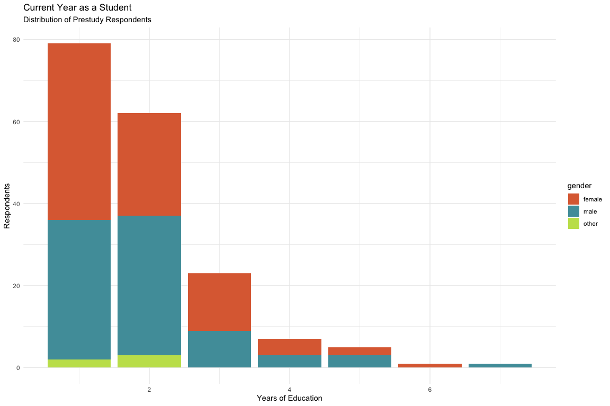

## 1. Demographic Data (Exploratry Data Analysis, a.k.a. Overview)


``` r
library(tidyverse)
library(gt)
source("analysfunc.R")
df_act = compose_df("user") |> 
  mutate(timestamp = ymd_hms(timestamp))
resp = elicit_respondents(df_act, no_timestamp = FALSE) |> 
  left_join(institute_lookup, by = c("subj" = "dep")) |> 
  na.omit()
```

Overall participants:


``` r
print(nrow(resp))
```

```
## [1] 175
```


Our respondent's data has 6 key observations:  

* `age` - age. 
* `gender` (with ability to enter gender if non-binary). 
* `subj` - department of the student's program/major. 
* `edu_year` - amount of years in the university. 
* `occup` - amount of years in Norway. 
* `family_acad` - highest degree of parents. 
* `orient`- sexual orientation. 


``` r
resp |> head() 
```

```
## # A tibble: 6 × 11
##   timestamp           id            age   gender gender_oth subj  edu_year occup
##   <dttm>              <chr>         <chr> <chr>  <chr>      <chr> <chr>    <chr>
## 1 2024-09-26 20:40:17 034010ca-4d6… 21    female ""         Depa… 2        21   
## 2 2024-09-30 11:01:02 04e683b9-5e1… 20    male   ""         Depa… 2        20   
## 3 2024-10-11 14:16:57 05bffbf4-08a… 20    male   ""         Depa… 1        13   
## 4 2024-09-30 10:59:54 07537ddc-800… 19    female ""         Depa… 2        19   
## 5 2024-09-27 07:36:03 07885f0e-1d1… 22    female ""         Depa… 2        22   
## 6 2024-09-26 15:42:22 08811b01-c6c… 21    female ""         Depa… 2        20   
## # ℹ 3 more variables: family_acad <chr>, orient <chr>, institute <chr>
```

Let's plot demographic data

### Age & Gender


``` r
resp |> 
  group_by(gender) |> 
  count()
```

```
## # A tibble: 3 × 2
## # Groups:   gender [3]
##   gender     n
##   <chr>  <int>
## 1 female    87
## 2 male      84
## 3 other      4
```

We see that gender is evenly distributed over the survey.


``` r
data_age_gender = resp |> 
    mutate(age = as.numeric(age)) |>
    count(age, gender) |>
    complete(age = 18:40, fill = list(n = 0))

ggplot(data_age_gender) +
  geom_bar(aes(x = age, y = n, fill = gender), stat = "identity") +
  theme_minimal() +
  labs(
    title = "Age/Gender Distribution of Prestudy Respondents",
    subtitle = "absolute values",
    x = "Age",
    y = "Respondents"
  ) +
  scale_fill_manual(values=c("#DD6C40", "#509DA9", "#C4E059"))
```

<!-- -->


``` r
ggplot(data_age_gender |> group_by(age) |> mutate(total_resp = sum(n)) |> filter(total_resp >= 10))+
  geom_bar(aes(x = age, y = n, fill = gender), stat = "identity", position = "fill") +
  theme_minimal() +
  labs(
    title = "Age/Gender Distribution of Prestudy Respondents",
    subtitle = "relative values for years with 10+ obs",
    x = "Age",
    y = "Respondents"
  ) +
  scale_fill_manual(values=c("#DD6C40", "#509DA9", "#C4E059"))
```

<!-- -->

Maybe it's make sense to replace gender "other" to non-binary in plots:


``` r
resp |> 
  filter(gender == "other") |> 
  select(gender_oth) |> 
  head()
```

```
## # A tibble: 4 × 1
##   gender_oth                
##   <chr>                     
## 1 ""                        
## 2 "Ikkje-bin<U+00E6>r"      
## 3 "Non-binary"              
## 4 "non binary (i think lol)"
```

### Departments & Institutes

We still have majority of students from ex-MATNAT, and 0 respondents from Medicine and Law Faculties:


``` r
data_inst_dep = resp |> 
  group_by(institute, subj) |> 
  count() |> 
  full_join(institute_lookup, by = c("institute", "subj" = "dep")) |> 
  mutate(n = ifelse(is.na(n), 0, n))

cutiepie = c("Faculty of Fine Art, Music and Design" = "#9A3FE5", "Faculty of Humanities" = "#D5CC4A", "Faculty of Law" = "#B73737", "Faculty of Mathematics and Natural Sciences" = "#2C968C", "Faculty of Medicine" = "#55DB46", "Faculty of Psychology" = "#3E63B3", "Faculty of Social Sciences" = "#C48E43")


institue_color = data_inst_dep |>
  group_by(institute) |> 
  count() |> 
  cbind(color = cutiepie) |>  # 7 institutes 7 colors
  select(-n)

dep_color_palette_vector = generate_department_colors(data_inst_dep, institue_color) 
dep_color_palette = data.frame(Name = names(dep_color_palette_vector), Value = dep_color_palette_vector, stringsAsFactors = FALSE, row.names = NULL)
data_inst_dep = data_inst_dep |> 
  left_join(dep_color_palette, by = c("subj" = "Name")) |> 
  mutate(institute_subj = interaction(institute, subj, sep = ": ")) |> 
  arrange(institute_subj)
```


``` r
data_inst_dep  |> 
  ggplot() +
  geom_bar(aes(x = institute, y = n), stat = "identity") +
  theme_minimal() + 
  labs(
    title = "Respondents by Institute",
    fill = "Department",
    x = "institute",
    y = "respondents"
  ) +
  theme(axis.text.x = element_text(angle = 45, hjust = 1, vjust = 1))
```

<!-- -->


``` r
data_inst_dep_nonull = data_inst_dep  |> 
  filter(n>0)
data_inst_dep_nonull |> 
  ggplot() +
  geom_bar(aes(x = institute, y = n, fill = institute_subj), stat = "identity") +
  theme_minimal() + 
  labs(
    title = "Respondents by Department",
    fill = "Department",
    x = "institute",
    y = "respondents"
  ) +
  theme(axis.text.x = element_text(angle = 45, hjust = 1, vjust = 1)) + 
  scale_fill_manual(values = data_inst_dep_nonull$Value) + 
  guides(fill = guide_legend(ncol = 1))
```

<!-- -->

### Education Year


``` r
data_edu_years = resp |> 
  mutate(edu_year = as.numeric(edu_year)) |> 
  group_by(gender, edu_year) |> 
  count(edu_year) |> 
  filter(edu_year < 10)

ggplot(data_edu_years) +
  geom_bar(aes(x = edu_year, y = n, fill = gender), stat = "identity") +
  theme_minimal() +
  labs(
    title = "Current Year as a Student",
    subtitle = "Distribution of Prestudy Respondents",
    x = "Years of Education",
    y = "Respondents"
  ) +
  scale_fill_manual(values=c("#DD6C40", "#509DA9", "#C4E059"))
```

<!-- -->

### Occupation

This was a proxy on native / international student:


``` r
cat(sum(resp$age == resp$occup), " ot of ", nrow(resp), " respondents lived in Norway the whole life (", round(sum(resp$age == resp$occup)/nrow(resp)*100,2), "%)", sep = "")
```

```
## 142 ot of 175 respondents lived in Norway the whole life (81.14%)
```

Only a small part of students are from abroad: 


``` r
resp_no_full_norw = resp |> 
  filter(age != occup) |> 
  select(age, occup) |> 
  mutate(
    age = as.numeric(age),
    occup = as.numeric(occup),
    diff = age - occup) |> 
  filter(diff > 0) 

resp_no_full_norw |> 
  summarise(average_age_occup_differnece = mean(diff))
```

```
## # A tibble: 1 × 1
##   average_age_occup_differnece
##                          <dbl>
## 1                         11.5
```


``` r
ggplot(resp_no_full_norw) + 
  geom_bar(aes(x = occup)) + 
  theme_minimal() + 
  labs(
    title = "Years in Norway",
    subtitle = "Distribution for students whos age != occup_years",
    x = "Years in Norway",
    y = "Respondents"
  )
```

<!-- -->

### First of the Family

Higher degree of family members can also correlate with the preformance, well-being, etc. 


``` r
data_family =  resp |> 
  group_by(family_acad, institute) |> 
  count() |> 
  mutate(family_acad = factor(family_acad,
                                 levels = c(
                                   "elementary school",
                                   "secondary school" ,
                                   "Bachelor (or equivalent)",
                                   "Master (or equivalent)",
                                   "PhD")),
         institute = factor(institute, 
                            levels = c("Faculty of Fine Art, Music and Design ", "Faculty of Humanities", "Faculty of Mathematics and Natural Sciences", "Faculty of Psychology", "Faculty of Social Sciences"))) |> 
  left_join(institue_color, by = "institute")

ggplot(data_family) +
  geom_bar(aes(x = family_acad, y = n), stat = "identity") + 
  theme_minimal() + 
  labs(
    title = "Parents' highest degree",
    x = "Highest Degree",
    y = "Respondents"
  ) 
```

<!-- -->


``` r
data_family  |> 
  arrange(institute) |> 
  ggplot() +
    geom_bar(aes(x = family_acad, y = n, fill = institute), stat = "identity") + 
    theme_minimal() + 
    labs(
      title = "Parents' highest degree",
      x = "Highest Degree",
      y = "Respondents", 
      fill = "Faculty"
    ) +
  scale_fill_manual(values = c(cutiepie[-3][-4], "black", "black", "black", "black"))
```

<!-- -->

### Sexual Orientation


``` r
data_so = resp |> 
  filter(orient != "") |> 
  group_by(orient) |> 
  count()

ggplot(data_so) +
  geom_bar(aes(x = orient, y = n), stat = "identity") + 
  theme_minimal() + 
  labs(
    title = "Sexual Orientation",
    x = "Highest Degree",
    y = "Orientation"
  ) +
  theme(axis.text.x = element_text(angle = 45, hjust = 1, vjust = 1))
```

<!-- -->

## 2. Responses Analysis


``` r
scale_genderness = c("Completely Masculine", "Mostly Masculine", "Slightly Masculine", "Neutral", "Slightly Feminine", "Mostly Feminine", "Completely Feminine")
scale_familiarity = c("Not Familiar at All", "Slightly Familiar", "Moderately Familiar", "Very Familiar", "Highly Familiar")

evals = compose_df("evals") |> 
  mutate(familiarity = factor(familiarity, levels = scale_familiarity),
         gender = factor(gender, levels = scale_genderness))
evals |>  head()
```

```
##                                     id round assessment
## 1 034010ca-4d68-4856-afa9-4d7cf8bbb003     1          0
## 2 034010ca-4d68-4856-afa9-4d7cf8bbb003     1          0
## 3 034010ca-4d68-4856-afa9-4d7cf8bbb003     1          0
## 4 034010ca-4d68-4856-afa9-4d7cf8bbb003     1          0
## 5 034010ca-4d68-4856-afa9-4d7cf8bbb003     1          0
## 6 034010ca-4d68-4856-afa9-4d7cf8bbb003     1          0
##                       topic         familiarity               gender intime
## 1     Ocean Waves Formation     Highly Familiar              Neutral   TRUE
## 2                      Soda       Very Familiar              Neutral   TRUE
## 3                Smartphone     Highly Familiar     Mostly Masculine   TRUE
## 4 World Health Organization Moderately Familiar              Neutral   TRUE
## 5              Acne Product     Highly Familiar              Neutral   TRUE
## 6      Computer Simulations     Highly Familiar Completely Masculine   TRUE
```

* For gender perception evaluations, as expected, totally normal distribution:


``` r
evals |> 
  group_by(gender_level = as.factor(gender)) |> 
  count() |> 
  ggplot() +
  geom_bar(aes(x = gender_level, y = n), stat = "identity") +
  theme_minimal() +
  labs(title = "Distribution of gender evaluations in the prestudy",
       x = "Level of gender perception",
       y = "Observations") + 
  theme(axis.text.x = element_text(angle = 45, hjust = 1, vjust = 1))
```

<!-- -->

* For familiarity evaluations, in contrast, there's a more versatile distribution:


``` r
evals |> 
  group_by(fam_level = as.factor(familiarity)) |> 
  count() |> 
  ggplot() +
  geom_bar(aes(x = fam_level, y = n), stat = "identity") +
  theme_minimal() +
  labs(title = "Distribution of familiarity evaluations in the prestudy",
       x = "Level of familiarity",
       y = "Observations") + 
  theme(axis.text.x = element_text(angle = 45, hjust = 1, vjust = 1))
```

<!-- -->

### Versioning

The versioning was not counted before `2024-10-11 16:25:40` [commit](https://git.app.uib.no/ii/did/sasha_prestudy/-/commit/a024deedc01d34c2cf22346d3590eee4f05526f4) due to mistake on application's design side. More data to be gathered to find out whether the mistake can cause additional biases in data.


``` r
df_act |> 
  filter(action == "version") |> 
  arrange(timestamp)
```

```
##             timestamp                                   id  action  value
## 1 2024-10-11 17:45:54 d10c248e-4ba8-442a-934a-06ba0089b7a3 version radios
## 2 2024-10-13 18:16:08 6d728738-486a-4e3f-ba5a-771d63ff9f5c version radios
## 3 2024-10-13 22:33:36 69a34f5c-193c-4043-a4e2-134c2ccb628f version radios
## 4 2024-10-13 23:11:48 95ae07a9-900f-4490-bdb7-7a97001b6285 version radios
```

### What topics are mostly perceived as masculine or feminine?z

There's a slight shift in topics set to a be more masculine:


``` r
evals2 = evals |> 
  mutate(gender = as.numeric(gender) - 4,
         familiarity = as.numeric(familiarity))

print(mean(evals2$gender))
```

```
## [1] -0.2331792
```

It also reflects on the most extreme topics: **first 11 masuline topic are more related to the gender than the 2nd femine topic**:


``` r
evals2_avgs = evals2 |> 
  filter(round == 1) |> 
  group_by(topic) |> 
  summarise(
    avg_fam = mean(familiarity),
    avg_gen = mean(gender),
    gen_eff = abs(avg_gen)
  ) 

evals2_avgs |> 
  arrange(-gen_eff) |> 
  head(15) |> 
  select(-gen_eff) |> 
  gt() |> 
  data_color(
    columns = vars(avg_gen),
    colors = scales::col_numeric(
      c("#509DA9", "#ffeb84", "#DD6C40"), 
      domain = c(-2.5, 0, 2))) |>
  cols_label(
    avg_fam = "avg.Familiarity",
    avg_gen = "avg.Gender Score"
  ) |> 
  tab_header(
    title = md("Top 15 topics that are mostly perceived as masculine or feminine"),
    subtitle = "sorted by absolute values"
  )
```

```
## Warning: Since gt v0.9.0, the `colors` argument has been deprecated.
## • Please use the `fn` argument instead.
## This warning is displayed once every 8 hours.
```

```
## Warning: Since gt v0.3.0, `columns = vars(...)` has been deprecated.
## • Please use `columns = c(...)` instead.
```

```{=html}
<div id="ecpxclzmat" style="padding-left:0px;padding-right:0px;padding-top:10px;padding-bottom:10px;overflow-x:auto;overflow-y:auto;width:auto;height:auto;">
<style>#ecpxclzmat table {
  font-family: system-ui, 'Segoe UI', Roboto, Helvetica, Arial, sans-serif, 'Apple Color Emoji', 'Segoe UI Emoji', 'Segoe UI Symbol', 'Noto Color Emoji';
  -webkit-font-smoothing: antialiased;
  -moz-osx-font-smoothing: grayscale;
}

#ecpxclzmat thead, #ecpxclzmat tbody, #ecpxclzmat tfoot, #ecpxclzmat tr, #ecpxclzmat td, #ecpxclzmat th {
  border-style: none;
}

#ecpxclzmat p {
  margin: 0;
  padding: 0;
}

#ecpxclzmat .gt_table {
  display: table;
  border-collapse: collapse;
  line-height: normal;
  margin-left: auto;
  margin-right: auto;
  color: #333333;
  font-size: 16px;
  font-weight: normal;
  font-style: normal;
  background-color: #FFFFFF;
  width: auto;
  border-top-style: solid;
  border-top-width: 2px;
  border-top-color: #A8A8A8;
  border-right-style: none;
  border-right-width: 2px;
  border-right-color: #D3D3D3;
  border-bottom-style: solid;
  border-bottom-width: 2px;
  border-bottom-color: #A8A8A8;
  border-left-style: none;
  border-left-width: 2px;
  border-left-color: #D3D3D3;
}

#ecpxclzmat .gt_caption {
  padding-top: 4px;
  padding-bottom: 4px;
}

#ecpxclzmat .gt_title {
  color: #333333;
  font-size: 125%;
  font-weight: initial;
  padding-top: 4px;
  padding-bottom: 4px;
  padding-left: 5px;
  padding-right: 5px;
  border-bottom-color: #FFFFFF;
  border-bottom-width: 0;
}

#ecpxclzmat .gt_subtitle {
  color: #333333;
  font-size: 85%;
  font-weight: initial;
  padding-top: 3px;
  padding-bottom: 5px;
  padding-left: 5px;
  padding-right: 5px;
  border-top-color: #FFFFFF;
  border-top-width: 0;
}

#ecpxclzmat .gt_heading {
  background-color: #FFFFFF;
  text-align: center;
  border-bottom-color: #FFFFFF;
  border-left-style: none;
  border-left-width: 1px;
  border-left-color: #D3D3D3;
  border-right-style: none;
  border-right-width: 1px;
  border-right-color: #D3D3D3;
}

#ecpxclzmat .gt_bottom_border {
  border-bottom-style: solid;
  border-bottom-width: 2px;
  border-bottom-color: #D3D3D3;
}

#ecpxclzmat .gt_col_headings {
  border-top-style: solid;
  border-top-width: 2px;
  border-top-color: #D3D3D3;
  border-bottom-style: solid;
  border-bottom-width: 2px;
  border-bottom-color: #D3D3D3;
  border-left-style: none;
  border-left-width: 1px;
  border-left-color: #D3D3D3;
  border-right-style: none;
  border-right-width: 1px;
  border-right-color: #D3D3D3;
}

#ecpxclzmat .gt_col_heading {
  color: #333333;
  background-color: #FFFFFF;
  font-size: 100%;
  font-weight: normal;
  text-transform: inherit;
  border-left-style: none;
  border-left-width: 1px;
  border-left-color: #D3D3D3;
  border-right-style: none;
  border-right-width: 1px;
  border-right-color: #D3D3D3;
  vertical-align: bottom;
  padding-top: 5px;
  padding-bottom: 6px;
  padding-left: 5px;
  padding-right: 5px;
  overflow-x: hidden;
}

#ecpxclzmat .gt_column_spanner_outer {
  color: #333333;
  background-color: #FFFFFF;
  font-size: 100%;
  font-weight: normal;
  text-transform: inherit;
  padding-top: 0;
  padding-bottom: 0;
  padding-left: 4px;
  padding-right: 4px;
}

#ecpxclzmat .gt_column_spanner_outer:first-child {
  padding-left: 0;
}

#ecpxclzmat .gt_column_spanner_outer:last-child {
  padding-right: 0;
}

#ecpxclzmat .gt_column_spanner {
  border-bottom-style: solid;
  border-bottom-width: 2px;
  border-bottom-color: #D3D3D3;
  vertical-align: bottom;
  padding-top: 5px;
  padding-bottom: 5px;
  overflow-x: hidden;
  display: inline-block;
  width: 100%;
}

#ecpxclzmat .gt_spanner_row {
  border-bottom-style: hidden;
}

#ecpxclzmat .gt_group_heading {
  padding-top: 8px;
  padding-bottom: 8px;
  padding-left: 5px;
  padding-right: 5px;
  color: #333333;
  background-color: #FFFFFF;
  font-size: 100%;
  font-weight: initial;
  text-transform: inherit;
  border-top-style: solid;
  border-top-width: 2px;
  border-top-color: #D3D3D3;
  border-bottom-style: solid;
  border-bottom-width: 2px;
  border-bottom-color: #D3D3D3;
  border-left-style: none;
  border-left-width: 1px;
  border-left-color: #D3D3D3;
  border-right-style: none;
  border-right-width: 1px;
  border-right-color: #D3D3D3;
  vertical-align: middle;
  text-align: left;
}

#ecpxclzmat .gt_empty_group_heading {
  padding: 0.5px;
  color: #333333;
  background-color: #FFFFFF;
  font-size: 100%;
  font-weight: initial;
  border-top-style: solid;
  border-top-width: 2px;
  border-top-color: #D3D3D3;
  border-bottom-style: solid;
  border-bottom-width: 2px;
  border-bottom-color: #D3D3D3;
  vertical-align: middle;
}

#ecpxclzmat .gt_from_md > :first-child {
  margin-top: 0;
}

#ecpxclzmat .gt_from_md > :last-child {
  margin-bottom: 0;
}

#ecpxclzmat .gt_row {
  padding-top: 8px;
  padding-bottom: 8px;
  padding-left: 5px;
  padding-right: 5px;
  margin: 10px;
  border-top-style: solid;
  border-top-width: 1px;
  border-top-color: #D3D3D3;
  border-left-style: none;
  border-left-width: 1px;
  border-left-color: #D3D3D3;
  border-right-style: none;
  border-right-width: 1px;
  border-right-color: #D3D3D3;
  vertical-align: middle;
  overflow-x: hidden;
}

#ecpxclzmat .gt_stub {
  color: #333333;
  background-color: #FFFFFF;
  font-size: 100%;
  font-weight: initial;
  text-transform: inherit;
  border-right-style: solid;
  border-right-width: 2px;
  border-right-color: #D3D3D3;
  padding-left: 5px;
  padding-right: 5px;
}

#ecpxclzmat .gt_stub_row_group {
  color: #333333;
  background-color: #FFFFFF;
  font-size: 100%;
  font-weight: initial;
  text-transform: inherit;
  border-right-style: solid;
  border-right-width: 2px;
  border-right-color: #D3D3D3;
  padding-left: 5px;
  padding-right: 5px;
  vertical-align: top;
}

#ecpxclzmat .gt_row_group_first td {
  border-top-width: 2px;
}

#ecpxclzmat .gt_row_group_first th {
  border-top-width: 2px;
}

#ecpxclzmat .gt_summary_row {
  color: #333333;
  background-color: #FFFFFF;
  text-transform: inherit;
  padding-top: 8px;
  padding-bottom: 8px;
  padding-left: 5px;
  padding-right: 5px;
}

#ecpxclzmat .gt_first_summary_row {
  border-top-style: solid;
  border-top-color: #D3D3D3;
}

#ecpxclzmat .gt_first_summary_row.thick {
  border-top-width: 2px;
}

#ecpxclzmat .gt_last_summary_row {
  padding-top: 8px;
  padding-bottom: 8px;
  padding-left: 5px;
  padding-right: 5px;
  border-bottom-style: solid;
  border-bottom-width: 2px;
  border-bottom-color: #D3D3D3;
}

#ecpxclzmat .gt_grand_summary_row {
  color: #333333;
  background-color: #FFFFFF;
  text-transform: inherit;
  padding-top: 8px;
  padding-bottom: 8px;
  padding-left: 5px;
  padding-right: 5px;
}

#ecpxclzmat .gt_first_grand_summary_row {
  padding-top: 8px;
  padding-bottom: 8px;
  padding-left: 5px;
  padding-right: 5px;
  border-top-style: double;
  border-top-width: 6px;
  border-top-color: #D3D3D3;
}

#ecpxclzmat .gt_last_grand_summary_row_top {
  padding-top: 8px;
  padding-bottom: 8px;
  padding-left: 5px;
  padding-right: 5px;
  border-bottom-style: double;
  border-bottom-width: 6px;
  border-bottom-color: #D3D3D3;
}

#ecpxclzmat .gt_striped {
  background-color: rgba(128, 128, 128, 0.05);
}

#ecpxclzmat .gt_table_body {
  border-top-style: solid;
  border-top-width: 2px;
  border-top-color: #D3D3D3;
  border-bottom-style: solid;
  border-bottom-width: 2px;
  border-bottom-color: #D3D3D3;
}

#ecpxclzmat .gt_footnotes {
  color: #333333;
  background-color: #FFFFFF;
  border-bottom-style: none;
  border-bottom-width: 2px;
  border-bottom-color: #D3D3D3;
  border-left-style: none;
  border-left-width: 2px;
  border-left-color: #D3D3D3;
  border-right-style: none;
  border-right-width: 2px;
  border-right-color: #D3D3D3;
}

#ecpxclzmat .gt_footnote {
  margin: 0px;
  font-size: 90%;
  padding-top: 4px;
  padding-bottom: 4px;
  padding-left: 5px;
  padding-right: 5px;
}

#ecpxclzmat .gt_sourcenotes {
  color: #333333;
  background-color: #FFFFFF;
  border-bottom-style: none;
  border-bottom-width: 2px;
  border-bottom-color: #D3D3D3;
  border-left-style: none;
  border-left-width: 2px;
  border-left-color: #D3D3D3;
  border-right-style: none;
  border-right-width: 2px;
  border-right-color: #D3D3D3;
}

#ecpxclzmat .gt_sourcenote {
  font-size: 90%;
  padding-top: 4px;
  padding-bottom: 4px;
  padding-left: 5px;
  padding-right: 5px;
}

#ecpxclzmat .gt_left {
  text-align: left;
}

#ecpxclzmat .gt_center {
  text-align: center;
}

#ecpxclzmat .gt_right {
  text-align: right;
  font-variant-numeric: tabular-nums;
}

#ecpxclzmat .gt_font_normal {
  font-weight: normal;
}

#ecpxclzmat .gt_font_bold {
  font-weight: bold;
}

#ecpxclzmat .gt_font_italic {
  font-style: italic;
}

#ecpxclzmat .gt_super {
  font-size: 65%;
}

#ecpxclzmat .gt_footnote_marks {
  font-size: 75%;
  vertical-align: 0.4em;
  position: initial;
}

#ecpxclzmat .gt_asterisk {
  font-size: 100%;
  vertical-align: 0;
}

#ecpxclzmat .gt_indent_1 {
  text-indent: 5px;
}

#ecpxclzmat .gt_indent_2 {
  text-indent: 10px;
}

#ecpxclzmat .gt_indent_3 {
  text-indent: 15px;
}

#ecpxclzmat .gt_indent_4 {
  text-indent: 20px;
}

#ecpxclzmat .gt_indent_5 {
  text-indent: 25px;
}

#ecpxclzmat .katex-display {
  display: inline-flex !important;
  margin-bottom: 0.75em !important;
}

#ecpxclzmat div.Reactable > div.rt-table > div.rt-thead > div.rt-tr.rt-tr-group-header > div.rt-th-group:after {
  height: 0px !important;
}
</style>
<table class="gt_table" data-quarto-disable-processing="false" data-quarto-bootstrap="false">
  <thead>
    <tr class="gt_heading">
      <td colspan="3" class="gt_heading gt_title gt_font_normal" style><span class='gt_from_md'>Top 15 topics that are mostly perceived as masculine or feminine</span></td>
    </tr>
    <tr class="gt_heading">
      <td colspan="3" class="gt_heading gt_subtitle gt_font_normal gt_bottom_border" style>sorted by absolute values</td>
    </tr>
    <tr class="gt_col_headings">
      <th class="gt_col_heading gt_columns_bottom_border gt_left" rowspan="1" colspan="1" scope="col" id="topic">topic</th>
      <th class="gt_col_heading gt_columns_bottom_border gt_right" rowspan="1" colspan="1" scope="col" id="avg.Familiarity">avg.Familiarity</th>
      <th class="gt_col_heading gt_columns_bottom_border gt_right" rowspan="1" colspan="1" scope="col" id="avg.Gender Score">avg.Gender Score</th>
    </tr>
  </thead>
  <tbody class="gt_table_body">
    <tr><td headers="topic" class="gt_row gt_left">Olympic Records</td>
<td headers="avg_fam" class="gt_row gt_right">3.500000</td>
<td headers="avg_gen" class="gt_row gt_right" style="background-color: #6BA5A6; color: #FFFFFF;">-2.2500000</td></tr>
    <tr><td headers="topic" class="gt_row gt_left">Species Extinction</td>
<td headers="avg_fam" class="gt_row gt_right">3.250000</td>
<td headers="avg_gen" class="gt_row gt_right" style="background-color: #96B69F; color: #000000;">-1.7500000</td></tr>
    <tr><td headers="topic" class="gt_row gt_left">Football Leagues and Rules</td>
<td headers="avg_fam" class="gt_row gt_right">2.609467</td>
<td headers="avg_gen" class="gt_row gt_right" style="background-color: #9FBA9D; color: #000000;">-1.6272189</td></tr>
    <tr><td headers="topic" class="gt_row gt_left">Strategic Planning</td>
<td headers="avg_fam" class="gt_row gt_right">3.500000</td>
<td headers="avg_gen" class="gt_row gt_right" style="background-color: #A9BF9B; color: #000000;">-1.5000000</td></tr>
    <tr><td headers="topic" class="gt_row gt_left">Video Games</td>
<td headers="avg_fam" class="gt_row gt_right">3.352941</td>
<td headers="avg_gen" class="gt_row gt_right" style="background-color: #A9BF9B; color: #000000;">-1.5000000</td></tr>
    <tr><td headers="topic" class="gt_row gt_left">Star Trek</td>
<td headers="avg_fam" class="gt_row gt_right">2.057143</td>
<td headers="avg_gen" class="gt_row gt_right" style="background-color: #BDC997; color: #000000;">-1.2190476</td></tr>
    <tr><td headers="topic" class="gt_row gt_left">Gas Station</td>
<td headers="avg_fam" class="gt_row gt_right">3.248555</td>
<td headers="avg_gen" class="gt_row gt_right" style="background-color: #C6CD94; color: #000000;">-1.0867052</td></tr>
    <tr><td headers="topic" class="gt_row gt_left">Acne Product</td>
<td headers="avg_fam" class="gt_row gt_right">2.902299</td>
<td headers="avg_gen" class="gt_row gt_right" style="background-color: #EEA25B; color: #000000;">1.0574713</td></tr>
    <tr><td headers="topic" class="gt_row gt_left">Computer Simulations</td>
<td headers="avg_fam" class="gt_row gt_right">3.108911</td>
<td headers="avg_gen" class="gt_row gt_right" style="background-color: #D0D292; color: #000000;">-0.9504950</td></tr>
    <tr><td headers="topic" class="gt_row gt_left">Comic</td>
<td headers="avg_fam" class="gt_row gt_right">2.986111</td>
<td headers="avg_gen" class="gt_row gt_right" style="background-color: #D1D392; color: #000000;">-0.9305556</td></tr>
    <tr><td headers="topic" class="gt_row gt_left">Carpentry</td>
<td headers="avg_fam" class="gt_row gt_right">2.514851</td>
<td headers="avg_gen" class="gt_row gt_right" style="background-color: #D6D590; color: #000000;">-0.8613861</td></tr>
    <tr><td headers="topic" class="gt_row gt_left">Frisbee Golf</td>
<td headers="avg_fam" class="gt_row gt_right">2.736111</td>
<td headers="avg_gen" class="gt_row gt_right" style="background-color: #D7D690; color: #000000;">-0.8472222</td></tr>
    <tr><td headers="topic" class="gt_row gt_left">HR management</td>
<td headers="avg_fam" class="gt_row gt_right">2.750000</td>
<td headers="avg_gen" class="gt_row gt_right" style="background-color: #F3B365; color: #000000;">0.7500000</td></tr>
    <tr><td headers="topic" class="gt_row gt_left">Files Navigation in PC</td>
<td headers="avg_fam" class="gt_row gt_right">3.104046</td>
<td headers="avg_gen" class="gt_row gt_right" style="background-color: #DFDA8E; color: #000000;">-0.7225434</td></tr>
    <tr><td headers="topic" class="gt_row gt_left">History of maths</td>
<td headers="avg_fam" class="gt_row gt_right">2.164384</td>
<td headers="avg_gen" class="gt_row gt_right" style="background-color: #E1DB8D; color: #000000;">-0.6986301</td></tr>
  </tbody>
  
  
</table>
</div>
```

Possible outcomes:

* as the topic list was generated entirely by males, it could be a design bias.  
  * e.g. things that were percieved as masculine are usually more specific (olympic records, star trek) than those that were considered as feminine (hr management, poetry). 
* maybe stimuli in psycology tend to be related with more protected class of students?

### Does the distribution of familiarity scores match gender perception?

There's no correlation or effect of familiarity on gender scores.  


``` r
ggplot(evals2_avgs) +
  geom_point(aes(x = avg_fam, y = avg_gen, color = avg_gen), size = 4) + 
  geom_hline(yintercept = 0, linetype = "dashed", alpha = 0.5) +
  theme_minimal() +
  labs(
    title = "Does the distribution of familiarity scores match gender perception?",
    x = "Average familiarity",
    y = "Average gender score",
    color = ""
  ) + 
  scale_color_gradient2(
    low = "#509DA9", 
    mid = "#ffeb84", 
    high = "#DD6C40", 
    midpoint = 0
  )
```

<!-- -->


``` r
summary(lm(avg_gen ~ avg_fam, evals2_avgs))
```

```
## 
## Call:
## lm(formula = avg_gen ~ avg_fam, data = evals2_avgs)
## 
## Residuals:
##      Min       1Q   Median       3Q      Max 
## -1.88670 -0.34788  0.03469  0.38498  1.41721 
## 
## Coefficients:
##             Estimate Std. Error t value Pr(>|t|)
## (Intercept) -0.34241    0.44977  -0.761    0.450
## avg_fam     -0.00597    0.14801  -0.040    0.968
## 
## Residual standard error: 0.6878 on 46 degrees of freedom
## Multiple R-squared:  3.536e-05,	Adjusted R-squared:  -0.0217 
## F-statistic: 0.001627 on 1 and 46 DF,  p-value: 0.968
```

* Students seem like hesitate to give extreme values to the topics even if they are familiar with it:


``` r
evals2 |> 
  filter(round == 1) |> 
  mutate(familiarity = as.factor(familiarity),
         gender = as.factor(gender)) |> 
  group_by(familiarity, gender) |> 
  count() |> 
  ggplot() +
    geom_bar(aes(x = gender, y = n), stat = "identity") +
    facet_grid(rows = vars(familiarity),
               labeller = as_labeller(c(`1` = "Not at All",
                                        `2` = "Slightly ",
                                        `3` = "Moderately ",
                                        `4` = "Very",
                                        `5` = "Highly"))) +
    theme_minimal() +
    labs(
      title = "Does the distribution of familiarity scores match gender perception?",
      x = "Average gender score",
      y = "N responses",
      
    ) + 
    scale_color_gradient2(
      low = "#509DA9", 
      mid = "#ffeb84", 
      high = "#DD6C40", 
      midpoint = 0
    )
```

<!-- -->

### Do men and women differ in the extent to which they associate the topics with the certain gender?


``` r
# evals  |> 
# left_join(
#   select(resp, id, gender), by = "gender" # rename required
# ) |> 
```

