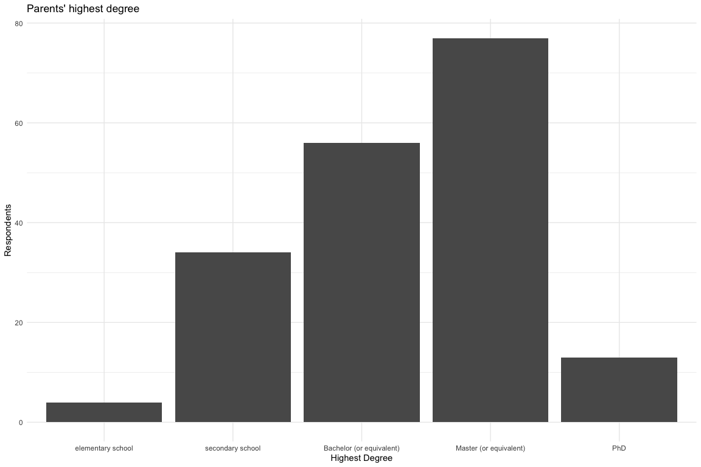
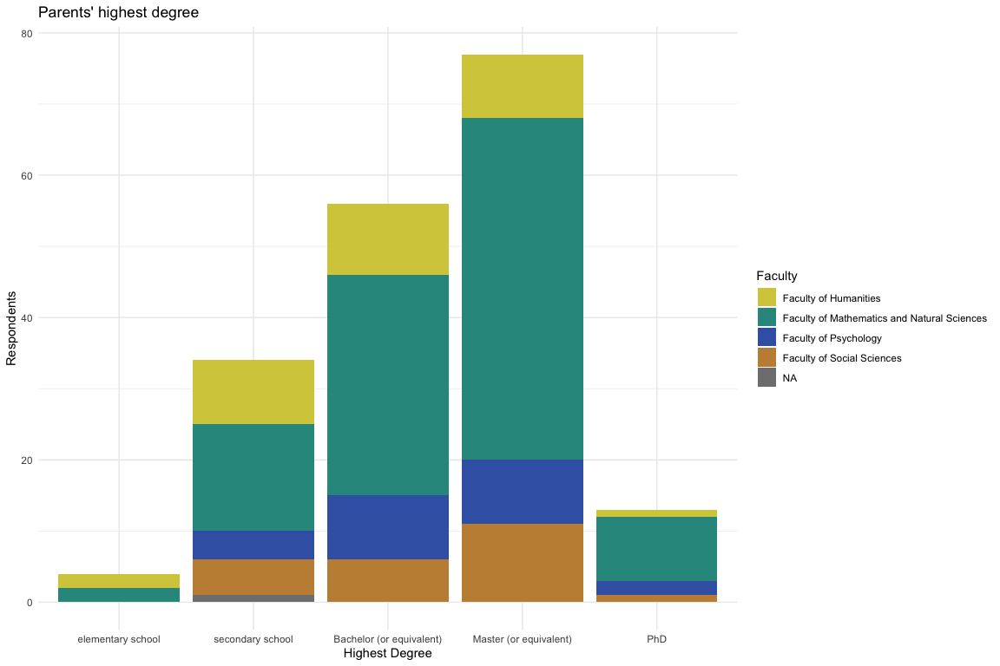

## 1. Demographic Data (Exploratry Data Analysis, a.k.a. Overview)


``` r
library(tidyverse)
library(gt)
source("analysfunc.R")
df_act = compose_action_df()
resp = elicit_respondents(df_act, no_timestamp = FALSE) |> 
  left_join(institute_lookup, by = c("subj" = "dep")) |> 
  na.omit()
```

Overall participants:


``` r
print(nrow(resp))
```

```
## [1] 171
```


Our respondent's data has 6 key observations:  

* `age` - age. 
* `gender` (with ability to enter gender if non-binary). 
* `subj` - department of the student's program/major. 
* `edu_year` - amount of years in the university. 
* `occup` - amount of years in Norway. 
* `family_acad` - highest degree of parents. 
* `orient`- sexual orientation. 


``` r
resp |>  head() |>  gt()
```

```{=html}
<div id="yhgwagectx" style="padding-left:0px;padding-right:0px;padding-top:10px;padding-bottom:10px;overflow-x:auto;overflow-y:auto;width:auto;height:auto;">
<style>#yhgwagectx table {
  font-family: system-ui, 'Segoe UI', Roboto, Helvetica, Arial, sans-serif, 'Apple Color Emoji', 'Segoe UI Emoji', 'Segoe UI Symbol', 'Noto Color Emoji';
  -webkit-font-smoothing: antialiased;
  -moz-osx-font-smoothing: grayscale;
}

#yhgwagectx thead, #yhgwagectx tbody, #yhgwagectx tfoot, #yhgwagectx tr, #yhgwagectx td, #yhgwagectx th {
  border-style: none;
}

#yhgwagectx p {
  margin: 0;
  padding: 0;
}

#yhgwagectx .gt_table {
  display: table;
  border-collapse: collapse;
  line-height: normal;
  margin-left: auto;
  margin-right: auto;
  color: #333333;
  font-size: 16px;
  font-weight: normal;
  font-style: normal;
  background-color: #FFFFFF;
  width: auto;
  border-top-style: solid;
  border-top-width: 2px;
  border-top-color: #A8A8A8;
  border-right-style: none;
  border-right-width: 2px;
  border-right-color: #D3D3D3;
  border-bottom-style: solid;
  border-bottom-width: 2px;
  border-bottom-color: #A8A8A8;
  border-left-style: none;
  border-left-width: 2px;
  border-left-color: #D3D3D3;
}

#yhgwagectx .gt_caption {
  padding-top: 4px;
  padding-bottom: 4px;
}

#yhgwagectx .gt_title {
  color: #333333;
  font-size: 125%;
  font-weight: initial;
  padding-top: 4px;
  padding-bottom: 4px;
  padding-left: 5px;
  padding-right: 5px;
  border-bottom-color: #FFFFFF;
  border-bottom-width: 0;
}

#yhgwagectx .gt_subtitle {
  color: #333333;
  font-size: 85%;
  font-weight: initial;
  padding-top: 3px;
  padding-bottom: 5px;
  padding-left: 5px;
  padding-right: 5px;
  border-top-color: #FFFFFF;
  border-top-width: 0;
}

#yhgwagectx .gt_heading {
  background-color: #FFFFFF;
  text-align: center;
  border-bottom-color: #FFFFFF;
  border-left-style: none;
  border-left-width: 1px;
  border-left-color: #D3D3D3;
  border-right-style: none;
  border-right-width: 1px;
  border-right-color: #D3D3D3;
}

#yhgwagectx .gt_bottom_border {
  border-bottom-style: solid;
  border-bottom-width: 2px;
  border-bottom-color: #D3D3D3;
}

#yhgwagectx .gt_col_headings {
  border-top-style: solid;
  border-top-width: 2px;
  border-top-color: #D3D3D3;
  border-bottom-style: solid;
  border-bottom-width: 2px;
  border-bottom-color: #D3D3D3;
  border-left-style: none;
  border-left-width: 1px;
  border-left-color: #D3D3D3;
  border-right-style: none;
  border-right-width: 1px;
  border-right-color: #D3D3D3;
}

#yhgwagectx .gt_col_heading {
  color: #333333;
  background-color: #FFFFFF;
  font-size: 100%;
  font-weight: normal;
  text-transform: inherit;
  border-left-style: none;
  border-left-width: 1px;
  border-left-color: #D3D3D3;
  border-right-style: none;
  border-right-width: 1px;
  border-right-color: #D3D3D3;
  vertical-align: bottom;
  padding-top: 5px;
  padding-bottom: 6px;
  padding-left: 5px;
  padding-right: 5px;
  overflow-x: hidden;
}

#yhgwagectx .gt_column_spanner_outer {
  color: #333333;
  background-color: #FFFFFF;
  font-size: 100%;
  font-weight: normal;
  text-transform: inherit;
  padding-top: 0;
  padding-bottom: 0;
  padding-left: 4px;
  padding-right: 4px;
}

#yhgwagectx .gt_column_spanner_outer:first-child {
  padding-left: 0;
}

#yhgwagectx .gt_column_spanner_outer:last-child {
  padding-right: 0;
}

#yhgwagectx .gt_column_spanner {
  border-bottom-style: solid;
  border-bottom-width: 2px;
  border-bottom-color: #D3D3D3;
  vertical-align: bottom;
  padding-top: 5px;
  padding-bottom: 5px;
  overflow-x: hidden;
  display: inline-block;
  width: 100%;
}

#yhgwagectx .gt_spanner_row {
  border-bottom-style: hidden;
}

#yhgwagectx .gt_group_heading {
  padding-top: 8px;
  padding-bottom: 8px;
  padding-left: 5px;
  padding-right: 5px;
  color: #333333;
  background-color: #FFFFFF;
  font-size: 100%;
  font-weight: initial;
  text-transform: inherit;
  border-top-style: solid;
  border-top-width: 2px;
  border-top-color: #D3D3D3;
  border-bottom-style: solid;
  border-bottom-width: 2px;
  border-bottom-color: #D3D3D3;
  border-left-style: none;
  border-left-width: 1px;
  border-left-color: #D3D3D3;
  border-right-style: none;
  border-right-width: 1px;
  border-right-color: #D3D3D3;
  vertical-align: middle;
  text-align: left;
}

#yhgwagectx .gt_empty_group_heading {
  padding: 0.5px;
  color: #333333;
  background-color: #FFFFFF;
  font-size: 100%;
  font-weight: initial;
  border-top-style: solid;
  border-top-width: 2px;
  border-top-color: #D3D3D3;
  border-bottom-style: solid;
  border-bottom-width: 2px;
  border-bottom-color: #D3D3D3;
  vertical-align: middle;
}

#yhgwagectx .gt_from_md > :first-child {
  margin-top: 0;
}

#yhgwagectx .gt_from_md > :last-child {
  margin-bottom: 0;
}

#yhgwagectx .gt_row {
  padding-top: 8px;
  padding-bottom: 8px;
  padding-left: 5px;
  padding-right: 5px;
  margin: 10px;
  border-top-style: solid;
  border-top-width: 1px;
  border-top-color: #D3D3D3;
  border-left-style: none;
  border-left-width: 1px;
  border-left-color: #D3D3D3;
  border-right-style: none;
  border-right-width: 1px;
  border-right-color: #D3D3D3;
  vertical-align: middle;
  overflow-x: hidden;
}

#yhgwagectx .gt_stub {
  color: #333333;
  background-color: #FFFFFF;
  font-size: 100%;
  font-weight: initial;
  text-transform: inherit;
  border-right-style: solid;
  border-right-width: 2px;
  border-right-color: #D3D3D3;
  padding-left: 5px;
  padding-right: 5px;
}

#yhgwagectx .gt_stub_row_group {
  color: #333333;
  background-color: #FFFFFF;
  font-size: 100%;
  font-weight: initial;
  text-transform: inherit;
  border-right-style: solid;
  border-right-width: 2px;
  border-right-color: #D3D3D3;
  padding-left: 5px;
  padding-right: 5px;
  vertical-align: top;
}

#yhgwagectx .gt_row_group_first td {
  border-top-width: 2px;
}

#yhgwagectx .gt_row_group_first th {
  border-top-width: 2px;
}

#yhgwagectx .gt_summary_row {
  color: #333333;
  background-color: #FFFFFF;
  text-transform: inherit;
  padding-top: 8px;
  padding-bottom: 8px;
  padding-left: 5px;
  padding-right: 5px;
}

#yhgwagectx .gt_first_summary_row {
  border-top-style: solid;
  border-top-color: #D3D3D3;
}

#yhgwagectx .gt_first_summary_row.thick {
  border-top-width: 2px;
}

#yhgwagectx .gt_last_summary_row {
  padding-top: 8px;
  padding-bottom: 8px;
  padding-left: 5px;
  padding-right: 5px;
  border-bottom-style: solid;
  border-bottom-width: 2px;
  border-bottom-color: #D3D3D3;
}

#yhgwagectx .gt_grand_summary_row {
  color: #333333;
  background-color: #FFFFFF;
  text-transform: inherit;
  padding-top: 8px;
  padding-bottom: 8px;
  padding-left: 5px;
  padding-right: 5px;
}

#yhgwagectx .gt_first_grand_summary_row {
  padding-top: 8px;
  padding-bottom: 8px;
  padding-left: 5px;
  padding-right: 5px;
  border-top-style: double;
  border-top-width: 6px;
  border-top-color: #D3D3D3;
}

#yhgwagectx .gt_last_grand_summary_row_top {
  padding-top: 8px;
  padding-bottom: 8px;
  padding-left: 5px;
  padding-right: 5px;
  border-bottom-style: double;
  border-bottom-width: 6px;
  border-bottom-color: #D3D3D3;
}

#yhgwagectx .gt_striped {
  background-color: rgba(128, 128, 128, 0.05);
}

#yhgwagectx .gt_table_body {
  border-top-style: solid;
  border-top-width: 2px;
  border-top-color: #D3D3D3;
  border-bottom-style: solid;
  border-bottom-width: 2px;
  border-bottom-color: #D3D3D3;
}

#yhgwagectx .gt_footnotes {
  color: #333333;
  background-color: #FFFFFF;
  border-bottom-style: none;
  border-bottom-width: 2px;
  border-bottom-color: #D3D3D3;
  border-left-style: none;
  border-left-width: 2px;
  border-left-color: #D3D3D3;
  border-right-style: none;
  border-right-width: 2px;
  border-right-color: #D3D3D3;
}

#yhgwagectx .gt_footnote {
  margin: 0px;
  font-size: 90%;
  padding-top: 4px;
  padding-bottom: 4px;
  padding-left: 5px;
  padding-right: 5px;
}

#yhgwagectx .gt_sourcenotes {
  color: #333333;
  background-color: #FFFFFF;
  border-bottom-style: none;
  border-bottom-width: 2px;
  border-bottom-color: #D3D3D3;
  border-left-style: none;
  border-left-width: 2px;
  border-left-color: #D3D3D3;
  border-right-style: none;
  border-right-width: 2px;
  border-right-color: #D3D3D3;
}

#yhgwagectx .gt_sourcenote {
  font-size: 90%;
  padding-top: 4px;
  padding-bottom: 4px;
  padding-left: 5px;
  padding-right: 5px;
}

#yhgwagectx .gt_left {
  text-align: left;
}

#yhgwagectx .gt_center {
  text-align: center;
}

#yhgwagectx .gt_right {
  text-align: right;
  font-variant-numeric: tabular-nums;
}

#yhgwagectx .gt_font_normal {
  font-weight: normal;
}

#yhgwagectx .gt_font_bold {
  font-weight: bold;
}

#yhgwagectx .gt_font_italic {
  font-style: italic;
}

#yhgwagectx .gt_super {
  font-size: 65%;
}

#yhgwagectx .gt_footnote_marks {
  font-size: 75%;
  vertical-align: 0.4em;
  position: initial;
}

#yhgwagectx .gt_asterisk {
  font-size: 100%;
  vertical-align: 0;
}

#yhgwagectx .gt_indent_1 {
  text-indent: 5px;
}

#yhgwagectx .gt_indent_2 {
  text-indent: 10px;
}

#yhgwagectx .gt_indent_3 {
  text-indent: 15px;
}

#yhgwagectx .gt_indent_4 {
  text-indent: 20px;
}

#yhgwagectx .gt_indent_5 {
  text-indent: 25px;
}

#yhgwagectx .katex-display {
  display: inline-flex !important;
  margin-bottom: 0.75em !important;
}

#yhgwagectx div.Reactable > div.rt-table > div.rt-thead > div.rt-tr.rt-tr-group-header > div.rt-th-group:after {
  height: 0px !important;
}
</style>
<table class="gt_table" data-quarto-disable-processing="false" data-quarto-bootstrap="false">
  <thead>
    <tr class="gt_col_headings">
      <th class="gt_col_heading gt_columns_bottom_border gt_right" rowspan="1" colspan="1" scope="col" id="timestamp">timestamp</th>
      <th class="gt_col_heading gt_columns_bottom_border gt_left" rowspan="1" colspan="1" scope="col" id="id">id</th>
      <th class="gt_col_heading gt_columns_bottom_border gt_right" rowspan="1" colspan="1" scope="col" id="age">age</th>
      <th class="gt_col_heading gt_columns_bottom_border gt_left" rowspan="1" colspan="1" scope="col" id="gender">gender</th>
      <th class="gt_col_heading gt_columns_bottom_border gt_right" rowspan="1" colspan="1" scope="col" id="gender_oth">gender_oth</th>
      <th class="gt_col_heading gt_columns_bottom_border gt_left" rowspan="1" colspan="1" scope="col" id="subj">subj</th>
      <th class="gt_col_heading gt_columns_bottom_border gt_right" rowspan="1" colspan="1" scope="col" id="edu_year">edu_year</th>
      <th class="gt_col_heading gt_columns_bottom_border gt_right" rowspan="1" colspan="1" scope="col" id="occup">occup</th>
      <th class="gt_col_heading gt_columns_bottom_border gt_left" rowspan="1" colspan="1" scope="col" id="family_acad">family_acad</th>
      <th class="gt_col_heading gt_columns_bottom_border gt_left" rowspan="1" colspan="1" scope="col" id="orient">orient</th>
      <th class="gt_col_heading gt_columns_bottom_border gt_left" rowspan="1" colspan="1" scope="col" id="institute">institute</th>
    </tr>
  </thead>
  <tbody class="gt_table_body">
    <tr><td headers="timestamp" class="gt_row gt_right">2024-09-26 20:40:17</td>
<td headers="id" class="gt_row gt_left">034010ca-4d68-4856-afa9-4d7cf8bbb003</td>
<td headers="age" class="gt_row gt_right">21</td>
<td headers="gender" class="gt_row gt_left">female</td>
<td headers="gender_oth" class="gt_row gt_right"></td>
<td headers="subj" class="gt_row gt_left">Department of Earth Science</td>
<td headers="edu_year" class="gt_row gt_right">2</td>
<td headers="occup" class="gt_row gt_right">21</td>
<td headers="family_acad" class="gt_row gt_left">Master (or equivalent)</td>
<td headers="orient" class="gt_row gt_left">heterosexual / straight</td>
<td headers="institute" class="gt_row gt_left">Faculty of Mathematics and Natural Sciences</td></tr>
    <tr><td headers="timestamp" class="gt_row gt_right">2024-09-30 11:01:02</td>
<td headers="id" class="gt_row gt_left">04e683b9-5e14-48b9-90cb-54062b158735</td>
<td headers="age" class="gt_row gt_right">20</td>
<td headers="gender" class="gt_row gt_left">male</td>
<td headers="gender_oth" class="gt_row gt_right"></td>
<td headers="subj" class="gt_row gt_left">Department of Informatics</td>
<td headers="edu_year" class="gt_row gt_right">2</td>
<td headers="occup" class="gt_row gt_right">20</td>
<td headers="family_acad" class="gt_row gt_left">secondary school</td>
<td headers="orient" class="gt_row gt_left">heterosexual / straight</td>
<td headers="institute" class="gt_row gt_left">Faculty of Mathematics and Natural Sciences</td></tr>
    <tr><td headers="timestamp" class="gt_row gt_right">2024-10-11 14:16:57</td>
<td headers="id" class="gt_row gt_left">05bffbf4-08a1-42f8-b937-09d1452c2dee</td>
<td headers="age" class="gt_row gt_right">20</td>
<td headers="gender" class="gt_row gt_left">male</td>
<td headers="gender_oth" class="gt_row gt_right"></td>
<td headers="subj" class="gt_row gt_left">Department of Physics and Technology</td>
<td headers="edu_year" class="gt_row gt_right">1</td>
<td headers="occup" class="gt_row gt_right">13</td>
<td headers="family_acad" class="gt_row gt_left">PhD</td>
<td headers="orient" class="gt_row gt_left">heterosexual / straight</td>
<td headers="institute" class="gt_row gt_left">Faculty of Mathematics and Natural Sciences</td></tr>
    <tr><td headers="timestamp" class="gt_row gt_right">2024-09-30 10:59:54</td>
<td headers="id" class="gt_row gt_left">07537ddc-8002-4fa6-8905-5ef8d208bd99</td>
<td headers="age" class="gt_row gt_right">19</td>
<td headers="gender" class="gt_row gt_left">female</td>
<td headers="gender_oth" class="gt_row gt_right"></td>
<td headers="subj" class="gt_row gt_left">Department of Informatics</td>
<td headers="edu_year" class="gt_row gt_right">2</td>
<td headers="occup" class="gt_row gt_right">19</td>
<td headers="family_acad" class="gt_row gt_left">secondary school</td>
<td headers="orient" class="gt_row gt_left">heterosexual / straight</td>
<td headers="institute" class="gt_row gt_left">Faculty of Mathematics and Natural Sciences</td></tr>
    <tr><td headers="timestamp" class="gt_row gt_right">2024-09-27 07:36:03</td>
<td headers="id" class="gt_row gt_left">07885f0e-1d19-4890-80a5-6406f5bd7250</td>
<td headers="age" class="gt_row gt_right">22</td>
<td headers="gender" class="gt_row gt_left">female</td>
<td headers="gender_oth" class="gt_row gt_right"></td>
<td headers="subj" class="gt_row gt_left">Department of Education</td>
<td headers="edu_year" class="gt_row gt_right">2</td>
<td headers="occup" class="gt_row gt_right">22</td>
<td headers="family_acad" class="gt_row gt_left">secondary school</td>
<td headers="orient" class="gt_row gt_left">heterosexual / straight</td>
<td headers="institute" class="gt_row gt_left">Faculty of Psychology</td></tr>
    <tr><td headers="timestamp" class="gt_row gt_right">2024-09-26 15:42:22</td>
<td headers="id" class="gt_row gt_left">08811b01-c6c4-4316-9db0-047e74fe7802</td>
<td headers="age" class="gt_row gt_right">21</td>
<td headers="gender" class="gt_row gt_left">female</td>
<td headers="gender_oth" class="gt_row gt_right"></td>
<td headers="subj" class="gt_row gt_left">Department of Earth Science</td>
<td headers="edu_year" class="gt_row gt_right">2</td>
<td headers="occup" class="gt_row gt_right">20</td>
<td headers="family_acad" class="gt_row gt_left">Bachelor (or equivalent)</td>
<td headers="orient" class="gt_row gt_left">heterosexual / straight</td>
<td headers="institute" class="gt_row gt_left">Faculty of Mathematics and Natural Sciences</td></tr>
  </tbody>
  
  
</table>
</div>
```

Let's plot demographic data

### Age & Gender


``` r
resp |> 
  group_by(gender) |> 
  count()
```

```
## # A tibble: 3 × 2
## # Groups:   gender [3]
##   gender     n
##   <chr>  <int>
## 1 female    84
## 2 male      83
## 3 other      4
```

We see that gender is evenly distributed over the survey.


``` r
data_age_gender = resp |> 
    mutate(age = as.numeric(age)) |>
    count(age, gender) |>
    complete(age = 18:40, fill = list(n = 0))

ggplot(data_age_gender) +
  geom_bar(aes(x = age, y = n, fill = gender), stat = "identity") +
  theme_minimal() +
  labs(
    title = "Age/Gender Distribution of Prestudy Respondents",
    subtitle = "absolute values",
    x = "Age",
    y = "Respondents"
  ) +
  scale_fill_manual(values=c("#DD6C40", "#509DA9", "#C4E059"))
```

<!-- -->


``` r
ggplot(data_age_gender |> group_by(age) |> mutate(total_resp = sum(n)) |> filter(total_resp >= 10))+
  geom_bar(aes(x = age, y = n, fill = gender), stat = "identity", position = "fill") +
  theme_minimal() +
  labs(
    title = "Age/Gender Distribution of Prestudy Respondents",
    subtitle = "relative values for years with 10+ obs",
    x = "Age",
    y = "Respondents"
  ) +
  scale_fill_manual(values=c("#DD6C40", "#509DA9", "#C4E059"))
```

<!-- -->

Maybe it's make sense to replace gender "other" to non-binary in plots:


``` r
resp |> 
  filter(gender == "other") |> 
  select(gender_oth) |> 
  head()
```

```
## # A tibble: 4 × 1
##   gender_oth                
##   <chr>                     
## 1 ""                        
## 2 "Ikkje-bin<U+00E6>r"      
## 3 "Non-binary"              
## 4 "non binary (i think lol)"
```

### Departments & Institutes

We still have majority of students from ex-MATNAT, and 0 respondents from Medicine and Law Faculties:


``` r
data_inst_dep = resp |> 
  group_by(institute, subj) |> 
  count() |> 
  full_join(institute_lookup, by = c("institute", "subj" = "dep")) |> 
  mutate(n = ifelse(is.na(n), 0, n))

cutiepie = c("Faculty of Fine Art, Music and Design" = "#9A3FE5", "Faculty of Humanities" = "#D5CC4A", "Faculty of Law" = "#B73737", "Faculty of Mathematics and Natural Sciences" = "#2C968C", "Faculty of Medicine" = "#55DB46", "Faculty of Psychology" = "#3E63B3", "Faculty of Social Sciences" = "#C48E43")


institue_color = data_inst_dep |>
  group_by(institute) |> 
  count() |> 
  cbind(color = cutiepie) |>  # 7 institutes 7 colors
  select(-n)

dep_color_palette_vector = generate_department_colors(data_inst_dep, institue_color) 
dep_color_palette = data.frame(Name = names(dep_color_palette_vector), Value = dep_color_palette_vector, stringsAsFactors = FALSE, row.names = NULL)
data_inst_dep = data_inst_dep |> 
  left_join(dep_color_palette, by = c("subj" = "Name")) |> 
  mutate(institute_subj = interaction(institute, subj, sep = ": ")) |> 
  arrange(institute_subj)
```


``` r
data_inst_dep  |> 
  ggplot() +
  geom_bar(aes(x = institute, y = n), stat = "identity") +
  theme_minimal() + 
  labs(
    title = "Respondents by Institute",
    fill = "Department",
    x = "institute",
    y = "respondents"
  ) +
  theme(axis.text.x = element_text(angle = 45, hjust = 1, vjust = 1))
```

<!-- -->


``` r
data_inst_dep_nonull = data_inst_dep  |> 
  filter(n>0)
data_inst_dep_nonull |> 
  ggplot() +
  geom_bar(aes(x = institute, y = n, fill = institute_subj), stat = "identity") +
  theme_minimal() + 
  labs(
    title = "Respondents by Department",
    fill = "Department",
    x = "institute",
    y = "respondents"
  ) +
  theme(axis.text.x = element_text(angle = 45, hjust = 1, vjust = 1)) + 
  scale_fill_manual(values = data_inst_dep_nonull$Value) + 
  guides(fill = guide_legend(ncol = 1))
```

<!-- -->

### Education Year


``` r
data_edu_years = resp |> 
  mutate(edu_year = as.numeric(edu_year)) |> 
  group_by(gender, edu_year) |> 
  count(edu_year) |> 
  filter(edu_year < 10)

ggplot(data_edu_years) +
  geom_bar(aes(x = edu_year, y = n, fill = gender), stat = "identity") +
  theme_minimal() +
  labs(
    title = "Current Year as a Student",
    subtitle = "Distribution of Prestudy Respondents",
    x = "Years of Education",
    y = "Respondents"
  ) +
  scale_fill_manual(values=c("#DD6C40", "#509DA9", "#C4E059"))
```

<!-- -->

### Occupation

This was a proxy on native / international student:


``` r
cat(sum(resp$age == resp$occup), " ot of ", nrow(resp), " respondents lived in Norway the whole life (", round(sum(resp$age == resp$occup)/nrow(resp)*100,2), "%)", sep = "")
```

```
## 138 ot of 171 respondents lived in Norway the whole life (80.7%)
```

Only a small part of students are from abroad: 


``` r
resp_no_full_norw = resp |> 
  filter(age != occup) |> 
  select(age, occup) |> 
  mutate(
    age = as.numeric(age),
    occup = as.numeric(occup),
    diff = age - occup) |> 
  filter(diff > 0) 

resp_no_full_norw |> 
  summarise(average_age_occup_differnece = mean(diff)) |> 
  gt()
```

```{=html}
<div id="velaniwzye" style="padding-left:0px;padding-right:0px;padding-top:10px;padding-bottom:10px;overflow-x:auto;overflow-y:auto;width:auto;height:auto;">
<style>#velaniwzye table {
  font-family: system-ui, 'Segoe UI', Roboto, Helvetica, Arial, sans-serif, 'Apple Color Emoji', 'Segoe UI Emoji', 'Segoe UI Symbol', 'Noto Color Emoji';
  -webkit-font-smoothing: antialiased;
  -moz-osx-font-smoothing: grayscale;
}

#velaniwzye thead, #velaniwzye tbody, #velaniwzye tfoot, #velaniwzye tr, #velaniwzye td, #velaniwzye th {
  border-style: none;
}

#velaniwzye p {
  margin: 0;
  padding: 0;
}

#velaniwzye .gt_table {
  display: table;
  border-collapse: collapse;
  line-height: normal;
  margin-left: auto;
  margin-right: auto;
  color: #333333;
  font-size: 16px;
  font-weight: normal;
  font-style: normal;
  background-color: #FFFFFF;
  width: auto;
  border-top-style: solid;
  border-top-width: 2px;
  border-top-color: #A8A8A8;
  border-right-style: none;
  border-right-width: 2px;
  border-right-color: #D3D3D3;
  border-bottom-style: solid;
  border-bottom-width: 2px;
  border-bottom-color: #A8A8A8;
  border-left-style: none;
  border-left-width: 2px;
  border-left-color: #D3D3D3;
}

#velaniwzye .gt_caption {
  padding-top: 4px;
  padding-bottom: 4px;
}

#velaniwzye .gt_title {
  color: #333333;
  font-size: 125%;
  font-weight: initial;
  padding-top: 4px;
  padding-bottom: 4px;
  padding-left: 5px;
  padding-right: 5px;
  border-bottom-color: #FFFFFF;
  border-bottom-width: 0;
}

#velaniwzye .gt_subtitle {
  color: #333333;
  font-size: 85%;
  font-weight: initial;
  padding-top: 3px;
  padding-bottom: 5px;
  padding-left: 5px;
  padding-right: 5px;
  border-top-color: #FFFFFF;
  border-top-width: 0;
}

#velaniwzye .gt_heading {
  background-color: #FFFFFF;
  text-align: center;
  border-bottom-color: #FFFFFF;
  border-left-style: none;
  border-left-width: 1px;
  border-left-color: #D3D3D3;
  border-right-style: none;
  border-right-width: 1px;
  border-right-color: #D3D3D3;
}

#velaniwzye .gt_bottom_border {
  border-bottom-style: solid;
  border-bottom-width: 2px;
  border-bottom-color: #D3D3D3;
}

#velaniwzye .gt_col_headings {
  border-top-style: solid;
  border-top-width: 2px;
  border-top-color: #D3D3D3;
  border-bottom-style: solid;
  border-bottom-width: 2px;
  border-bottom-color: #D3D3D3;
  border-left-style: none;
  border-left-width: 1px;
  border-left-color: #D3D3D3;
  border-right-style: none;
  border-right-width: 1px;
  border-right-color: #D3D3D3;
}

#velaniwzye .gt_col_heading {
  color: #333333;
  background-color: #FFFFFF;
  font-size: 100%;
  font-weight: normal;
  text-transform: inherit;
  border-left-style: none;
  border-left-width: 1px;
  border-left-color: #D3D3D3;
  border-right-style: none;
  border-right-width: 1px;
  border-right-color: #D3D3D3;
  vertical-align: bottom;
  padding-top: 5px;
  padding-bottom: 6px;
  padding-left: 5px;
  padding-right: 5px;
  overflow-x: hidden;
}

#velaniwzye .gt_column_spanner_outer {
  color: #333333;
  background-color: #FFFFFF;
  font-size: 100%;
  font-weight: normal;
  text-transform: inherit;
  padding-top: 0;
  padding-bottom: 0;
  padding-left: 4px;
  padding-right: 4px;
}

#velaniwzye .gt_column_spanner_outer:first-child {
  padding-left: 0;
}

#velaniwzye .gt_column_spanner_outer:last-child {
  padding-right: 0;
}

#velaniwzye .gt_column_spanner {
  border-bottom-style: solid;
  border-bottom-width: 2px;
  border-bottom-color: #D3D3D3;
  vertical-align: bottom;
  padding-top: 5px;
  padding-bottom: 5px;
  overflow-x: hidden;
  display: inline-block;
  width: 100%;
}

#velaniwzye .gt_spanner_row {
  border-bottom-style: hidden;
}

#velaniwzye .gt_group_heading {
  padding-top: 8px;
  padding-bottom: 8px;
  padding-left: 5px;
  padding-right: 5px;
  color: #333333;
  background-color: #FFFFFF;
  font-size: 100%;
  font-weight: initial;
  text-transform: inherit;
  border-top-style: solid;
  border-top-width: 2px;
  border-top-color: #D3D3D3;
  border-bottom-style: solid;
  border-bottom-width: 2px;
  border-bottom-color: #D3D3D3;
  border-left-style: none;
  border-left-width: 1px;
  border-left-color: #D3D3D3;
  border-right-style: none;
  border-right-width: 1px;
  border-right-color: #D3D3D3;
  vertical-align: middle;
  text-align: left;
}

#velaniwzye .gt_empty_group_heading {
  padding: 0.5px;
  color: #333333;
  background-color: #FFFFFF;
  font-size: 100%;
  font-weight: initial;
  border-top-style: solid;
  border-top-width: 2px;
  border-top-color: #D3D3D3;
  border-bottom-style: solid;
  border-bottom-width: 2px;
  border-bottom-color: #D3D3D3;
  vertical-align: middle;
}

#velaniwzye .gt_from_md > :first-child {
  margin-top: 0;
}

#velaniwzye .gt_from_md > :last-child {
  margin-bottom: 0;
}

#velaniwzye .gt_row {
  padding-top: 8px;
  padding-bottom: 8px;
  padding-left: 5px;
  padding-right: 5px;
  margin: 10px;
  border-top-style: solid;
  border-top-width: 1px;
  border-top-color: #D3D3D3;
  border-left-style: none;
  border-left-width: 1px;
  border-left-color: #D3D3D3;
  border-right-style: none;
  border-right-width: 1px;
  border-right-color: #D3D3D3;
  vertical-align: middle;
  overflow-x: hidden;
}

#velaniwzye .gt_stub {
  color: #333333;
  background-color: #FFFFFF;
  font-size: 100%;
  font-weight: initial;
  text-transform: inherit;
  border-right-style: solid;
  border-right-width: 2px;
  border-right-color: #D3D3D3;
  padding-left: 5px;
  padding-right: 5px;
}

#velaniwzye .gt_stub_row_group {
  color: #333333;
  background-color: #FFFFFF;
  font-size: 100%;
  font-weight: initial;
  text-transform: inherit;
  border-right-style: solid;
  border-right-width: 2px;
  border-right-color: #D3D3D3;
  padding-left: 5px;
  padding-right: 5px;
  vertical-align: top;
}

#velaniwzye .gt_row_group_first td {
  border-top-width: 2px;
}

#velaniwzye .gt_row_group_first th {
  border-top-width: 2px;
}

#velaniwzye .gt_summary_row {
  color: #333333;
  background-color: #FFFFFF;
  text-transform: inherit;
  padding-top: 8px;
  padding-bottom: 8px;
  padding-left: 5px;
  padding-right: 5px;
}

#velaniwzye .gt_first_summary_row {
  border-top-style: solid;
  border-top-color: #D3D3D3;
}

#velaniwzye .gt_first_summary_row.thick {
  border-top-width: 2px;
}

#velaniwzye .gt_last_summary_row {
  padding-top: 8px;
  padding-bottom: 8px;
  padding-left: 5px;
  padding-right: 5px;
  border-bottom-style: solid;
  border-bottom-width: 2px;
  border-bottom-color: #D3D3D3;
}

#velaniwzye .gt_grand_summary_row {
  color: #333333;
  background-color: #FFFFFF;
  text-transform: inherit;
  padding-top: 8px;
  padding-bottom: 8px;
  padding-left: 5px;
  padding-right: 5px;
}

#velaniwzye .gt_first_grand_summary_row {
  padding-top: 8px;
  padding-bottom: 8px;
  padding-left: 5px;
  padding-right: 5px;
  border-top-style: double;
  border-top-width: 6px;
  border-top-color: #D3D3D3;
}

#velaniwzye .gt_last_grand_summary_row_top {
  padding-top: 8px;
  padding-bottom: 8px;
  padding-left: 5px;
  padding-right: 5px;
  border-bottom-style: double;
  border-bottom-width: 6px;
  border-bottom-color: #D3D3D3;
}

#velaniwzye .gt_striped {
  background-color: rgba(128, 128, 128, 0.05);
}

#velaniwzye .gt_table_body {
  border-top-style: solid;
  border-top-width: 2px;
  border-top-color: #D3D3D3;
  border-bottom-style: solid;
  border-bottom-width: 2px;
  border-bottom-color: #D3D3D3;
}

#velaniwzye .gt_footnotes {
  color: #333333;
  background-color: #FFFFFF;
  border-bottom-style: none;
  border-bottom-width: 2px;
  border-bottom-color: #D3D3D3;
  border-left-style: none;
  border-left-width: 2px;
  border-left-color: #D3D3D3;
  border-right-style: none;
  border-right-width: 2px;
  border-right-color: #D3D3D3;
}

#velaniwzye .gt_footnote {
  margin: 0px;
  font-size: 90%;
  padding-top: 4px;
  padding-bottom: 4px;
  padding-left: 5px;
  padding-right: 5px;
}

#velaniwzye .gt_sourcenotes {
  color: #333333;
  background-color: #FFFFFF;
  border-bottom-style: none;
  border-bottom-width: 2px;
  border-bottom-color: #D3D3D3;
  border-left-style: none;
  border-left-width: 2px;
  border-left-color: #D3D3D3;
  border-right-style: none;
  border-right-width: 2px;
  border-right-color: #D3D3D3;
}

#velaniwzye .gt_sourcenote {
  font-size: 90%;
  padding-top: 4px;
  padding-bottom: 4px;
  padding-left: 5px;
  padding-right: 5px;
}

#velaniwzye .gt_left {
  text-align: left;
}

#velaniwzye .gt_center {
  text-align: center;
}

#velaniwzye .gt_right {
  text-align: right;
  font-variant-numeric: tabular-nums;
}

#velaniwzye .gt_font_normal {
  font-weight: normal;
}

#velaniwzye .gt_font_bold {
  font-weight: bold;
}

#velaniwzye .gt_font_italic {
  font-style: italic;
}

#velaniwzye .gt_super {
  font-size: 65%;
}

#velaniwzye .gt_footnote_marks {
  font-size: 75%;
  vertical-align: 0.4em;
  position: initial;
}

#velaniwzye .gt_asterisk {
  font-size: 100%;
  vertical-align: 0;
}

#velaniwzye .gt_indent_1 {
  text-indent: 5px;
}

#velaniwzye .gt_indent_2 {
  text-indent: 10px;
}

#velaniwzye .gt_indent_3 {
  text-indent: 15px;
}

#velaniwzye .gt_indent_4 {
  text-indent: 20px;
}

#velaniwzye .gt_indent_5 {
  text-indent: 25px;
}

#velaniwzye .katex-display {
  display: inline-flex !important;
  margin-bottom: 0.75em !important;
}

#velaniwzye div.Reactable > div.rt-table > div.rt-thead > div.rt-tr.rt-tr-group-header > div.rt-th-group:after {
  height: 0px !important;
}
</style>
<table class="gt_table" data-quarto-disable-processing="false" data-quarto-bootstrap="false">
  <thead>
    <tr class="gt_col_headings">
      <th class="gt_col_heading gt_columns_bottom_border gt_right" rowspan="1" colspan="1" scope="col" id="average_age_occup_differnece">average_age_occup_differnece</th>
    </tr>
  </thead>
  <tbody class="gt_table_body">
    <tr><td headers="average_age_occup_differnece" class="gt_row gt_right">11.48485</td></tr>
  </tbody>
  
  
</table>
</div>
```


``` r
ggplot(resp_no_full_norw) + 
  geom_bar(aes(x = occup)) + 
  theme_minimal() + 
  labs(
    title = "Years in Norway",
    subtitle = "Distribution for students whos age != occup_years",
    x = "Years in Norway",
    y = "Respondents"
  )
```

<!-- -->

### First of the Family

Higher degree of family members can also correlate with the preformance, well-being, etc. 


``` r
data_family =  resp |> 
  group_by(family_acad, institute) |> 
  count() |> 
  mutate(family_acad = factor(family_acad,
                                 levels = c(
                                   "elementary school",
                                   "secondary school" ,
                                   "Bachelor (or equivalent)",
                                   "Master (or equivalent)",
                                   "PhD")),
         institute = factor(institute, 
                            levels = c("Faculty of Fine Art, Music and Design ", "Faculty of Humanities", "Faculty of Mathematics and Natural Sciences", "Faculty of Psychology", "Faculty of Social Sciences"))) |> 
  left_join(institue_color, by = "institute")

ggplot(data_family) +
  geom_bar(aes(x = family_acad, y = n), stat = "identity") + 
  theme_minimal() + 
  labs(
    title = "Parents' highest degree",
    x = "Highest Degree",
    y = "Respondents"
  ) 
```

<!-- -->


``` r
data_family  |> 
  arrange(institute) |> 
  ggplot() +
    geom_bar(aes(x = family_acad, y = n, fill = institute), stat = "identity") + 
    theme_minimal() + 
    labs(
      title = "Parents' highest degree",
      x = "Highest Degree",
      y = "Respondents", 
      fill = "Faculty"
    ) +
  scale_fill_manual(values = c(cutiepie[-3][-4], "black", "black", "black", "black"))
```

<!-- -->

### Sexual Orientation


``` r
data_so = resp |> 
  filter(orient != "") |> 
  group_by(orient) |> 
  count()

ggplot(data_so) +
  geom_bar(aes(x = orient, y = n), stat = "identity") + 
  theme_minimal() + 
  labs(
    title = "Sexual Orientation",
    x = "Highest Degree",
    y = "Orientation"
  ) +
  theme(axis.text.x = element_text(angle = 45, hjust = 1, vjust = 1))
```

<!-- -->

